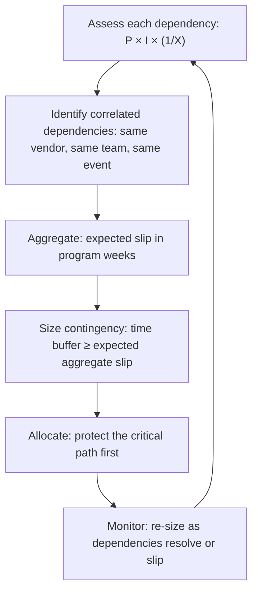

# Dependency Risk and Contingency

> **Core skill:** Assessing the risk that each dependency will fail — probability of slip, impact if it fires, proximity to need-by date — and building proportionate contingency so the program absorbs dependency failure without cascading into program failure.

## Why This Matters

Every dependency carries risk. The question is not whether dependencies will slip — some will — but whether the program can absorb the slip without the end date moving. A program with no contingency is a program that treats every dependency as certain — and certainty about dependencies in a multi-team program is a planning error, not a virtue.

Dependency contingency is insurance purchased before the dependency fails. It takes three forms: time buffer (weeks of float between commit date and need-by date), scope buffer (the ability to reduce or defer the dependent scope), and alternative buffer (a fallback provider, a different approach, a manual process). The TPM's job is to size contingency against the aggregate risk of the dependency portfolio and to deploy it before — not after — a dependency becomes an issue.

A program that ships on time despite three dependency slips did not get lucky. It had contingency sized for those slips, activated at the right moment, and never called it luck.

## The Risk Equation for Dependencies

For each dependency, risk is a function of three variables:

| Variable | Definition | Scale |
|----------|------------|-------|
| **Probability of slip (P)** | How likely is the target team to miss the commit date? | 0–100%, informed by classification, history, signals |
| **Impact if it slips (I)** | How much schedule damage does a slip cause? | Days or weeks of delay to the dependent workstream |
| **Proximity (X)** | How close are we to the commitment date? | Weeks remaining; risk intensifies as proximity shrinks |

The dependency's risk score: **Risk = P × I × (1 / X)** — probability times impact, intensified by proximity. A dependency with a 30% chance of slipping, three weeks of impact, and four weeks away is a different problem than the same dependency two weeks away with no mitigation progress.

The aggregate dependency risk is not the sum of individual risks — some dependencies are correlated (the same vendor failing affects three workstreams). The TPM assesses correlation when sizing the total program contingency.

## Contingency Strategies

| Strategy | What It Is | Best For | Cost |
|----------|------------|----------|------|
| **Time buffer** | Extra weeks between the commit date and the need-by date | Dependencies where the only variable is when | Schedule slack that cannot be used elsewhere |
| **Scope buffer** | Pre-identified scope that can be cut or deferred if the dependency slips | Dependencies where the dependent feature has negotiable scope | Reduced launch scope |
| **Alternative provider** | A second source for the same capability | Critical external dependencies with no internal option | Cost of maintaining the alternative relationship |
| **Internal build option** | The ability to build it yourself if the external dependency fails | Dependencies on unique external capabilities | Engineering capacity held in reserve |
| **Parallel path** | Two teams working different technical approaches; one wins | High-uncertainty technical dependencies | Duplicated engineering effort until one path retires |
| **Manual workaround** | A slower, manual process that keeps the program moving | Dependencies where automation is nice-to-have | Operational overhead |

Contingency is not free. The TPM sizes contingency proportionately: critical-path dependencies with high probability of slip get the strongest contingency; low-criticality dependencies get acknowledgment but no dedicated buffer.

## Sizing Contingency Against Aggregate Risk

The aggregate expected slip is the program's dependency risk exposure in weeks. Contingency should cover at least the expected exposure, with additional buffer for the correlated worst case. If the expected exposure is six weeks and the program has two weeks of buffer, the program is gambling — and the TPM must communicate that honestly to the sponsor.

## Contingency Activation Triggers

Contingency is not a last resort — it is a planned response activated at defined triggers:

| Trigger | Action |
|---------|--------|
| **Target team misses an intermediate milestone** | Activate scope contingency: identify what can be cut if the slip cascades |
| **Commit date slips by more than 25% of the buffer** | Activate time contingency: re-sequence dependent work to protect the critical path |
| **Target team stops responding or goes dark** | Activate alternative provider or internal build option |
| **Dependency risk score crosses the escalation threshold** | Escalate to sponsor with contingency options and recommendation |

The trigger is set early enough that the contingency has time to work. A contingency activated the day before the need-by date is not contingency — it is panic.

## Contingency Communication

Contingency is a sensitive topic. Telling a target team "we have a backup plan in case you fail" damages the relationship. Telling a sponsor "we built six weeks of buffer" invites scope creep to fill it.

| Audience | How to Communicate Contingency |
|----------|-------------------------------|
| **Target team** | "We have aligned our internal schedule to give both sides room to absorb surprises" |
| **Sponsor** | "Our dependency risk exposure is X weeks; we carry Y weeks of program contingency; the gap is Z" |
| **Dependent team** | "We are sequencing work so that if the dependency arrives late, we can still make the date by deferring these items" |
| **Program team** | Contingency is transparent in the dependency register; the team knows what buffers exist and who owns them |

Contingency is neither a secret nor a license. It is a program asset, managed with the same discipline as budget and schedule.

## When Contingency Is Consumed

Contingency is a finite resource. When a dependency slip consumes part of the buffer:

| Step | Action |
|------|--------|
| Record | Log the consumption: which dependency, how much buffer consumed, date, rationale |
| Reassess | Recalculate the remaining contingency against the remaining dependency risk |
| Communicate | If contingency drops below the risk exposure, escalate to sponsor with options |
| Replenish | Can the program recover contingency elsewhere (scope cuts, parallelization)? |

A program that burns through its contingency without acknowledging it is a program that will miss its date without understanding why. The TPM tracks contingency consumption as a primary program metric.

## Practical Applications

- [ ] Every critical dependency has a risk score: probability, impact, proximity
- [ ] Aggregate dependency risk exposure is calculated and tracked
- [ ] Program contingency is sized against aggregate risk, with additional buffer for correlated worst case
- [ ] Contingency activation triggers are defined and communicated to the program team
- [ ] Contingency consumption is tracked; sponsor is informed when remaining buffer drops below exposure
- [ ] Alternative providers or fallback plans exist for critical external dependencies

## Common Pitfalls

| Pitfall | Why It Is a Problem | Better Approach |
|---------|---------------------|-----------------|
| **No contingency** | Every dependency slip becomes a program slip | Size contingency against aggregate risk; make it a program asset |
| **Hidden contingency** | Buffer exists but nobody knows; teams over-commit and consume it | Contingency is transparent in the dependency register |
| **One-size-fits-all buffer** | Same contingency for a stable internal dependency and a volatile external one | Contingency proportionate to risk classification |
| **Contingency as scope magnet** | "We have buffer, let's add this feature" | Contingency is for dependency failure, not scope expansion |
| **Late activation** | Contingency activated after the dependency has already missed | Triggers set early; contingency is a planned response, not a last resort |

## Success Indicators

- Dependency slips are absorbed within program contingency; end dates hold
- Contingency consumption is tracked and transparent; no silent buffer erosion
- Critical external dependencies have exercised alternative plans
- The sponsor knows the program's contingency position at every review

## Related Topics

- [[02_Dependency_Classification]]: risk profile drives contingency sizing
- [[04_External_Dependency_Management]]: external dependencies require the strongest contingency
- [[06_Unblocking_Escalations]]: escalation when contingency is insufficient
- [[07_Dependency_Health_and_Reporting]]: contingency position in the dependency health dashboard
- [[../04_Risk_and_Issue_Leadership/07_Program_Contingency_Planning|Program Contingency Planning]]: program-level contingency beyond dependencies

## Summary

Dependency risk and contingency is the TPM's insurance discipline: assess each dependency's probability of slip, impact, and proximity; calculate the aggregate risk exposure across the program; size contingency (time, scope, alternative) to cover it; and activate contingency at defined triggers before the dependency fails. Contingency is a program asset — transparent, tracked, consumed deliberately, and never a secret. Programs that absorb dependency slips without moving their date are not lucky; they are contingently funded.