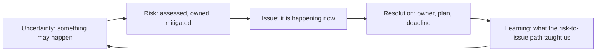

# Risk and Issue Leadership

> **Core capability:** The TPM makes uncertainty visible — distinguishing risks from issues, managing both through a disciplined register, and escalating risk before it becomes an incident the program absorbs.

## Why This Matters

Every program has risks. The difference between programs that deliver and programs that drift is whether risks are named, owned, and managed — or discovered when they become issues. A risk is something that might happen; an issue is something that is happening. The TPM's discipline is keeping risks in the risk register and issues in the issue log, with the right owner, mitigation, and escalation path for each.

Risk management is also the TPM's honesty system: the program status that reports "all green" while unspoken risks accumulate is a lie the TPM is responsible for preventing. Good risk management is boring — and that is the point.

## Topics in This Capability Area

| Topic | Core Skill | When It Matters |
|-------|------------|-----------------|
| [[01_Risk_vs_Issue_Management]] | Distinguishing and managing uncertainty vs actual problems | Continuously |
| [[02_Risk_Identification_and_Assessment]] | Surfacing and scoring risks: probability, impact, proximity | Program planning; every review cycle |
| [[03_Risk_Response_Planning]] | Mitigation, transfer, avoidance, acceptance — with owners | Before risks become issues |
| [[04_Issue_Tracking_and_Resolution]] | Logging, triaging, and resolving issues with owners and deadlines | Whenever issues occur |
| [[05_RAID_Log_Management]] | Running the Risks, Assumptions, Issues, Decisions log | Central program artifact |
| [[06_Risk_Escalation_and_Communication]] | Escalating risks with options, not alarms | Before risks cross the threshold |
| [[07_Program_Contingency_Planning]] | Building time, budget, and scope buffers for uncertainty | Program planning |

## Risk vs Issue

The TPM's job: keep things in the left half of the diagram as long as possible.

## Practical Applications

### Risk Leadership Checklist

- [ ] A RAID log is the central program artifact, reviewed in every status cycle
- [ ] Every risk has a probability, impact, proximity score, owner, and response plan
- [ ] Issues are logged with resolution owners and target dates
- [ ] Risks approaching their threshold are escalated with options
- [ ] Program contingency is sized against the aggregate risk exposure
- [ ] RAID log history shows risks that were closed without becoming issues

## Common Pitfalls

| Pitfall | Why It Is a Problem | Better Approach |
|---------|---------------------|-----------------|
| **RAID-as-formality** | Log exists but nobody reads it; risks rot into issues | Review RAID in every program status; make it the agenda |
| **Risk-hoarding** | TPM holds all risks privately; team unaware | RAID log visible to all; teams own their risks |
| **Escalation-as-alarm** | "The program is at risk" — with no options | Escalate with options and a recommendation |
| **No contingency** | Every delay is a crisis; no buffer exists | Size contingency against aggregate risk |

## Success Indicators

- Risks get retired before they become issues — the RAID log shows closed risks
- Issues resolve within their target window because owners are named
- Escalations carry options and result in decisions within one governance cycle
- The RAID log is the first artifact stakeholders ask to see

## Related Capabilities

- [[01_Program_Structure_and_Charter/00_overview|Program Structure and Charter]]: governance enables risk escalation
- [[03_Dependency_Management/00_overview|Dependency Management]]: dependencies are a primary risk source
- [[career-path/11_Engineering_Manager/04_Delivery_Leadership_for_Managers/05_Delivery_Risk_Ownership|Delivery Risk Ownership (EM)]]: the manager's program-risk perspective

## Summary

Risk and issue leadership is the TPM's honesty system: risks identified and scored before they become issues, a RAID log that is the program's central artifact, escalation that carries options, and contingency sized against aggregate exposure. The TPM's credibility rests on the RAID log — because every stakeholder reads the gaps between risks closed and issues open.