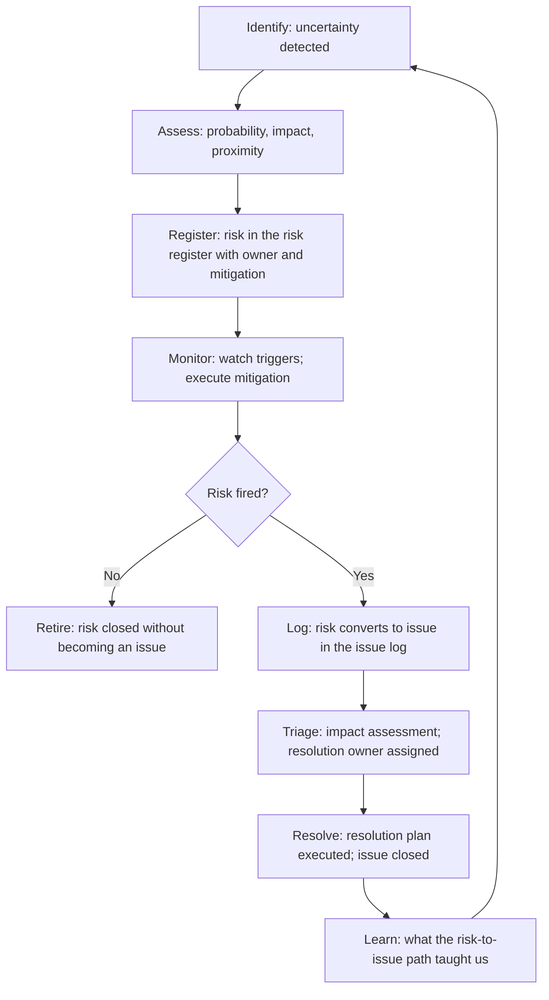

# Risk vs Issue Management

> **Core skill:** Drawing and maintaining the bright line between risks (things that might happen) and issues (things that are happening) — because the disciplines for managing each are different, and blurring the line is the root cause of most program surprises.

## Why This Matters

The most dangerous words in program management are "we'll deal with it if it happens." This sentence takes a risk — something that might happen, with a probability, an impact, and a set of mitigations available — and turns it into a surprise. By the time "if it happens" becomes "it happened," the cheap options are gone and the program is absorbing the full impact.

The distinction between risk and issue is not semantic. Risks are managed proactively: identified, assessed, mitigated, monitored. Issues are managed reactively: logged, triaged, resolved, learned from. The TPM who treats a risk like an issue is spending energy on problems that have not materialized. The TPM who treats an issue like a risk is watching a fire and calling it a temperature anomaly.

The TPM's core discipline is keeping the boundary clean: risks in the risk register with owners and mitigations, issues in the issue log with owners and resolution dates, and a process for what happens when a risk crosses the line and becomes an issue.

## The Boundary

| Dimension | Risk | Issue |
|-----------|------|-------|
| **Definition** | An uncertain event that, if it occurs, has a positive or negative effect on the program | An event that has occurred and is currently affecting the program |
| **Temporal state** | Future: "might happen" | Present: "is happening" or past: "has happened" |
| **Management mode** | Proactive: mitigate, transfer, avoid, accept | Reactive: contain, resolve, recover, learn |
| **Primary artifact** | Risk register | Issue log |
| **Key question** | "What can we do now to reduce the probability or impact?" | "How do we resolve this with minimum damage to the program?" |
| **Owner's task** | Watch for triggers; execute mitigation before the risk fires | Execute resolution plan; report progress until closed |

A risk becomes an issue when its trigger condition is met. "If the vendor misses the 10/15 milestone, the integration date slips by two weeks" — on 10/15, the vendor either met the milestone (risk retired) or missed it (risk becomes an issue). The TPM's moment of truth is the trigger date: a risk that fires without a pre-planned issue response is a risk that was never truly managed.

## The Lifecycle

The lifecycle is a loop: every issue that was once a risk teaches the program something about risk identification, assessment, or mitigation. The learning feeds back into the next cycle's risk register. A program that repeats the same risk-to-issue pattern without learning is a program where risk management is theater.

## The Behavioral Dimension

The risk/issue boundary is also a behavioral line. Teams resist calling things risks because naming a risk feels like admitting weakness. Teams resist calling things issues because the issue log feels like a record of failure. The TPM's cultural work is to make both registers safe:

| Behavior | What It Looks Like | TPM's Response |
|-----------|--------------------|----------------|
| **Risk suppression** | Team knows a risk exists but does not name it | "What is the worst case here? Let's name it now while we have options." |
| **Issue denial** | Something is clearly broken; team calls it a "challenge" or "opportunity" | "This is affecting the program now. Let's log it as an issue and resolve it." |
| **Risk inflation** | Everything is a risk; register has 200 items, none with mitigations | "Which of these, if they fired, would change the program date?" |
| **Issue hoarding** | Team tries to resolve issues privately; issues not in the log | "The issue log is how we track resolution. Let's log it so we can close it." |

The TPM models the behavior: risks are named early, issues are logged promptly, neither is a reflection on competence. The question is not "who caused this?" but "what do we do about it?"

## Operating Two Registers

| Practice | Risk Register | Issue Log |
|----------|--------------|-----------|
| **Entry trigger** | Any uncertain event that would affect the program if it occurred | Any event that is currently affecting the program |
| **Required fields** | Risk statement, probability, impact, proximity, owner, mitigation, trigger, review date | Issue statement, impact, owner, resolution plan, target date, status |
| **Review cadence** | Every program status cycle; top risks weekly | Every program status cycle; active issues at every stand-up or equivalent |
| **Closure criterion** | Risk retired (trigger passed without firing, or probability reduced to zero) | Issue resolved (resolution plan complete; impact contained) |
| **Historical value** | Shows what the program anticipated and prevented | Shows what the program responded to and how effectively |

The two registers are separate but linked. A risk entry carries a reference to the issue log entry it will create if it fires. An issue entry carries a reference to the risk entry it originated from — closing the learning loop.

## When the Boundary Blurs

Some situations resist clean classification:

| Situation | Classification | Rationale |
|-----------|---------------|-----------|
| A vendor missed a milestone but has a recovery plan | Issue (it happened) with risk characteristics (recovery may fail) | Log as issue; add "recovery failure" as a new risk |
| A key person gave notice but is still here for four weeks | Issue (resignation happened) | Log as issue; the attrition risk has fired |
| A technology choice might not scale — early perf tests are concerning | Risk (uncertain) | Register as risk; the trigger is the perf test outcome |
| The architecture review board might reject the design | Risk until the review; issue if rejected | Register as risk; set the review date as the trigger |

The boundary is maintained by a simple test: "Has the damaging event already occurred?" If yes, it is an issue. If not yet, it is a risk. The test is applied dispassionately — emotional discomfort with calling something an issue does not change what it is.

## Practical Applications

- [ ] Every program status review distinguishes risks from issues explicitly
- [ ] Risk register and issue log are separate artifacts with different entry criteria
- [ ] Every risk has a defined trigger — the condition under which it becomes an issue
- [ ] Risk-to-issue conversion is recorded: which risk fired, when, and what issue was created
- [ ] The team culture makes it safe to name risks early and log issues promptly

## Common Pitfalls

| Pitfall | Why It Is a Problem | Better Approach |
|---------|---------------------|-----------------|
| **Calling issues risks** | "The integration is broken — it is a risk" — it already happened | If the damaging event occurred, it is an issue; log and resolve |
| **Calling risks issues** | "We have an issue with the vendor" — the vendor has not missed yet | If the event has not occurred, it is a risk; mitigate and monitor |
| **One register for both** | Risks and issues in the same list; different management disciplines collapsed | Separate registers with different fields, cadences, and closure criteria |
| **No risk-to-issue conversion** | Risk fires; issue is handled ad-hoc; learning is lost | Every issue that was once a risk carries the risk reference |
| **Fear of the registers** | Teams avoid naming risks or logging issues because it reflects poorly | TPM models safety: naming is competence, not admission of failure |

## Success Indicators

- The risk register shows risks being retired without becoming issues
- The issue log shows active issues resolving within their target dates
- Risk-to-issue conversions are tracked and learned from
- Nobody hesitates to name a risk or log an issue in a program review

## Related Topics

- [[02_Risk_Identification_and_Assessment]]: the process for surfacing and scoring risks
- [[04_Issue_Tracking_and_Resolution]]: the issue log and resolution discipline
- [[05_RAID_Log_Management]]: the integrated RAID artifact that houses both registers
- [[../03_Dependency_Management/05_Dependency_Risk_and_Contingency|Dependency Risk and Contingency]]: dependency-specific risk and contingency

## Summary

Risk vs issue management is the TPM's boundary discipline: risks are uncertain future events managed proactively through the risk register; issues are present events managed reactively through the issue log. The two registers have different entry criteria, fields, cadences, and closure conditions — and the conversion from risk to issue, when a trigger fires, is the moment the program's risk discipline proves its value. The TPM's test: when a risk fires, is the issue response already planned, or is the program scrambling?