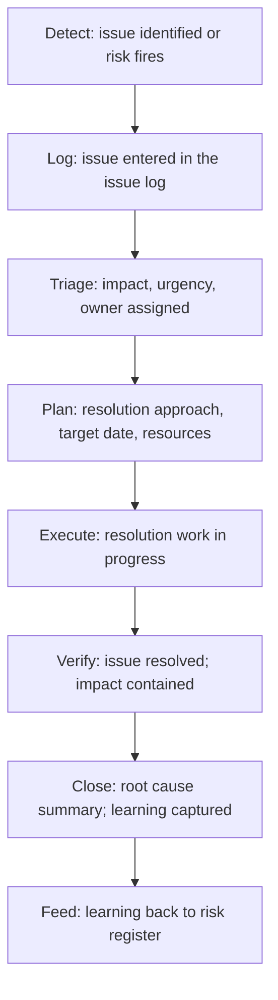

# Issue Tracking and Resolution

> **Core skill:** Logging, triaging, and driving issues to resolution — with named owners, dated resolution plans, and status tracking — so that the program's problems are visible, owned, and closed, not buried in email threads and forgotten until they resurface.

## Why This Matters

Issues are the program's reality. A risk is something that might go wrong; an issue is something that has gone wrong. The difference between programs that recover from issues and programs that drown in them is whether issues are managed through a disciplined process or handled ad-hoc by whoever is closest to the fire.

An ad-hoc issue culture looks like this: the database is down, three people are working on it, nobody knows who is coordinating, the stakeholder asks for an update and gets five different stories, and the issue is "resolved" when the database comes back up — with no record of what happened, why, or whether it could recur. A disciplined issue culture looks like this: the issue is logged with an owner and a target resolution date, status is updated in a shared log, the stakeholder receives one consistent update, and resolution includes a root-cause summary that feeds back into the risk register.

The issue log is not bureaucracy. It is the program's shared reality about what is broken and who is fixing it. Without it, issues are resolved in private and the program learns nothing.

## Issue Lifecycle

Every issue follows this path. Issues that skip steps — logged but never triaged, assigned but never planned, resolved but never verified — are issues that will recur.

## The Issue Log Entry

| Field | Content | Example |
|-------|---------|---------|
| **Issue ID** | Unique identifier | "ISS-042" |
| **Statement** | One sentence: what is happening | "Production payment processing latency exceeds 5 seconds (SLA is 500ms)" |
| **Detected** | Date and source | "2026-10-05 — monitoring alert" |
| **Impact** | What is affected: scope, schedule, quality, users | "All payment transactions degraded; launch-readiness sign-off blocked" |
| **Urgency** | How quickly resolution must begin | "Immediate — customer-facing; revenue impact" |
| **Owner** | One named person driving resolution | "Diana, Payments TL" |
| **Resolution plan** | How the issue will be resolved | "1. Identify bottleneck (in progress). 2. Apply fix. 3. Verify latency. 4. Root cause analysis." |
| **Target resolution date** | When the issue is expected to be resolved | "2026-10-06" |
| **Status** | Open / In Progress / Resolved / Closed | "In Progress" |
| **Risk reference** | If the issue originated from a risk, the risk ID | "Originated from RISK-018: Payment processor scaling unknown" |
| **Closure summary** | What was done, root cause, and what prevents recurrence | (Filled at closure) |

The log entry is the single source of truth for the issue's status. Every stakeholder who asks "what is happening with the payment issue?" gets pointed to ISS-042 — not to five different people's recollections.

## Triage: Urgency and Impact

Not every issue demands immediate resolution. Triage allocates attention:

| Urgency | Definition | Response Expectation |
|---------|------------|---------------------|
| **Immediate** | Customer-facing outage; revenue impact; safety/security | Resolution begins now; all-hands if needed |
| **High** | Blocks critical-path work; will become immediate if unresolved | Resolution begins within hours; dedicated owner |
| **Medium** | Degrades progress but work continues with workaround | Resolution planned within days |
| **Low** | Minor inconvenience; workaround exists; no schedule impact | Logged; resolved when capacity permits |

| Impact | Definition | Escalation |
|--------|------------|------------|
| **Program** | Affects program date, scope, or quality commitments | Sponsor visibility; program-level resolution |
| **Workstream** | Affects a single workstream's commitments | Workstream lead manages; TPM tracks |
| **Team** | Affects a single team's productivity or morale | Team manages; logged for visibility |

Urgency determines when. Impact determines who needs to know. A high-urgency, program-impact issue gets immediate attention and sponsor visibility. A low-urgency, team-impact issue gets logged and resolved within the team.

## Resolution Planning

| Element | What the Owner Defines |
|---------|----------------------|
| **Containment** | What stops the bleeding right now? (Workaround, rollback, escalation) |
| **Root cause** | Why did this happen? (Not "who caused it" — "what condition allowed it") |
| **Fix** | What permanently resolves the issue? |
| **Verification** | How do we know the fix worked? (Metrics, tests, monitoring) |
| **Prevention** | What changes prevent recurrence? (Process, tooling, architecture, training) |

The owner does not necessarily execute all of these — but the owner ensures each element has someone doing it and tracks progress until all are complete.

## The Issue Stand-Up

For programs with many concurrent issues, a brief dedicated stand-up keeps resolution on track:

| Agenda Item | Duration | Purpose |
|-------------|----------|---------|
| New issues since last stand-up | 5 min | Triage: assign owners and urgency |
| Active issues — blockers | 5 min | Issues where resolution is stalled; what is needed to unblock |
| Active issues — approaching target date | 5 min | Issues where the target date is near; is resolution on track? |
| Issues resolved since last stand-up | 5 min | Brief closure summary; learning captured |

Total: 20 minutes, daily if the program is in a high-issue period; otherwise folded into the regular status cycle. The stand-up is not a status-reporting session — it is a resolution-unblocking session.

## Issue Aging and Escalation

An issue that ages without progress is a second-order problem: the original issue is unresolved, and the resolution process itself is failing.

| Aging Signal | Escalation |
|-------------|------------|
| **No owner assigned after 24 hours** (immediate urgency) or **48 hours** (high urgency) | TPM assigns an owner and escalates to the workstream lead |
| **No resolution plan after 48 hours** | TPM facilitates planning session; escalates if owner is unresponsive |
| **Target date missed without re-plan** | Issue escalated to program sponsor with options |
| **Status not updated for two reporting cycles** | TPM checks in directly; issue may be stalled without acknowledgment |

The TPM watches issue age as a leading indicator of resolution health. An average issue age that is rising means the program is accumulating unresolved problems — a trend that surfaces in the monthly RAID review.

## Issue-to-Learning

Every resolved issue is a learning opportunity. The closure summary captures:

| Element | Content |
|---------|---------|
| **Resolution** | What was done to resolve the issue |
| **Root cause** | The underlying condition that allowed the issue to occur |
| **Was this a risk?** | Was this issue anticipated in the risk register? If not, why not? |
| **Prevention** | What changes prevent recurrence: process, tooling, architecture, training |
| **New risks** | Does this issue reveal new risks that should be in the register? |

The closure summary is not a postmortem — it is a brief, structured entry that takes five minutes to write and pays for itself the first time it prevents a recurrence. The TPM reviews closure summaries monthly and surfaces patterns: recurring root causes, categories of issues that were never in the risk register, resolutions that took longer than expected.

## Practical Applications

- [ ] Issue log is the single source of truth for all active program issues
- [ ] Every issue has: ID, statement, impact, urgency, owner, resolution plan, target date, status
- [ ] Triage allocates attention: urgency determines when, impact determines who needs to know
- [ ] Issues are aged; aging issues are escalated before they become forgotten
- [ ] Every resolved issue has a closure summary with root cause and prevention

## Common Pitfalls

| Pitfall | Why It Is a Problem | Better Approach |
|---------|---------------------|-----------------|
| **Issues in email, not in the log** | Status is fragmented; nobody knows the full picture | Every issue goes in the log; the log is the source of truth |
| **Owner assigned but not accountable** | "Diana owns it" — but Diana does not know she owns it | Owner explicitly accepts; TPM confirms |
| **Resolution without root cause** | Issue is fixed; same root cause creates three more issues | Closure summary includes root cause and prevention |
| **No aging discipline** | Issues sit in "In Progress" for weeks without scrutiny | TPM watches issue age; aging issues are escalated |
| **Triage inflation** | Everything is "immediate" so nothing is | Urgency levels applied consistently; "immediate" is reserved for customer/revenue impact |

## Success Indicators

- Average issue resolution time is stable or declining
- No issue ages beyond its target date without a re-plan and escalation
- Closure summaries reveal root causes that feed back into the risk register
- Stakeholders reference the issue log, not individual recollections, for issue status

## Related Topics

- [[01_Risk_vs_Issue_Management]]: the boundary that determines whether something is a risk or an issue
- [[05_RAID_Log_Management]]: the RAID log contains the issue log alongside risks, assumptions, and decisions
- [[06_Risk_Escalation_and_Communication]]: escalating issues and risks through governance
- [[../03_Dependency_Management/06_Unblocking_Escalations|Unblocking Escalations]]: escalation for dependency-specific blockages

## Summary

Issue tracking and resolution is the TPM's reality discipline: every issue is logged with an owner and a target date, triaged by urgency and impact, driven to resolution through a planned process, and closed with a root-cause summary that prevents recurrence. The issue log is the program's shared truth about what is broken and who is fixing it — and the TPM's test is whether stakeholders check the log or check with the TPM personally when they need an update.