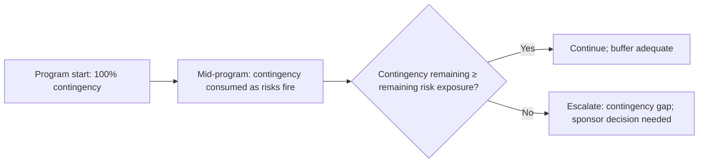

# Program Contingency Planning

> **Core skill:** Building and managing program-level contingency — time, budget, scope, and resource buffers sized against aggregate risk exposure — so that the program absorbs uncertainty without every surprise becoming a crisis and every delay becoming a date change.

## Why This Matters

A program without contingency is a program that assumes perfect execution. Every estimate is accurate. Every dependency delivers on time. Every risk stays in the register. No key person leaves. No technology surprise emerges. This is not a plan — it is a wish.

Contingency is the program's shock absorber. It converts the TPM's risk assessment into concrete buffers: time between the planned completion date and the committed date, budget reserved for unplanned work, scope that can be cut without breaking the minimum viable product, resources that can be redirected to the critical path. Contingency is not padding — it is a deliberate allocation of program resources against quantified uncertainty.

The TPM's contingency discipline has three parts: sizing (how much contingency does the program need, based on aggregate risk exposure?), allocation (where in the program does the contingency live — schedule, budget, scope, resources?), and management (how is contingency consumed, tracked, and replenished?). A program that gets all three right absorbs surprises. A program that gets any one wrong absorbs blame.

## Sizing Contingency

Contingency is sized against the program's aggregate risk exposure — not a round number like "10% of the schedule."

### Step 1: Quantify Aggregate Risk Exposure

For each risk in the program's risk register, calculate the expected impact:

**Expected Impact = Probability × Impact (in program weeks or budget units)**

| Risk | Probability | Impact (weeks) | Expected Impact (weeks) |
|------|------------|----------------|------------------------|
| RISK-001: Vendor delivery delayed | 40% | 4 | 1.6 |
| RISK-002: Key engineer departure | 20% | 3 | 0.6 |
| RISK-003: Architecture rework | 30% | 6 | 1.8 |
| RISK-004: Regulatory review extended | 50% | 2 | 1.0 |
| **Aggregate expected impact** | | | **5.0 weeks** |

The aggregate expected impact is the statistically expected total slip from all risks — assuming risks are independent. But not all risks are independent. A vendor delay and a regulatory delay might be uncorrelated. Two dependency risks on the same target team are highly correlated.

### Step 2: Adjust for Correlation

| Correlation Pattern | Adjustment |
|--------------------|------------|
| Risks on the same target team or vendor | Treat as partially correlated; sum the worst-case of the correlated cluster, not each individually |
| Risks in the same program phase | Overlap in timing increases resource contention; modest upward adjustment |
| Independent risks | Expected impact sums linearly |

The correlated worst case is what happens if the riskiest cluster fires at once. Contingency should cover the expected case, with awareness of the correlated worst case. If the expected case is 5 weeks and the correlated worst case is 12 weeks, the program cannot carry 12 weeks of contingency — but the sponsor must know the 12-week number exists.

### Step 3: Set Contingency Levels

| Level | Coverage | When to Use |
|-------|----------|-------------|
| **Minimum** | Expected aggregate impact | Mature domain; known technology; experienced team |
| **Moderate** | Expected × 1.5 | Mixed maturity; some unknowns; standard program |
| **Conservative** | Expected × 2.0 or correlated worst case (whichever is higher) | New domain; new technology; new team; fixed external deadline |

The contingency level is a program decision, not a TPM calculation. The TPM presents the analysis; the sponsor decides the risk appetite. The TPM's job is to ensure the sponsor understands what "minimum" contingency means: a 50% chance that contingency is exhausted before the program completes.

## Types of Program Contingency

| Type | What It Is | Best For | Management |
|------|------------|----------|------------|
| **Schedule contingency** | Buffer weeks between planned completion and committed date | Absorbing estimate error, dependency slips, integration delays | Held at program level; not allocated to workstreams |
| **Budget contingency** | Reserve funds for unplanned work, scope discovery, vendor overages | Absorbing cost uncertainty | Held by sponsor; released against specific needs |
| **Scope contingency** | Pre-identified features or requirements that can be cut without breaking the MVP | Absorbing scope discovery and capacity shortfalls | Prioritized backlog; cut list maintained with sponsor agreement |
| **Resource contingency** | Flexible capacity: on-call experts, float engineers, vendor surge options | Absorbing key-person loss, unexpected complexity | On standby; activated against specific triggers |

Most programs use a mix. A program with a fixed external date (regulatory deadline, market window) relies heavily on scope and resource contingency, because schedule contingency is not available. A program with a flexible date relies primarily on schedule contingency.

## Contingency Allocation

Contingency is held at the program level, not distributed to workstreams. The moment contingency is allocated to individual teams, it disappears — every team consumes its buffer "just in case" and the program buffer is gone.

| Allocation Principle | Rationale |
|---------------------|-----------|
| **Program holds the buffer** | Workstreams plan to their realistic dates; the program holds the aggregate buffer |
| **Workstreams know the buffer exists** | Transparency prevents double-buffering (teams add their own hidden buffer on top) |
| **Buffer is released against specific, validated needs** | "We need two weeks because the vendor slipped" — not "we need two weeks because we are behind" |
| **Scope contingency is pre-negotiated** | The sponsor agrees which scope can be cut before the pressure to cut it arrives |

The TPM is the buffer's gatekeeper. Releasing buffer is a program decision, not a workstream request. The TPM validates the need against the risk register and the program's contingency consumption tracking.

## Contingency Management

### Consumption Tracking

| Metric | What It Measures | Signal |
|--------|-----------------|--------|
| **Total contingency** | Weeks/budget/scope originally allocated | Baseline |
| **Contingency consumed** | Buffer released to date | Cumulative drawdown |
| **Contingency remaining** | Total minus consumed | Available buffer |
| **Consumption rate** | Buffer consumed per reporting period | Runway: at current rate, when does contingency run out? |
| **Consumption by source** | Which risks consumed the buffer? | Are the risks we anticipated consuming it, or are new ones? |

The TPM tracks contingency consumption as a primary program metric — alongside schedule and budget. A program that has consumed 80% of its contingency at the 50% completion point is a program that will run out of buffer before it finishes.

### Contingency Burn-Down

The TPM compares contingency remaining against remaining risk exposure at every major review. If the gap is negative — remaining contingency is less than remaining expected impact — the TPM escalates to the sponsor with options: release additional contingency (if available), cut scope, renegotiate the date, or accept the risk.

### Contingency Replenishment

Contingency can sometimes be replenished — not by asking for more, but by retiring risks:

| Replenishment Source | How It Works |
|---------------------|-------------|
| **Risk retirement** | A risk is retired without firing; its expected impact is returned to the contingency pool |
| **Mitigation effectiveness** | Mitigation reduces a risk's probability; the expected impact decreases |
| **Scope cuts** | Pre-identified scope contingency is activated; schedule contingency is preserved |
| **Efficiency gains** | Team velocity exceeds plan; buffer is partially recovered |

Contingency replenishment is not padding-creation. It is the natural result of risks being retired and mitigations working. The TPM tracks replenishment alongside consumption.

## Contingency Communication

| Audience | What They Need to Know |
|----------|----------------------|
| **Sponsor** | Total contingency, consumed, remaining; current vs remaining risk exposure; decision needed if gap is negative |
| **Program team** | Contingency is available; it is released against validated needs; do not double-buffer |
| **Stakeholders** | The program carries contingency; it does not mean the date is soft or scope is negotiable |
| **External partners** | The program's schedule includes contingency; their commitments are to the planned date, not the contingency-inclusive date |

Contingency communication is delicate. Announcing "we have three months of buffer" invites scope creep and schedule complacency. Hiding the buffer prevents honest planning. The TPM's balance: the buffer exists, it is sized against risk, it is managed at the program level, and it is not a license to relax.

## Practical Applications

- [ ] Program contingency is sized against quantified aggregate risk exposure, not an arbitrary percentage
- [ ] Contingency is held at the program level — not distributed to workstreams
- [ ] Multiple contingency types are used: schedule, budget, scope, resources
- [ ] Contingency consumption is tracked as a primary program metric
- [ ] Remaining contingency is compared against remaining risk exposure at every major review
- [ ] Contingency gap (remaining < exposure) triggers immediate sponsor escalation

## Common Pitfalls

| Pitfall | Why It Is a Problem | Better Approach |
|---------|---------------------|-----------------|
| **Arbitrary contingency** | "Add 20%" — not tied to actual risk exposure | Size against quantified aggregate expected impact |
| **Distributed contingency** | Every team adds its own buffer; total buffer is consumed before the program starts | Program holds the buffer; workstreams plan to realistic dates |
| **Contingency as scope magnet** | "We have buffer, let's add features" | Contingency is for risk absorption; scope changes are separate decisions |
| **No consumption tracking** | Buffer erodes silently; program discovers it is gone when a risk fires | Track consumption as a primary metric; escalate when the gap appears |
| **One-type contingency** | Only schedule buffer, no scope or resource contingency | Match contingency types to the program's flexibility |

## Success Indicators

- The program completes within its contingency envelope — buffer is consumed but not exhausted
- Contingency consumption tracks against anticipated risks — the risks that were expected to consume buffer did
- Contingency gap (if any) is identified and escalated before the buffer runs out
- The sponsor can state the program's contingency position at every review

## Related Topics

- [[02_Risk_Identification_and_Assessment]]: the risk assessment that drives contingency sizing
- [[03_Risk_Response_Planning]]: mitigation reduces the need for contingency
- [[06_Risk_Escalation_and_Communication]]: contingency gap as an escalation trigger
- [[../03_Dependency_Management/05_Dependency_Risk_and_Contingency|Dependency Risk and Contingency]]: dependency-specific contingency

## Summary

Program contingency planning is the TPM's buffer discipline: contingency (time, budget, scope, resources) sized against quantified aggregate risk exposure, held at the program level, consumed against validated needs, and tracked as a primary program metric. The TPM compares remaining contingency against remaining risk exposure at every major review — and escalates when the gap turns negative. A program that completes within its contingency is a program where risk management worked. A program that exhausts its contingency early is a program where either the risk assessment was wrong, the mitigations failed, or the contingency was consumed silently — and all three are TPM failures.