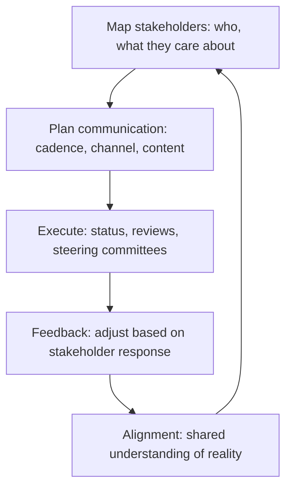

# Stakeholder Alignment

> **Core capability:** The TPM creates shared context among technical, business, and leadership stakeholders — so that expectations match reality, decisions are made with the same information, and nobody learns about the program's status from a surprise.

## Why This Matters

Multi-team programs have stakeholders with genuinely different incentives: engineering wants technical quality, product wants features and dates, leadership wants strategic outcomes and cost control, security wants risk reduction. The TPM's stakeholder work is not "managing expectations" — it is creating enough shared context that the different incentives don't produce different understandings of reality.

Alignment fails silently: the engineering team thinks the date is aspirational, product thinks it is committed, leadership builds a roadmap on it. The TPM's weekly status is the antidote — a single source of truth that every stakeholder reads because it tells them what they need to know in their language.

## Topics in This Capability Area

| Topic | Core Skill | When It Matters |
|-------|------------|-----------------|
| [[01_Stakeholder_Mapping]] | Identifying who matters, what they care about, and how to engage them | Program initiation |
| [[02_Communication_Planning]] | Designing the communication cadence and channels per stakeholder | Program setup |
| [[03_Executive_Communication_for_TPMs]] | Reporting program status to leadership honestly | Steering committee; escalations |
| [[04_Managing_Stakeholder_Expectations]] | Keeping commitments and reality in honest contact | Every status cycle |
| [[05_Stakeholder_Negotiation]] | Negotiating scope, timeline, and resources across stakeholder groups | Planning; change requests |
| [[06_Stakeholder_Conflict_Resolution]] | Resolving misalignment between stakeholder groups | When priorities conflict |
| [[07_Building_Stakeholder_Trust]] | Building the reputation that delivers bad news early | Accumulated over programs |

## The Stakeholder Alignment Loop

Status that nobody reads is misalignment with extra steps.

## Practical Applications

### Stakeholder Alignment Checklist

- [ ] All program stakeholders are mapped with interest, influence, and communication needs
- [ ] A stakeholder communication plan exists with cadence, channels, and content per group
- [ ] Program status reports tell each stakeholder group what they need to know
- [ ] Steering committee meetings have pre-reads, clear agendas, and recorded decisions
- [ ] Stakeholder conflicts are surfaced and resolved in the program governance, not outside it

## Common Pitfalls

| Pitfall | Why It Is a Problem | Better Approach |
|---------|---------------------|-----------------|
| **One-status-fits-all** | Engineering detail for executives; executive summary for engineers | Tailored communication per stakeholder group |
| **Happy-status syndrome** | Problems hidden until they are crises | Bad news early, with options |
| **Stakeholder-as-audience** | Stakeholders informed, not engaged; they disengage until surprised | Active engagement: steering committees, decision forums |
| **Trust-by-absence** | TPM only surfaces when there is a problem | Build trust through regular, honest, boring status |

## Success Indicators

- Stakeholders reference the same status artifact in their own meetings
- Bad news reaches stakeholders before they ask for it
- Steering committee decisions are recorded, actioned, and reviewed
- Stakeholder conflicts are resolved in governance, not in hallways

## Related Capabilities

- [[01_Program_Structure_and_Charter/00_overview|Program Structure and Charter]]: governance is the stakeholder alignment forum
- [[06_Decision_Facilitation/00_overview|Decision Facilitation]]: decisions are where alignment becomes action
- [[career-path/11_Engineering_Manager/07_Manager_Communication/00_overview|Manager Communication (EM)]]: the manager's communication craft

## Summary

Stakeholder alignment means mapping who matters and what they care about, communicating honestly in their language, keeping expectations in contact with reality, and resolving conflicts in governance rather than gossip. The TPM's status report is the program's single source of truth — and the trust that delivers bad news early is earned by delivering honest status always.