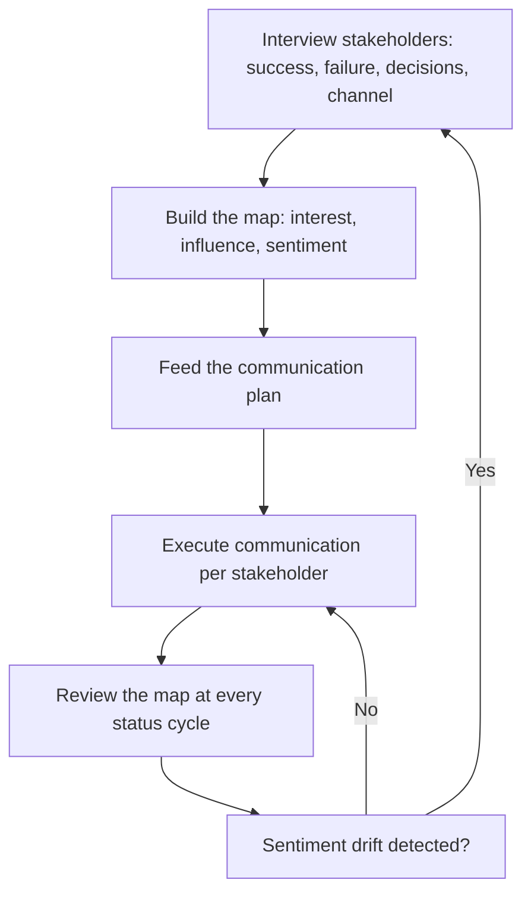

# Stakeholder Mapping

> **Core skill:** The TPM identifies every person and group with influence over the program, understands what they care about and what they can block, and builds an engagement plan that reaches them before they reach the TPM — with questions, objections, or surprises.

## Why This Matters

Programs fail at stakeholder boundaries. The executive who kills funding because they were never told about scope change. The engineering director who refuses the architecture because nobody asked them during design. The security team that blocks the launch because they were informed, not engaged. Every one of these is a mapping failure: the stakeholder existed, the TPM knew about them, and still missed them.

Stakeholder mapping is not a one-time art project — a pretty matrix delivered at kick-off and never updated. It is a living document that tells the TPM who needs what information, who can block what decision, and whose expectations are drifting out of contact with reality. The map is the TPM's early-warning system: when a stakeholder's sentiment changes, the map tells you before the meeting does.

## The Stakeholder Map: Dimensions

Every stakeholder is plotted on three dimensions. One dimension is not enough.

| Dimension | Question | Why It Matters |
|-----------|----------|-----------------|
| Interest | How much do they care about this program's outcome? | High-interest stakeholders will engage regardless; low-interest stakeholders need explicit reasons to care |
| Influence | What can they block, fund, accelerate, or kill? | High-influence stakeholders must be actively managed; low-influence stakeholders must not be surprised |
| Sentiment | Are they supportive, neutral, or resistant right now? | Sentiment changes; the map tracks it so the TPM sees resistance forming before it hardens |

The classic power-interest grid gets you started, but the third dimension — sentiment — is what turns the map from a static artifact into a dynamic tool. A high-influence, high-interest stakeholder who is resistant is a program risk; the same stakeholder who is supportive is a program asset. The TPM's job is to move them, and the map tracks the movement.

## The Stakeholder Map Table

| Stakeholder | Role | Interest | Influence | Current Sentiment | What They Care About | Communication Need | Engagement Owner |
|-------------|------|----------|-----------|-------------------|----------------------|--------------------|-------------------|
| [Name] | VP Engineering | High | High — can kill funding | Supportive | Technical quality; team morale | Monthly steering; pre-reads before decisions | TPM |
| [Name] | Product Director | High | Medium — owns roadmap priority | Neutral | Dates; feature scope | Weekly status; decision forum | TPM |
| [Name] | Security Lead | Medium | High — can block launch | Resistant | Risk; compliance | Security review with findings tracked; not just informed | Security architect |
| [Name] | Legal | Low | High — can block contract | Neutral | Contract terms; IP | Milestone notifications; escalation path | TPM via program sponsor |

The engagement owner is the person responsible for keeping the stakeholder aligned — often the TPM, but sometimes a program sponsor for executive stakeholders where the TPM lacks standing.

## Building the Map: The Stakeholder Interview

The map is not built from the TPM's assumptions. It is built from fifteen-minute conversations with each stakeholder, structured around four questions:

1. **"What does success look like for you in this program?"** — reveals their incentive, which is often different from the program's stated outcome.
2. **"What would make this program a failure from your perspective?"** — reveals the risk they are watching for; the TPM's job is to track that risk.
3. **"What decisions do you need to be part of, and which ones do you trust the team to make?"** — reveals their decision appetite; over-including them wastes their time; under-including them triggers vetoes.
4. **"How do you prefer to receive updates — written, verbal, dashboard, meeting?"** — reveals the channel; use the wrong one and they disengage.

The interview produces the map. The map produces the communication plan. The communication plan produces the alignment. Skip the interview and the map is fiction.

## Stakeholder Dynamics: Coalitions and Conflicts

Stakeholders do not exist in isolation. Two stakeholders with the same interest but opposed sentiment will produce conflict that the map must surface. Two stakeholders with different interests but aligned sentiment will form a coalition the TPM can leverage.

| Dynamic | Signal | TPM Response |
|---------|--------|--------------|
| Coalition | Two or more stakeholders share sentiment and meet separately | Engage as a group; present decisions to the coalition before the forum |
| Conflict | Two stakeholders have opposed interests on the same decision | Surface the conflict in the map; facilitate a structured disagreement before it derails a meeting |
| Influence gap | A high-interest stakeholder lacks influence; a low-interest stakeholder has it | Bridge: connect the interested stakeholder to the decision; brief the influential stakeholder on why they should care |
| Sentiment drift | A stakeholder's sentiment shifts without a visible trigger | Re-interview: the map missed something, or conditions changed |

## Updating the Map

The map is updated at every program review, not once. The update is three questions: has any stakeholder's sentiment changed, has any stakeholder's influence changed, and is anyone new who should be on the map. The first question catches alignment drift; the second catches re-orgs and scope changes; the third catches the stakeholder you missed.



The map is the TPM's early-warning system. When it drifts, the TPM moves before the meeting does.

## Practical Applications

### Stakeholder Map Template

```markdown
# Stakeholder Map — [Program Name] — [Date]

## Stakeholder Table
| Stakeholder | Role | Interest | Influence | Sentiment | What They Care About | Communication Need | Engagement Owner |
|-------------|------|----------|-----------|-----------|----------------------|--------------------|-------------------|
|             |      | H/M/L    | H/M/L     | +/-/N     |                      |                    |                   |

## Dynamics
- Coalitions: [who aligns with whom, and on what]
- Conflicts: [who is opposed, and on what]
- Gaps: [missing stakeholders, influence gaps]

## Sentiment Changes Since Last Review
- [stakeholder]: [change] — [likely cause] — [action]
```

### Stakeholder Mapping Checklist

- [ ] Every person or group with influence over the program is on the map
- [ ] Each stakeholder has been interviewed, not assumed
- [ ] Interest, influence, and sentiment are plotted for each
- [ ] Communication needs and engagement owners are assigned
- [ ] Coalitions and conflicts between stakeholders are surfaced
- [ ] The map is reviewed and updated at every program status cycle
- [ ] Sentiment changes trigger re-engagement, not waiting

## Common Pitfalls

| Pitfall | Why It Is a Problem | Better Approach |
|---------|---------------------|-----------------|
| **Map-as-decoration** | Built once at kick-off, never updated; sentiment drifts unnoticed | Review and update the map at every status cycle |
| **Assumed sentiment** | The TPM guesses what stakeholders care about without asking | Interview every stakeholder before plotting them |
| **Missing the blocker** | Low-interest, high-influence stakeholders left off because they seem disengaged | Map by influence first; disengagement is a risk, not an absence |
| **One-size communication** | Every stakeholder gets the same update; nobody reads it | Communication tailored per the map's communication-need column |
| **No engagement owner** | The TPM owns every relationship; relationships with executives degrade without sponsor support | Assign engagement owners; use sponsors for executive stakeholders |

## Success Indicators

- Every stakeholder who can block the program is on the map with a communication plan
- Sentiment changes are detected before they become meeting surprises
- Stakeholders reference the TPM's communication as "what I need to know"
- No stakeholder learns about a program event from someone outside the program
- The map survives a re-org — the TPM knows who moved and what it means

## Related Topics

- [[02_Communication_Planning]]: the map feeds the plan
- [[04_Managing_Stakeholder_Expectations]]: sentiment drift is the early signal
- [[06_Stakeholder_Conflict_Resolution]]: when the map surfaces a conflict
- [[01_Program_Structure_and_Charter/00_overview|Program Structure and Charter]]: governance defines stakeholder roles
- [[career-path/03_Staff_Engineer/04_Influence_and_Alignment/00_overview|Influence and Alignment (Staff)]]: the staff engineer's stakeholder landscape
- [[career-path/11_Engineering_Manager/07_Manager_Communication/00_overview|Manager Communication (EM)]]: upward and downward stakeholder dynamics

## Summary

Stakeholder mapping is the TPM's first and most consequential alignment activity: identifying every person with influence over the program, understanding what they care about and what they can block through structured interviews, plotting them on interest, influence, and sentiment, and maintaining the map as a living early-warning system. The map feeds the communication plan, and the communication plan feeds the alignment — but the map is only as honest as the interviews behind it.