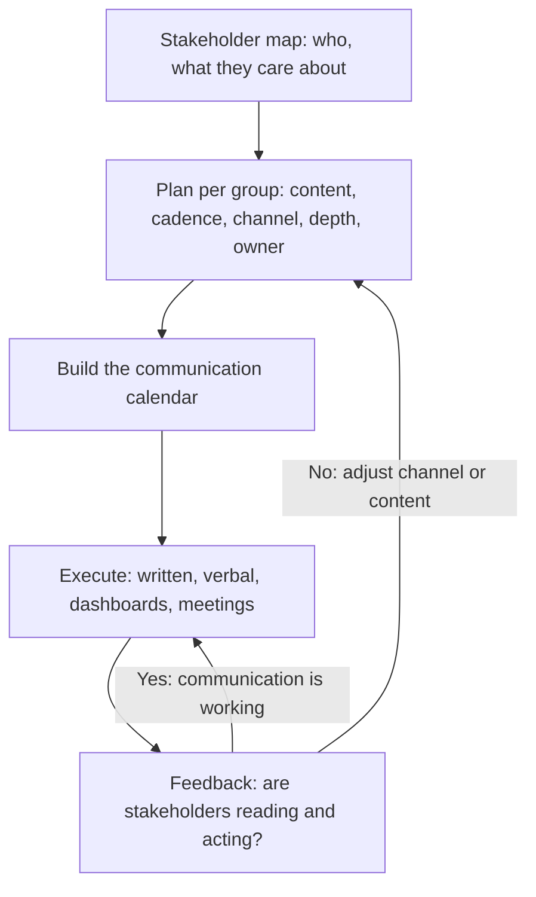

# Communication Planning

> **Core skill:** The TPM designs a communication architecture — cadence, channel, content, and owner per stakeholder group — so that every person who influences the program receives the right information at the right time in the right form, and nobody learns about the program from a surprise.

## Why This Matters

A program with 200 stakeholders and no communication plan generates 200 different understandings of reality. The engineering team thinks the date is a target; product treats it as a commitment; the executive builds a roadmap on it. The TPM's communication plan is the architecture that prevents this divergence — a deliberate design of who hears what, when, through which channel, in whose voice.

Communication planning is not a calendar of meetings. It is the answer to five questions per stakeholder group: what do they need to know, when do they need to know it, through which channel, in what level of detail, and from whom. A plan that answers these five questions produces a shared understanding of program reality. A plan that answers zero produces a program where every stakeholder's reality is different — and the divergence is discovered in the worst possible forum.

## The Communication Plan: Five Dimensions

Every stakeholder group gets five decisions in the communication plan. Miss one and the communication fails for that group.

| Dimension | Question | Failure Mode |
|-----------|----------|---------------|
| Content | What do they need to know? | Too much detail for executives; too little for engineers |
| Cadence | How often do they need to know it? | Weekly for a monthly concern; monthly for a daily risk |
| Channel | Through which medium? | Email for urgent; meeting for informational |
| Depth | At what level of detail? | Engineering detail for leadership; summary for implementers |
| Owner | Who delivers the message? | TPM for status; sponsor for strategic; architect for technical |

## Content by Stakeholder Group

Different stakeholders need different slices of the same program reality. The TPM does not write one status report and send it to everyone — the TPM writes one status truth and presents it five ways.

| Stakeholder Group | What They Need | Content Format |
|-------------------|----------------|----------------|
| Executive sponsors | Strategic outcomes, major risks, decisions needed | One-page dashboard: RAG status, top 3 risks, decisions due |
| Engineering leads | Technical status, dependencies, blockers, integration schedule | Detailed status: milestones, RAID log updates, technical decisions |
| Product stakeholders | Feature scope, timeline, trade-offs, customer impact | Feature tracker: scope changes, milestone forecasts, beta feedback |
| Operations / Security | Operational readiness, risk posture, launch criteria | Readiness review: checklist progress, open findings, go/no-go criteria |
| Extended team | Program context, their piece, what changed | Monthly newsletter: wins, what is next, what changed, who to thank |

## The Communication Calendar

The plan lives on a calendar. Each stakeholder group has one or more recurring touchpoints, and the calendar is the TPM's commitment to communication discipline.

| Cadence | Touchpoint | Audience | Content | Owner |
|---------|------------|----------|---------|-------|
| Weekly | Program status report | All stakeholders | Written: RAG, milestones, top risks, decisions | TPM |
| Weekly | Engineering sync | Engineering leads | Verbal: blockers, dependencies, integration status | TPM |
| Biweekly | Product review | Product stakeholders | Verbal: scope, schedule, trade-offs | TPM + Product |
| Monthly | Steering committee | Executive sponsors | Deck: strategic status, decisions required, risk deep-dive | TPM + Sponsor |
| Quarterly | Program review | All stakeholders | Deck: outcomes to date, forecast, lessons | TPM |

## Channel Selection

The channel determines whether the communication is received. The wrong channel is invisible.

| Channel | Right For | Wrong For |
|---------|-----------|-----------|
| Written status (email, wiki, doc) | Regular updates; anything that needs a record | Urgent escalations; bad news first delivery |
| Live meeting | Decisions; alignment; bad news | Purely informational updates; reading documents aloud |
| Dashboard | Real-time data; self-serve status | Narrative context; trade-off reasoning |
| Chat / Slack | Quick questions; FYI signals | Decisions that need a record; complex status |
| Pre-read + meeting | Decisions where time is scarce | Status where nothing is being decided |

The rule: match the channel to the communication's purpose. A status report delivered in a meeting is wasted time. A decision delivered in a status report is noise that nobody reads.

## The Communication Owner Rule

Every communication in the plan has a named owner. The owner is not always the TPM. Some messages gain credibility from their source — and the TPM is not always the most credible source.

| Message Type | Best Owner | Why |
|--------------|------------|-----|
| Program status | TPM | Neutral, consistent, the single source of truth |
| Strategic direction | Program sponsor | Authority; signals leadership commitment |
| Technical decisions | Technical lead or architect | Technical credibility the TPM cannot claim |
| Scope changes | Product lead | Product authority; customer context |
| Bad news about dates | TPM + Sponsor together | Honesty from the TPM; ownership from the sponsor |

When the TPM delivers a message that belongs to someone else, it lands as hearsay. When the right owner delivers it, it lands as fact.



## Practical Applications

### Communication Plan Template

```markdown
# Communication Plan — [Program Name]

## Stakeholder Communication Matrix
| Group | Content Need | Cadence | Channel | Depth | Owner |
|-------|-------------|---------|---------|-------|-------|
| Executives | Strategic outcomes, top risks, decisions due | Monthly | Steering deck + pre-read | Dashboard + one-pager | TPM + Sponsor |
| Engineering leads | Technical status, blockers, dependencies | Weekly | Written status + sync meeting | Detailed; RAID log | TPM |
| Product | Scope, timeline, trade-offs | Biweekly | Product review meeting | Feature-level; customer impact | TPM + Product |
| Ops/Security | Readiness, findings, go/no-go | Per milestone | Readiness review | Checklist detail | TPM + Ops lead |

## Communication Calendar
| When | What | Who | Channel | Owner |
|------|------|-----|---------|-------|
| Monday 10:00 | Program status report published | All | Wiki/email | TPM |
| Tuesday 14:00 | Engineering sync | Eng leads | Meeting | TPM |
| First Wednesday | Steering committee | Executives | Meeting + deck | TPM + Sponsor |

## Escalation Path
- Level 1 (inform): Status report notes the issue
- Level 2 (engage): Direct message to affected stakeholders with options
- Level 3 (escalate): Sponsor briefed; steering committee agenda item
```

### Communication Planning Checklist

- [ ] Every stakeholder group from the map has a row in the communication plan
- [ ] Content, cadence, channel, depth, and owner are defined per group
- [ ] The communication calendar has recurring touchpoints with owners
- [ ] Channel selection matches purpose: decisions in meetings, status in writing
- [ ] Message owners match message type: sponsor for strategy, TPM for status
- [ ] The escalation path is defined and communicated
- [ ] The plan is reviewed quarterly: are stakeholders reading what we send?

## Common Pitfalls

| Pitfall | Why It Is a Problem | Better Approach |
|---------|---------------------|-----------------|
| **One-size communication** | Engineering detail bores executives; executive summary starves engineers | Tailored content per stakeholder group |
| **Meeting-as-communication** | Meetings are for decisions, not for reading status aloud | Written status for information; meetings for decisions |
| **TPM-as-every-owner** | Sponsor messages from the TPM lack authority; technical messages lack credibility | Match owner to message type |
| **Cadence mismatch** | Weekly noise for monthly concerns; monthly silence for weekly risks | Match cadence to the rate at which the stakeholder's reality changes |
| **No escalation path** | Issues are raised informally, inconsistently, and to the wrong person | Define the escalation path in the plan and communicate it |

## Success Indicators

- Stakeholders reference the program status report in their own meetings
- Nobody asks for information that was already in the last communication
- Escalations follow the defined path and arrive at the right person
- Communication channels are used at the defined cadence without reminders
- The plan is reviewed and adjusted based on stakeholder feedback

## Related Topics

- [[01_Stakeholder_Mapping]]: the map feeds the plan
- [[03_Executive_Communication_for_TPMs]]: the executive slice of the plan
- [[04_Managing_Stakeholder_Expectations]]: when the plan reveals expectation drift
- [[01_Program_Structure_and_Charter/00_overview|Program Structure and Charter]]: governance defines the communication forums
- [[career-path/11_Engineering_Manager/07_Manager_Communication/06_Communication_Rhythms_and_Channels|Communication Rhythms and Channels (EM)]]: the manager's channel architecture

## Summary

Communication planning is the TPM's architecture for shared understanding: defining content, cadence, channel, depth, and owner per stakeholder group, building a calendar of recurring touchpoints, matching channels to purpose, and assigning owners by message type so that credibility travels with authority. A plan that answers these five questions per group produces one shared reality across 200 stakeholders; a plan that answers none produces 200 different realities — discovered too late.