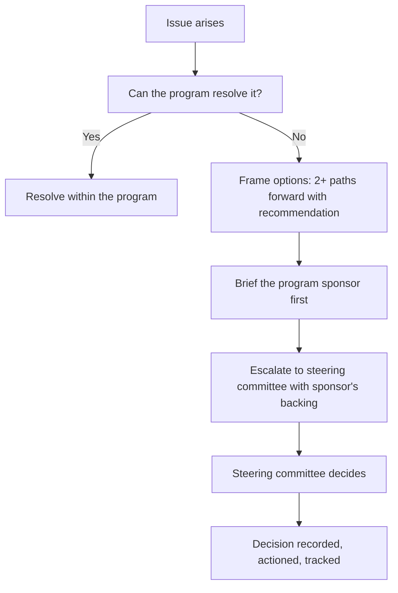

# Executive Communication for TPMs

> **Core skill:** The TPM communicates program status to leadership with radical honesty — bad news early, decisions framed as options, status at the altitude executives need to make resource and strategy choices, and never hiding a problem that will become a crisis.

## Why This Matters

Executive communication is the TPM's highest-stakes channel because executives control the resources, the strategy, and the program's existence. It is also the channel where TPMs are most tempted to shade the truth — "the date is tight but we are tracking" instead of "we will miss the date unless we descope or add headcount." The temptation is survivable in the short term and catastrophic in the long term, because the executive who discovers the truth from someone else never trusts the TPM's status again.

The executive's constraint is attention, not intelligence. They can understand the program deeply — they cannot spend an hour understanding it. The TPM's discipline is compression without distortion: the program's reality in the fewest possible words, with the clearest possible decision ask, and nothing hidden that would change the decision if known.

## The Executive Communication Principles

| Principle | What It Means | What It Rejects |
|-----------|---------------|-----------------|
| Honesty first | Bad news travels up before it travels sideways | Happy-status syndrome; problem-hiding until crisis |
| Options, not problems | Every escalation carries two or more paths forward | Complaint escalation; "we have a problem, what do we do" |
| Time-respecting | Decision-ready in five minutes of reading | Slide decks that require an hour of presentation |
| Decision-forcing | Every communication ends with a clear ask or none | Status without a decision when a decision is due |
| Sponsor-partnered | Executive communications are co-owned with the program sponsor | TPM going to executives alone on sensitive topics |

## The Steering Committee Deck

The steering committee is the program's executive governance forum. The TPM's deck for it follows a strict format that respects executive attention and forces decisions.

| Slide | Content | Rule |
|-------|---------|------|
| 1: Executive Summary | RAG status, top-line milestone forecast, one-sentence program health | One page; readable in 30 seconds |
| 2: Decisions Required | What is being asked, options, recommendation, deadline | Decisions before status — decide first, then review |
| 3: Milestone Dashboard | Key milestones with RAG, forecast finish, variance | Red means "not on track and needs a decision" |
| 4: Top Risks | Top 3-5 risks with impact, mitigation, and decision needed | Risks without decisions are complaints |
| 5: Dependency Status | Critical cross-team dependencies with RAG | Only dependencies the executive can unblock |
| 6: Appendix | Supporting data, detailed timeline, risk register | Referenced, not presented |

The rule: the deck is distributed 48 hours before the meeting. The meeting does not read slides — it resolves the decisions on slide 2. Any slide that requires reading aloud is a waste of executive time.

## Writing Executive Status: The One-Page Rule

The TPM's most frequent executive communication is the status update — an email, a Slack message, or a dashboard snapshot. It follows the one-page rule: if it does not fit on one page, the executive will not read it.

| Section | Content | Length |
|---------|---------|--------|
| Program health | One sentence: "The program is [green/yellow/red]. The top risk is [risk]." | 1 line |
| This period | What was accomplished since the last update | 2-3 bullets |
| Next period | What will be accomplished before the next update | 2-3 bullets |
| Decisions needed | What is being asked of the executive, options, deadline | 2-3 bullets |
| Key risks | Top 3 risks with mitigation status | Table, 3 rows |

A yellow status means "on track with known risks that are managed." A red status means "not on track and needs a decision or intervention." The TPM never calls a program green when it is yellow — the downgrade is harder later, and the executive remembers the false green.

## The Bad News Delivery

Bad news to executives follows a discipline that preserves trust:

1. **Deliver it yourself, before anyone else does.** The executive who hears about a slip from a peer loses trust in the TPM's reporting, not in the peer.
2. **State it in the first sentence.** "The Q3 milestone will slip by four weeks." Not: "We have been working hard on the Q3 milestone, and while progress has been strong, we have encountered..."
3. **Bring the options, not just the problem.** "We can recover by descoping feature X, adding two engineers for six weeks, or accepting the slip. Our recommendation is descoping."
4. **Own the miss.** "We missed the forecast." Not: "External factors caused a delay."
5. **State what changes to prevent recurrence.** "We are adding an integration checkpoint at week three of every milestone to catch this earlier."

The TPM who delivers bad news this way builds executive trust. The TPM who delays, hedges, or blames burns it — and trust burned in the executive channel is trust burned in the channel that controls resources.

## The Escalation Decision Tree

Not everything goes to executives. The TPM escalates when the decision exceeds the program's authority, the risk exceeds the program's risk appetite, or a dependency is blocked outside the program's influence.



The sponsor brief is non-negotiable. The TPM never surprises the sponsor in a steering committee. The sponsor hears the escalation first, shapes it, and owns it in the room.

## When Executives Disengage

Executive disengagement is a program risk: the steering committee attendance drops, pre-reads go unread, decisions stall. The TPM diagnoses the cause before treating the symptom.

| Cause | Signal | TPM Response |
|-------|--------|--------------|
| No decisions needed | Steering committee is status-only; executives delegate attendance | Restructure: fewer meetings, only when decisions are due |
| Status is always green | Executives assume the program runs itself | Report honestly; yellow status when risks are present |
| Wrong altitude | Too much detail or too little; executives cannot act on the information | Adjust to decision-forcing content at resource-allocation altitude |
| Trust lost | A previous surprise damaged credibility | Rebuild through honest, boring status; over-communicate for two cycles |
| Sponsor absent | Sponsor not visibly backing the program | Escalate to the sponsor first: their disengagement is the problem |

## Practical Applications

### Executive Status Template

```markdown
# [Program Name] — Status Update — [Date]

**Program Health: [Green / Yellow / Red]**
[One-sentence explanation. Red always names the decision needed.]

## This Period
- [Accomplishment 1]
- [Accomplishment 2]
- [Accomplishment 3]

## Next Period
- [Planned 1]
- [Planned 2]
- [Planned 3]

## Decisions Needed
| Decision | Options | Recommendation | Deadline |
|----------|---------|----------------|----------|
| [What]   | [A / B / C] | [Choice, reason] | [Date] |

## Top Risks
| Risk | Impact | Mitigation | Status |
|------|--------|------------|--------|
| [Risk] | [Impact] | [Mitigation] | [RAG] |
```

### Executive Communication Checklist

- [ ] Status is honest: red when it is red, yellow when risks are managed
- [ ] Bad news is delivered by the TPM, before anyone else, with options
- [ ] Steering committee decks are pre-read 48 hours before the meeting
- [ ] Steering committee time is spent on decisions, not reading slides
- [ ] Every escalation carries options and a recommendation
- [ ] The program sponsor is briefed before any steering committee escalation
- [ ] Status fits on one page; the executive can act on it in 30 seconds

## Common Pitfalls

| Pitfall | Why It Is a Problem | Better Approach |
|---------|---------------------|-----------------|
| **Happy-status syndrome** | Problems hidden until crisis; trust destroyed | Report yellow when risks are known; red when intervention is needed |
| **Complaint escalation** | "We have a problem" — no options, no recommendation | Escalate options, not problems |
| **Surprising the sponsor** | Sponsor blindsided in steering committee; credibility lost | Brief the sponsor before every steering committee |
| **Status without decisions** | Executive time spent on information, not decision-making | Every steering committee has at least one decision on the agenda |
| **Too much detail** | Executives cannot extract the decision signal from the noise | One page; decision on top; appendix for detail |
| **Delayed bad news** | The rumor arrives first; the TPM's version arrives as damage control | Deliver bad news immediately, with options |

## Success Indicators

- Executives cite the TPM's status as their source of program truth
- Steering committee meetings end with recorded decisions, not deferred discussion
- Bad news reaches executives from the TPM first, consistently
- The sponsor pre-briefs the TPM, not the other way around
- Executives attend steering committees because decisions are being made there

## Related Topics

- [[02_Communication_Planning]]: the plan that determines executive cadence and channel
- [[04_Managing_Stakeholder_Expectations]]: the expectation management that prevents executive surprises
- [[05_Stakeholder_Negotiation]]: negotiating scope and resources with executive stakeholders
- [[06_Decision_Facilitation/00_overview|Decision Facilitation]]: the steering committee is a decision forum
- [[career-path/11_Engineering_Manager/07_Manager_Communication/02_Representing_the_Team_Upward|Representing the Team Upward (EM)]]: the EM's upward communication discipline

## Summary

Executive communication for TPMs is the discipline of compression without distortion: honest status that calls red when it is red, bad news delivered first with options, steering committee decks that respect attention and force decisions, and escalation that carries recommendation to the sponsor before it reaches the room. The TPM who communicates to executives this way builds the trust that controls resources; the TPM who shades the truth burns it — and trust burned in the executive channel is trust that does not return.