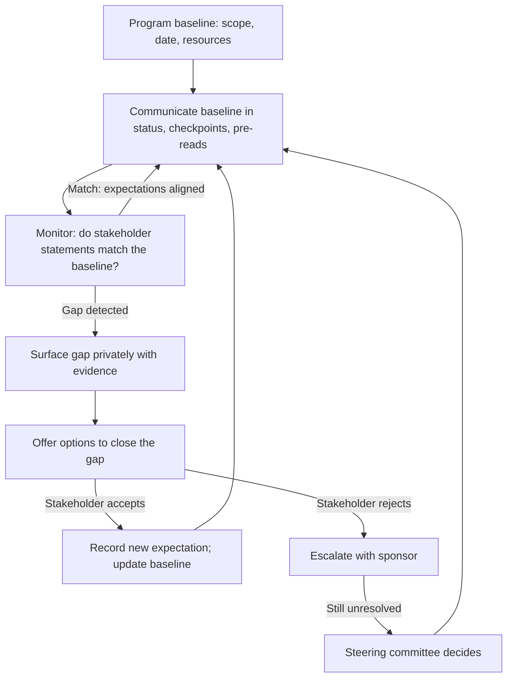

# Managing Stakeholder Expectations

> **Core skill:** The TPM keeps stakeholder expectations in honest contact with program reality — detecting when expectations and reality have diverged, correcting the divergence before it becomes a crisis, and never letting hope be mistaken for a commitment.

## Why This Matters

Expectation management is the TPM's daily alignment work. It is not a quarterly presentation or a steering committee agenda item — it is the continuous discipline of ensuring that what stakeholders believe about the program matches what the program is actually doing. When expectations and reality stay in contact, the program is boring — and boring is the goal. When they diverge, the program generates a surprise, and surprises are the TPM's failure mode.

The divergence mechanism is innocent: the engineering team gives a best-case estimate, product hears a commitment, leadership builds a roadmap, and nobody said anything false. The TPM's job is to catch these divergences at formation — when the estimate is still an estimate, the commitment is still a target, and the roadmap is still a draft — and to correct them before they harden into expectation.

## The Expectation-Reality Gap

The gap between expectation and reality forms in predictable ways and widens in predictable patterns.

| Formation Pattern | How It Happens | TPM Intervention |
|-------------------|----------------|------------------|
| Aspiration-as-commitment | A target date becomes a promise | "That is our target. Our confidence is medium because of dependency X. We will update the forecast at [checkpoint]." |
| Best-case-as-plan | The optimistic scenario becomes the baseline | "The range is 8-12 weeks. We are planning for 10, with a 20% chance of 12." |
| Silence-as-assent | Nobody objects, so everyone assumes agreement | "Here is what we committed to. Reply if this does not match your understanding." |
| Status-optimism | Green status hides yellow reality | "The program is yellow: on track with managed risks in dependencies and headcount." |
| Scope-creep-without-date-change | More work added, same date expected | "Adding feature X extends the timeline by 3 weeks. Here are the options: descope Y, extend to [date], or add headcount." |

## The Expectation Correction Sequence

When the TPM detects a gap between what a stakeholder believes and what the program can deliver, the correction follows a sequence — escalating in directness only if the softer intervention fails.

| Step | Action | Example |
|------|--------|---------|
| 1. Surface the gap | Name the difference between expectation and reality, privately | "I want to make sure we are aligned. My read of the program is [reality]. Your read seems to be [expectation]. Let me explain the gap." |
| 2. Provide the evidence | Show the data that supports reality | "Here is the milestone trend, the dependency status, and the team's velocity data." |
| 3. Offer options | Do not just correct the expectation — offer paths forward | "Given the reality, we can [option A], [option B], or [option C]. Our recommendation is [A]." |
| 4. Record the new expectation | Write down what was agreed and who owns it | "Per our conversation, the new milestone date is [date], with [scope], contingent on [condition]. I will track this in the program status." |
| 5. Escalate if necessary | If the stakeholder rejects reality, escalate with the program sponsor | "We have a gap between stakeholder expectation and program reality. The stakeholder expects [X]; the program can deliver [Y]. Options: [A/B/C]." |

The sequence matters: surface privately before publicly, provide evidence before offering options, offer options before escalating. A public correction embarrasses; a private one aligns.

## The Status Report as Expectation Anchor

The TPM's weekly status report is the program's expectation anchor — the artifact that says "this is what is true right now." Every stakeholder who reads it shares the same baseline. Every stakeholder who does not read it has a different baseline.

The status report anchors expectations through three disciplines:

| Discipline | What It Means | Example |
|------------|---------------|---------|
| Forecast, not just actuals | Every milestone shows the current forecast finish date, not just what was done | "Milestone M3: forecast Oct 15 (was Oct 1; slip due to dependency X)" |
| Confidence labels | Every forecast carries a confidence label: high, medium, low | "Forecast: Oct 15 (medium confidence; dependency X is the variable)" |
| Variance explanation | Every change from the previous forecast is explained | "M3 slipped 2 weeks from last report. Cause: team Y deprioritized the API. Mitigation: sponsor escalation in progress." |

## Preventing Expectation Drift

Prevention is cheaper than correction. The TPM builds expectation management into the program's communication rhythm so that drift is caught before it becomes a gap.

| Prevention Mechanism | How It Works | Frequency |
|----------------------|--------------|-----------|
| Written status with forecasts | Every stakeholder sees the same forecast every week | Weekly |
| Milestone checkpoint meetings | Formal review of milestone forecast vs. commitment at key points | Per milestone |
| "No-surprises" rule | Any change that affects a stakeholder's expectation is communicated to them directly before it appears in status | Continuous |
| Expectation confirmation | After key meetings, the TPM writes: "Here is what I believe we agreed. Reply if incorrect." | After every decision meeting |
| Pre-steering-committee alignment | Stakeholder expectations are aligned before the steering committee, not during it | Before every steering committee |

## When Stakeholders Reject Reality

Some stakeholders refuse to accept that the program cannot meet their expectation. The TPM's response is not to argue harder — it is to make the gap visible in a forum where the stakeholder cannot ignore it.

| Escalation | Forum | Content |
|------------|-------|---------|
| Level 1 | One-on-one with the stakeholder | "Here is the data. Here are the options. What would you like to do?" |
| Level 2 | Sponsor + stakeholder | Sponsor reinforces the reality with authority the TPM lacks |
| Level 3 | Steering committee | Options presented as a decision: "The program can deliver X by date Y, or X+Z by date Y+W. Which do we choose?" |

The steering committee is the final forum because it forces a decision. A stakeholder who rejects reality in a steering committee must either accept it or produce an alternative that the committee accepts. The TPM's job is to frame the decision so that the options are clear, the trade-offs are priced, and the committee cannot defer.



## Practical Applications

### Expectation Gap Brief Template

```markdown
# Expectation Gap — [Stakeholder] — [Date]

## The Gap
- Stakeholder expectation: [what they believe]
- Program reality: [what the program can deliver]
- Gap description: [quantified difference — date, scope, quality]

## Evidence
- [Data point 1]
- [Data point 2]
- [Data point 3]

## Options
| Option | Description | Consequence | Recommendation |
|--------|-------------|-------------|----------------|
| A | [What] | [Impact] | [Yes/No, reason] |

## Agreed Resolution
- New expectation: [what was agreed]
- Owner: [who owns making it happen]
- Next checkpoint: [date]
```

### Expectation Management Checklist

- [ ] Every milestone forecast includes a confidence label and variance explanation
- [ ] Expectation gaps are surfaced privately with evidence before public correction
- [ ] After every decision meeting, the TPM writes a confirmation of what was agreed
- [ ] Stakeholder-facing changes are communicated to the stakeholder before they appear in status
- [ ] The status report is the program's single source of truth for expectations
- [ ] Stakeholders who reject reality are escalated through the defined path

## Common Pitfalls

| Pitfall | Why It Is a Problem | Better Approach |
|---------|---------------------|-----------------|
| **Hope-as-plan** | "We think we can make it" becomes a commitment nobody agreed to | Label every forecast with its confidence; never let hope travel without its probability |
| **Public correction** | Correcting a stakeholder in a meeting embarrasses and hardens resistance | Surface privately first; escalate to public forums only when private fails |
| **Silence-as-alignment** | Nobody objects, so the TPM assumes alignment; drift continues | Write confirmation after every decision meeting; ask for explicit correction |
| **Greenwashing** | Yellow status reported as green to avoid difficult conversations | Report yellow when risks are known; the difficult conversation is cheaper early |
| **Forecast-without-variance** | "Date changed" without "here is why and what we are doing about it" | Every forecast change explains the cause and the mitigation |

## Success Indicators

- Stakeholders restate program forecasts accurately in their own meetings
- Expectation gaps are detected and closed before they become meeting surprises
- The status report is the program's expectation anchor — cited by stakeholders
- No stakeholder uses a date the TPM did not publish
- Steering committees never discover an expectation gap that the TPM knew about earlier

## Related Topics

- [[02_Communication_Planning]]: the communication architecture that delivers expectations
- [[03_Executive_Communication_for_TPMs]]: managing executive expectations specifically
- [[05_Stakeholder_Negotiation]]: when expectation gaps require negotiation to resolve
- [[01_Program_Structure_and_Charter/00_overview|Program Structure and Charter]]: the charter is the original expectation baseline
- [[07_Benefits_and_Outcome_Measurement/00_overview|Benefits and Outcome Measurement]]: outcome expectations versus delivery expectations

## Summary

Managing stakeholder expectations is the TPM's continuous alignment discipline: detecting when what stakeholders believe diverges from what the program can deliver, correcting the divergence privately with evidence and options, anchoring expectations in a weekly status report with forecasts and confidence labels, and escalating through sponsor to steering committee when stakeholders reject reality. The TPM who keeps expectations in contact with reality produces a boring program — and boring is the goal.