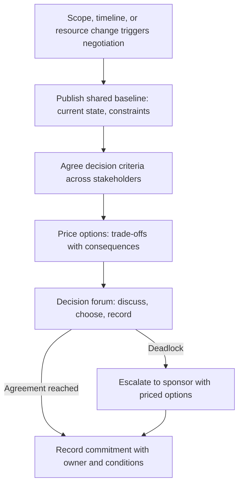

# Stakeholder Negotiation

> **Core skill:** The TPM negotiates scope, timeline, and resources across stakeholder groups — not by splitting differences but by pricing trade-offs, framing options in shared criteria, and producing commitments that survive because both sides see their interest in the outcome.

## Why This Matters

Every program negotiation is a trade-off conversation that nobody wants to have: engineering wants more time, product wants more scope, leadership wants less cost, and the TPM is the person who must broker an agreement among groups with genuinely different incentives. The TPM does not decide the trade-off — the TPM structures the conversation so that a decision can be made without anyone feeling ambushed, railroaded, or robbed.

TPM negotiation is not positional bargaining — "I want 8 weeks, you want 6, let's split at 7." Splitting the difference produces a commitment nobody is satisfied with and nobody is accountable for. The TPM negotiates by pricing the trade-off: "If you want feature X, it costs 3 weeks. If you want the date, you must descope Y or Z. Which trade-off do you prefer?" The decision belongs to the stakeholders; the pricing belongs to the TPM.

## The TPM's Negotiation Stance

The TPM negotiates from a specific stance — not as an advocate for any stakeholder group but as the neutral broker who makes trade-offs visible and decisions possible.

| Stance | What It Means | What It Rejects |
|--------|---------------|-----------------|
| Neutral broker | The TPM represents the program's interests, not any stakeholder group's | Advocating for engineering over product, or vice versa |
| Trade-off pricer | The TPM prices options: "X costs Y" | Positional bargaining: splitting the difference |
| Criteria builder | The TPM helps stakeholders agree on what a good decision looks like before arguing the decision | Arguing outcomes without agreed criteria |
| Commitment recorder | The TPM records what was agreed, by whom, with what conditions | Verbal handshakes that evaporate into ambiguity |

## The Negotiation Framework: Price, Don't Split

| Positional Bargaining | Trade-Off Pricing |
|------------------------|-------------------|
| "We need 8 weeks." "You have 6." "Let's do 7." | "At 6 weeks, you get features A and B. Feature C costs 2 more weeks. Which matters more, the date or feature C?" |
| Produces a compromise nobody owns | Produces a decision the stakeholder owns because they chose the trade-off |
| The TPM is the middleman | The TPM is the pricer; the stakeholder is the decider |

The framework has four steps:

1. **Define the constraint.** Which variable is fixed — scope, date, or resources? You cannot negotiate all three at once.
2. **Price the options.** "Adding feature X costs Y weeks. Descoping feature Z saves Y weeks. Adding two engineers accelerates by W weeks."
3. **Establish criteria.** "We are deciding between scope and date. The criteria: customer commitment Q, revenue impact R, engineering cost S."
4. **Force the choice.** "Given the criteria, which trade-off do you choose? The choice is yours; the consequences are priced."

## Negotiating with Different Stakeholder Types

Different stakeholders negotiate differently. The TPM adapts the approach to the stakeholder, not the other way around.

| Stakeholder Type | Negotiation Style | TPM Approach |
|------------------|-------------------|--------------|
| Executive | High-level; wants options and recommendations | Frame as a decision: "Here are the options, each priced. Our recommendation is A. What do you choose?" |
| Engineering lead | Detail-oriented; wants technical justification | Show the technical trade-off: "Adding feature X means deferring refactor Y. The risk is Z. Is that acceptable?" |
| Product lead | Scope-driven; wants maximum features | Price every scope request: "Feature X costs Y weeks or Z engineers. Which existing feature would you trade?" |
| Operations / Security | Risk-averse; wants guarantees | Price risk reduction: "Mitigation X costs Y weeks and reduces risk from high to medium. Is that worth the schedule impact?" |
| External vendor / partner | Contract-driven; wants clarity on obligations | Frame as dependency negotiation: "We need deliverable X by date Y. If you cannot commit, here is the alternative plan." |

## The Multi-Stakeholder Negotiation

When the negotiation involves multiple stakeholder groups with conflicting interests, the TPM runs a structured process that prevents bilateral deals from undermining the program.

| Step | Action | Output |
|------|--------|--------|
| 1. Shared baseline | Publish the current state: scope, date, resources, risks | A document every stakeholder reads before the negotiation |
| 2. Criteria workshop | Stakeholders agree on the criteria for evaluating trade-offs | A ranked list of criteria: e.g., customer commitment > cost > engineer morale |
| 3. Option pricing | TPM prices all feasible trade-offs against the criteria | A menu: "Option A trades X for Y at cost Z" |
| 4. Decision forum | Stakeholders meet, discuss options against criteria, decide | A recorded decision with rationale and dissent |
| 5. Commitment recording | The decision, trade-offs, and conditions are written and distributed | A commitment artifact that survives the meeting |

The criteria workshop is the step most TPMs skip — and the step that prevents the negotiation from becoming a series of bilateral deals where engineering gives product extra scope on Monday and operations extracts extra time on Tuesday, and neither knows about the other's deal.

## When Negotiation Fails

Some negotiations do not produce agreement. The TPM has a defined escalation path for deadlock.

| Deadlock Type | TPM Response |
|---------------|--------------|
| Criteria disagreement | Escalate to the criteria workshop: "We cannot agree on the trade-off because we disagree on what matters. Let's agree on criteria first." |
| Authority gap | The stakeholders at the table lack decision authority | Escalate to the decision-maker: "We have priced options A, B, and C. [Decider], which do you choose?" |
| Zero-sum deadlock | Both sides lose something they consider non-negotiable | Escalate to the program sponsor: "The program cannot proceed without a decision. Here are the options and consequences." |
| Bad-faith negotiation | One side is negotiating to delay, not to agree | Name the pattern with the sponsor; set a decision deadline; escalate if missed |



## Practical Applications

### Negotiation Brief Template

```markdown
# Negotiation Brief — [Topic] — [Date]

## The Situation
- Constraint: [scope / date / resources — which is fixed?]
- Stakeholders: [who, with what interest]

## Shared Baseline
- Current scope: [list]
- Current date: [date]
- Current resources: [headcount, budget]

## Decision Criteria (agreed by stakeholders)
1. [Criterion 1]
2. [Criterion 2]
3. [Criterion 3]

## Priced Options
| Option | Scope | Date | Resources | Risks | Against Criteria |
|--------|-------|------|-----------|-------|------------------|
| A      | [scope] | [date] | [resources] | [risks] | [how it scores] |

## Recommendation
- [Option], with [confidence], because [reasoning against criteria]

## Decision
- Chosen option: [ ]
- Rationale: [ ]
- Dissent: [ ]
- Conditions: [ ]
- Owner: [ ]
```

### Stakeholder Negotiation Checklist

- [ ] The constraint is defined: which variable is fixed — scope, date, or resources?
- [ ] All affected stakeholders are at the table before negotiation begins
- [ ] Decision criteria are agreed before options are discussed
- [ ] Every option is priced: cost, benefit, risk
- [ ] The decision forum produces a recorded commitment with owner and conditions
- [ ] Bilateral deals are surfaced and reconciled in the shared forum
- [ ] Deadlock is escalated through the defined path, not allowed to stall the program

## Common Pitfalls

| Pitfall | Why It Is a Problem | Better Approach |
|---------|---------------------|-----------------|
| **Splitting the difference** | Produces a compromise nobody owns; the commitment is soft | Price trade-offs; let stakeholders choose |
| **Negotiating without criteria** | Stakeholders argue preferences, not trade-offs; no basis for resolution | Agree criteria first; evaluate options against them |
| **Bilateral deals** | Engineering gives product scope in exchange for nothing visible; later trades conflict | All trade-offs visible in the shared negotiation forum |
| **TPM as advocate** | The TPM loses neutrality; one stakeholder group disengages | TPM as neutral broker; sponsor as advocate when advocacy is needed |
| **Verbal agreements** | "We agreed" means different things to different people a week later | Write the commitment immediately; distribute for confirmation |

## Success Indicators

- Stakeholders can restate the trade-off they made and why
- Commitments from negotiations survive execution without re-litigation
- No stakeholder group claims they were excluded from a trade-off that affects them
- Deadlocks are escalated with priced options, not complaints
- Bilateral deals are invisible — all trade-offs are surfaced in the program status

## Related Topics

- [[04_Managing_Stakeholder_Expectations]]: negotiation is how expectation gaps are resolved
- [[06_Stakeholder_Conflict_Resolution]]: when negotiation becomes conflict resolution
- [[03_Executive_Communication_for_TPMs]]: escalating negotiation deadlocks to executives
- [[06_Decision_Facilitation/02_Decision_Framing|Decision Framing]]: the option-pricing discipline
- [[career-path/03_Staff_Engineer/04_Influence_and_Alignment/02_Pre_Alignment_and_Coalitions|Pre-Alignment and Coalitions (Staff)]]: building support before the negotiation forum

## Summary

Stakeholder negotiation for TPMs is trade-off pricing, not positional bargaining: defining the constraint, pricing every option against agreed criteria, running a shared forum where all stakeholders see every trade-off, and producing commitments that survive because each stakeholder chose their trade-off. The TPM is the neutral broker who makes choices possible; the stakeholders are the deciders who own the consequences.