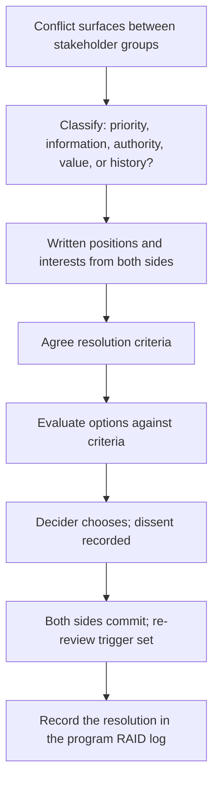

# Stakeholder Conflict Resolution

> **Core skill:** The TPM resolves conflicts between stakeholder groups — surfacing the real disagreement behind the stated one, structuring the resolution in the program's governance rather than in hallways, and producing outcomes that both sides can commit to because the process was fair, not because their side won.

## Why This Matters

Cross-team programs surface conflicts that single-team work absorbs. Engineering wants to refactor; product wants the feature. Security wants a review; the vendor wants a signature. The executive wants the date; the data suggests the date is wrong. These are not communication failures — they are genuine conflicts of interest, and they are the reason programs need a TPM instead of a status spreadsheet.

The TPM's conflict resolution discipline is not mediation in the therapeutic sense. It is process: surfacing the conflict in the right forum, structuring it so that both sides are arguing from the same evidence against the same criteria, and producing a decision that sticks because the process was visible and fair. Conflicts resolved in hallways produce grudges; conflicts resolved in governance produce commitments.

## The Conflict Taxonomy

Not all stakeholder conflicts are the same. The TPM classifies the conflict before attempting resolution — because the wrong resolution approach makes the conflict worse.

| Conflict Type | What It Looks Like | Root Cause | Resolution Approach |
|---------------|-------------------|------------|---------------------|
| Priority conflict | Two groups want different things from the same constrained resource | Genuine scarcity; both wants are legitimate | Trade-off pricing against shared criteria |
| Information asymmetry | One group knows something the other does not; the conflict dissolves with shared data | Gaps in the communication architecture | Shared data, joint review, evidence-first discussion |
| Authority conflict | Disagreement over who gets to decide | Unclear decision rights in governance | Clarify decision rights; escalate the meta-question to the sponsor |
| Value conflict | Different groups value different outcomes (quality vs. speed, security vs. features) | Deep difference in incentives; not resolvable by data | Agree criteria that weight both values; let the decider choose |
| History conflict | The current issue is a proxy for an old grievance | Unresolved past conflict between the same people | Name the pattern; separate the people from the current question; structured process |

The history conflict is the most dangerous because it presents as a priority conflict. The TPM who tries to resolve a history conflict with data will fail — the data is not the issue. History conflicts require naming the pattern and, often, escalation to leadership.

## The Conflict Resolution Process

| Step | Action | Owner | Output |
|------|--------|-------|--------|
| 1. Surface | Name the conflict in the program governance, not in a hallway | TPM | "We have a conflict between [group A] and [group B] on [question]." |
| 2. Classify | Determine the conflict type | TPM | Classification drives the resolution approach |
| 3. Separate positions from interests | Each side states what they want (position) and why they want it (interest) | Both sides, facilitated by TPM | Written positions and interests |
| 4. Agree resolution criteria | Both sides agree on how the decision will be evaluated | Both sides, facilitated by TPM | A short, ranked list of criteria |
| 5. Evaluate options against criteria | Options are assessed against the agreed criteria | TPM + both sides | Scored options |
| 6. Decide | The decider chooses; dissent is recorded | Decider (sponsor or steering committee) | Recorded decision with rationale |
| 7. Commit | Both sides commit to the decision; re-review conditions are set | Both sides | Explicit commitment; re-review trigger |

## The TPM's Conflict Facilitation Stance

The TPM facilitates conflict resolution from a specific stance that preserves neutrality and keeps the process moving.

| TPM Does | TPM Does Not |
|----------|--------------|
| Surface the conflict in the right forum | Let the conflict fester in private channels |
| Insist on written positions before discussion | Let the meeting become unstructured argument |
| Help both sides articulate interests behind positions | Advocate for one side's interest |
| Propose criteria and facilitate agreement on them | Impose criteria without stakeholder buy-in |
| Escalate with priced options when deadlocked | Escalate with complaints or blame |
| Record the decision, dissent, and commitment | Let the decision evaporate into verbal agreement |

## The Conflict Escalation Path

When the TPM cannot resolve the conflict at the program level — because the stakeholders lack authority, the criteria cannot be agreed, or the conflict is fundamentally about values — escalation follows a defined path.

| Level | Forum | Escalation Trigger | Content |
|-------|-------|--------------------|---------|
| 1. Program | TPM-facilitated resolution process | Standard conflict | Written positions, agreed criteria, scored options |
| 2. Sponsor | TPM + program sponsor | Deadlock at Level 1; authority gap | Priced options with sponsor's authority behind the process |
| 3. Steering committee | Executive governance forum | Value conflict; deadlock at Level 2 | Decision framed as a choice between priced options with consequences |

The sponsor is the bridge between program-level resolution and executive decision. The TPM never escalates to the steering committee without the sponsor's backing — because the steering committee needs to see a unified program position, not a TPM appealing over the sponsor's head.

## Recording Conflict Resolution

A conflict resolution that is not recorded did not happen. The record serves three purposes: it confirms what was decided, it captures dissent so it can be revisited, and it sets the conditions for re-review.

| Record Element | Content |
|----------------|---------|
| The conflict | What was in dispute, between whom |
| The process | Classification, positions, criteria |
| The decision | What was chosen, by whom, on what date |
| The rationale | Why this choice, against the criteria |
| The dissent | Who disagreed, on what grounds, with what alternative |
| The commitment | Each side's stated commitment to the decision |
| Re-review trigger | What would cause the decision to be revisited |



## Practical Applications

### Conflict Resolution Brief Template

```markdown
# Conflict Resolution Brief — [Topic] — [Date]

## The Conflict
- Between: [stakeholder A] and [stakeholder B]
- On: [question in dispute]
- Type: [priority / information / authority / value / history]

## Position A: [Stakeholder A]
- Position: [what they want]
- Interest: [why they want it]
- Evidence: [supporting data]

## Position B: [Stakeholder B]
- Position: [what they want]
- Interest: [why they want it]
- Evidence: [supporting data]

## Agreed Criteria
1. [Criterion 1]
2. [Criterion 2]

## Options Scored Against Criteria
| Option | Criterion 1 | Criterion 2 | Total |
|--------|-------------|-------------|-------|
| A      | [score]      | [score]      | [score] |

## Decision
- Chosen: [option]
- Decider: [name]
- Rationale: [reasoning]
- Dissent: [who, grounds, alternative]
- Commitment: [each side's commitment]
- Re-review trigger: [condition]
```

### Conflict Resolution Checklist

- [ ] The conflict is surfaced in program governance, not handled in private channels
- [ ] The conflict is classified before resolution is attempted
- [ ] Both sides have written their positions and interests
- [ ] Resolution criteria are agreed before options are evaluated
- [ ] The decider is identified and has authority to decide
- [ ] Dissent is recorded with re-review conditions
- [ ] Both sides state their commitment to the decision explicitly
- [ ] The resolution is recorded in the program RAID log

## Common Pitfalls

| Pitfall | Why It Is a Problem | Better Approach |
|---------|---------------------|-----------------|
| **Resolving before classifying** | A history conflict treated as a priority conflict resists data and deepens | Classify first; match resolution approach to type |
| **Hallway resolution** | Conflicts resolved informally produce grudges, not commitments | Surface in governance; record in RAID |
| **TPM as advocate** | The TPM loses neutrality; the other side disengages from the process | Facilitate; never advocate |
| **Criteria imposed, not agreed** | One side rejects the criteria and therefore rejects the outcome | Facilitate criteria agreement before evaluating options |
| **Verbal resolution** | "We resolved it" evaporates a week later into "we never agreed" | Record the decision, rationale, dissent, commitment, and re-review trigger |
| **Crushing dissent** | Silencing the losing side produces fake commitment that collapses in execution | Record dissent; ask for explicit commitment; set re-review conditions |

## Success Indicators

- Stakeholder conflicts surface early in governance, not late in execution
- Both sides can restate the other's position accurately before resolution
- Decisions are recorded with rationale, dissent, and commitment
- Resolved conflicts do not re-emerge as the same argument in a different forum
- Stakeholders who lost the argument are seen committing fully to the decision

## Related Topics

- [[05_Stakeholder_Negotiation]]: negotiation is conflict resolution before it hardens
- [[04_Managing_Stakeholder_Expectations]]: expectation gaps are the most common conflict source
- [[01_Stakeholder_Mapping]]: the map surfaces conflicts early
- [[06_Decision_Facilitation/06_Managing_Decision_Disagreement|Managing Decision Disagreement]]: the decision-side counterpart
- [[career-path/03_Staff_Engineer/04_Influence_and_Alignment/03_Managing_Disagreement|Managing Disagreement (Staff)]]: the staff engineer's conflict resolution craft

## Summary

Stakeholder conflict resolution is the TPM's governance discipline: surfacing conflict in the right forum, classifying its type before attempting resolution, structuring it through written positions and agreed criteria, producing a decision with recorded dissent and explicit commitment, and escalating with priced options when deadlocked. Conflicts resolved in governance produce commitments; conflicts resolved in hallways produce grudges — and grudges break programs.