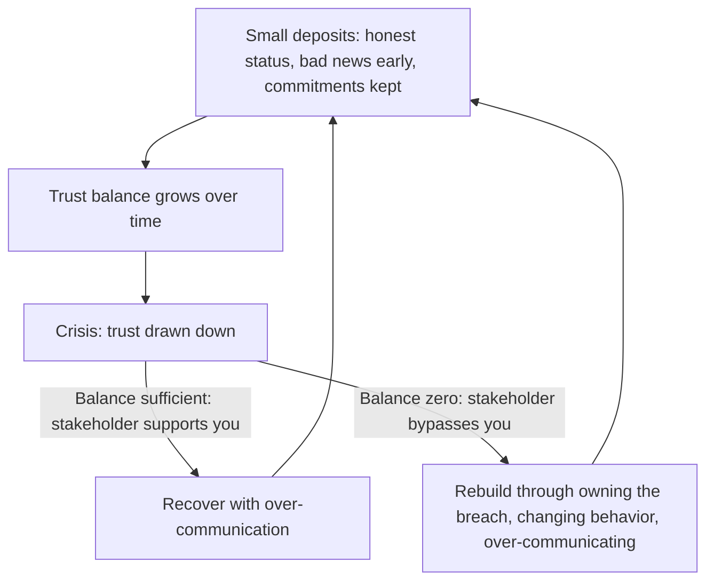

# Building Stakeholder Trust

> **Core skill:** The TPM builds stakeholder trust through consistent, boring honesty — delivering bad news early, keeping commitments visible, admitting uncertainty, and accumulating a reputation that makes the next program's stakeholder conversations start from trust instead of skepticism.

## Why This Matters

Stakeholder trust is the TPM's career asset. A TPM who is trusted gets the benefit of the doubt when a date slips, when a risk materializes, when a decision is contested. A TPM who is not trusted gets second-guessed, micro-managed, and bypassed — and the overhead of being second-guessed consumes the energy that should go to program management.

Trust is not built in steering committees. It is built in the thousand small communications between them: the status update that called yellow when it could have called green, the Friday email that flagged a risk before it was a problem, the admission that "we don't know yet" instead of the invented answer. Trust is earned in the boring moments and drawn down in the crises — and a TPM who has not banked enough boring trust has nothing to draw down when the crisis comes.

## The Trust Bank Account

Think of stakeholder trust as a bank account: deposits are accumulated through consistent honest behavior; withdrawals happen in crises. A TPM with a large balance survives a program failure. A TPM with a zero balance does not survive a missed date.

| Trust Deposit | Trust Withdrawal |
|---------------|------------------|
| Delivering bad news before anyone else knows | Stakeholder learns about the problem from someone else |
| Admitting "I don't know yet, here is when I will" | Inventing an answer that later proves false |
| Status that calls yellow when it is yellow | Status that calls green when it is actually yellow |
| Forecasting a range with confidence, not a point with certainty | Promising a date with no basis, then missing it |
| Following through on every commitment, small and large | "I'll get back to you" — and not getting back |
| Giving credit to the teams doing the work | Taking credit for outcomes the TPM coordinated but did not produce |

## The Trust-Building Behaviors

| Behavior | What It Looks Like | Why It Builds Trust |
|----------|--------------------|---------------------|
| Bad news early | "We have identified a risk that could delay M3. Here is what we know, what we are doing, and when we will have more information." | The stakeholder learns from you, not from the rumor mill; you are the source of truth |
| Honest status | The program is yellow because dependency X is at risk; here is the mitigation | Stakeholders learn that yellow means yellow — so when you call green, they believe it |
| Admitted uncertainty | "The forecast range is 8-12 weeks. We will narrow it to 2 weeks by the next checkpoint." | Certainty claims that later collapse destroy more trust than uncertainty ever does |
| Commitment discipline | Every promise — a follow-up email, a status update, a decision brief — is delivered on time | Small commitments kept build the credibility for large commitments |
| No surprises | A change that affects a stakeholder is communicated to them before it appears in group status | The stakeholder never learns about their program from a peer's question |
| Credit to teams | "The engineering team delivered M2 two weeks early through [specific action]" | Stakeholders trust a TPM who does not claim credit they did not earn |

## The Trust-Building Timeline

Trust accumulates slowly and can be destroyed in a single event. The TPM understands the timeline and plans for it.

| Phase | Duration | Trust Activity |
|-------|----------|----------------|
| Program initiation | First 4 weeks | Deliver the stakeholder map, communication plan, and program charter on time; run the first steering committee perfectly |
| Early delivery | First 2 milestones | Hit the first commitments; if you cannot, communicate the miss before it happens |
| Steady state | Middle of program | Boring, consistent status; every communication on time; every commitment tracked |
| Crisis | Any point | Draw down on accumulated trust; honest about severity; options, not complaints |
| Closure | Final milestone | Honest benefits assessment; credit to teams; lessons recorded |

The first four weeks are disproportionately important because stakeholders form their trust baseline quickly. A TPM who delivers the charter late and runs a chaotic first steering committee starts from a deficit that takes months to recover.

## Rebuilding Trust After a Breach

Trust breaches happen — a missed commitment, a hidden problem, a stakeholder surprised. The TPM's response determines whether trust recovers or is permanently lost.

| Step | Action | Example |
|------|--------|---------|
| 1. Own it immediately | "I should have told you about this earlier. I did not. Here is the situation now." | No defensiveness, no blaming external factors, no minimizing |
| 2. Explain what happened | "The delay occurred because [cause]. I knew about it on [date] and did not escalate because [reason — usually over-optimism or fear]." | Honest diagnosis, including self-diagnosis |
| 3. State what changes | "Going forward, I will flag any milestone variance greater than one week within 24 hours, directly to you." | A specific, observable change in behavior |
| 4. Over-communicate for a period | For the next two cycles, the TPM communicates more frequently and in more detail than normal | Temporary over-communication re-establishes the signal |
| 5. Deliver the changed behavior | The new behavior is demonstrated consistently until the stakeholder stops expecting the old behavior | Trust is rebuilt by evidence, not promises |

The trust rebuild is slow — expect two to three cycles of over-communication before the stakeholder stops checking. The TPM who tries to fast-forward through apology to restored trust is the TPM who breaches again.

## Trust Across Stakeholder Types

Different stakeholders trust differently. The TPM adapts trust-building to the stakeholder.

| Stakeholder Type | Trust Currency | How to Earn It |
|------------------|----------------|----------------|
| Executive | Predictability and honesty | Consistent, honest status; bad news early; decisions framed as options |
| Engineering lead | Technical credibility and follow-through | Understanding the technical reality; delivering on commitments to the team |
| Product lead | Scope and date reliability | Accurate forecasting; scope trade-offs priced honestly |
| Security / Ops | Risk transparency | Never hiding a risk; escalating security concerns immediately |
| Program sponsor | No surprises and shared ownership | Pre-briefing before every steering committee; sharing credit and blame |



## Practical Applications

### Trust Audit Template

```markdown
# Stakeholder Trust Audit — [Program Name] — [Date]

## Trust Assessment per Stakeholder
| Stakeholder | Trust Level (High/Medium/Low) | Evidence | Actions to Build/Rebuild |
|-------------|-------------------------------|----------|--------------------------|
| [Name]      | [H/M/L]                       | [What they do that signals trust level] | [Specific actions] |

## Trust Signals
- High: stakeholder cites your status; gives benefit of doubt; asks you first
- Medium: stakeholder reads your status; asks questions but accepts answers
- Low: stakeholder bypasses you; double-checks your data; surprises you in meetings

## Trust-Building Plan
- [ ] [Action 1 — specific, dated, observable]
- [ ] [Action 2]
- [ ] [Action 3]
```

### Building Trust Checklist

- [ ] Bad news is delivered by the TPM before anyone else knows
- [ ] Status reports call the honest color: yellow when yellow, red when red
- [ ] Uncertainty is admitted with a timeline for resolution
- [ ] Every commitment — small and large — is tracked and delivered
- [ ] Stakeholders are never surprised about their own program in a group forum
- [ ] Credit is given to teams; blame is owned by the TPM
- [ ] The program sponsor is pre-briefed before every steering committee
- [ ] Trust breaches are owned immediately with a specific behavior change plan

## Common Pitfalls

| Pitfall | Why It Is a Problem | Better Approach |
|---------|---------------------|-----------------|
| **Happy-status investing** | Green status today builds a false trust balance that collapses at the first red | Call yellow when it is yellow; honest status is the only trust currency |
| **Certainty theater** | Inventing certainty to look competent; the certainty collapses and takes trust with it | Admit uncertainty with a timeline for resolution |
| **Credit hoarding** | "I delivered X" when the teams did the work; stakeholders see the inflation | Give credit to teams; the TPM's value is coordination, not implementation |
| **Surprising the sponsor** | Sponsor learns about a problem in the steering committee; trust destroyed in one event | Pre-brief the sponsor before every steering committee; never let them be surprised |
| **Apology without change** | "I'm sorry, it won't happen again" — and then it happens again | Own the breach, name the behavior change, demonstrate it consistently |

## Success Indicators

- Stakeholders cite the TPM's status as their source of program truth
- Bad news reaches stakeholders from the TPM first — consistently, over months
- Stakeholders give the TPM the benefit of the doubt when a date is at risk
- The program sponsor pre-briefs with the TPM as a partner, not as a formality
- Trust transfers: stakeholders from this program trust the TPM on the next program

## Related Topics

- [[03_Executive_Communication_for_TPMs]]: trust is built in the executive channel through honest status
- [[04_Managing_Stakeholder_Expectations]]: keeping expectations honest builds trust over time
- [[01_Stakeholder_Mapping]]: the map identifies where trust is low and needs investment
- [[07_Benefits_and_Outcome_Measurement/07_Program_ROI_and_Value_Communication|Program ROI and Value Communication]]: honest value communication extends trust beyond the program
- [[career-path/03_Staff_Engineer/04_Influence_and_Alignment/04_Building_Trust_Across_Teams|Building Trust Across Teams (Staff)]]: the staff engineer's trust-building parallel

## Summary

Building stakeholder trust is the TPM's career compounding: small deposits of honest status, early bad news, admitted uncertainty, and commitment discipline accumulate into a balance that survives crises. Trust is earned in boring moments and drawn down in crises; the TPM who banks enough boring trust has something to draw down when the crisis comes — and the TPM who does not is second-guessed, bypassed, and replaced. A trust breach is owned immediately with a specific behavior change; trust is rebuilt by evidence over time, not by apology.