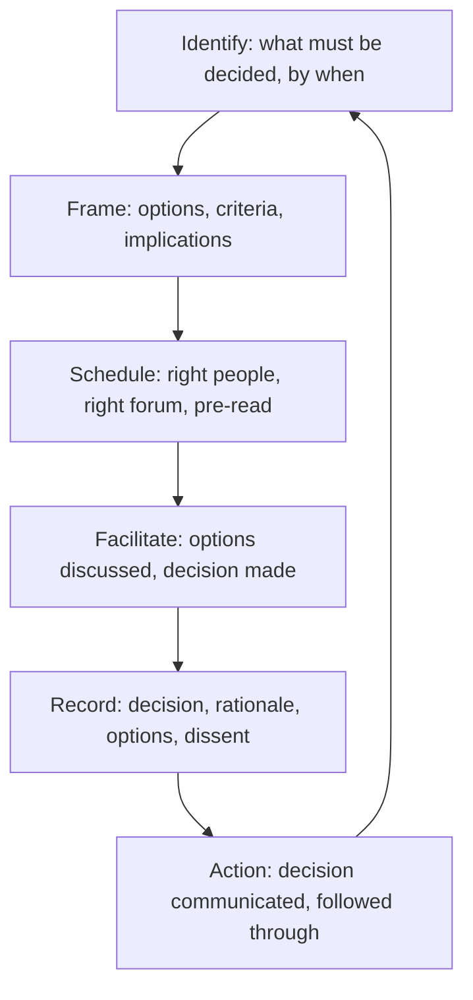

# Decision Facilitation

> **Core capability:** The TPM helps the right people make timely, documented decisions — framing options, managing the decision process, and ensuring decisions stick because they were made by the people with the authority and context to make them.

## Why This Matters

Programs stall on unmade decisions. The architecture choice nobody owns, the scope trade-off that keeps getting deferred, the vendor selection stuck in analysis — these are not technical problems; they are decision-process problems. The TPM does not make these decisions. The TPM makes the decisions happen: who decides, by when, based on what criteria, with what options, recorded where.

Decision facilitation is the TPM's highest-leverage activity because one unmade decision blocks an entire workstream, while one well-facilitated decision unblocks weeks of dependent work. The skill is process design, not content — framing options without advocating, managing disagreement without taking sides, and producing a record that survives the meeting.

## Topics in This Capability Area

| Topic | Core Skill | When It Matters |
|-------|------------|-----------------|
| [[01_Decision_Process_Design]] | Designing who decides, by when, based on what | Before every consequential decision |
| [[02_Decision_Framing]] | Presenting options neutrally with trade-offs and implications | Decision preparation |
| [[03_Facilitating_Decision_Meetings]] | Running meetings that produce decisions, not more discussion | Decision forums |
| [[04_Decision_Documentation]] | Recording decisions with rationale, options considered, and dissent | Every decision |
| [[05_Decision_Deadlines_and_Accountability]] | Setting and enforcing decision timelines | When decisions stall |
| [[06_Managing_Decision_Disagreement]] | Handling conflict and producing commitment | Disagreement on technical or strategic choices |
| [[07_Decision_Follow_Through]] | Ensuring decisions turn into action | Post-decision; the gap where decisions die |

## The Decision Facilitation Process

The TPM owns the process; the deciders own the decision.

## Practical Applications

### Decision Facilitation Checklist

- [ ] Every consequential program decision has a named decider and a target date
- [ ] Decisions are framed with options, criteria, and trade-offs — not just a recommendation
- [ ] Decision meetings have pre-reads so time is spent deciding, not briefing
- [ ] Decisions are documented with rationale and options considered
- [ ] Dissent is recorded without sabotaging commitment
- [ ] Decision follow-through is tracked: who does what by when

## Common Pitfalls

| Pitfall | Why It Is a Problem | Better Approach |
|---------|---------------------|-----------------|
| **TPM as decider** | TPM lacks authority; decision is contested or ignored | Facilitate; never substitute your judgment for the decider's |
| **Decision-by-meeting-drift** | Discussion without framing, criteria, or conclusion | Pre-reads with framed options; facilitated with decision at the end |
| **Unrecorded decisions** | Decisions remade because nobody can find the record | Documented and linked from the program RAID log |
| **Decision-without-action** | Decision made, nothing changes | Track post-decision actions in the program status |

## Success Indicators

- Decisions happen on the program timeline, not after the dependency is blocked
- Decision documentation is findable and cited later
- Decision meetings end with a decision, not another meeting
- Post-decision actions close within the agreed timeframe

## Related Capabilities

- [[01_Program_Structure_and_Charter/00_overview|Program Structure and Charter]]: governance defines decision rights
- [[05_Stakeholder_Alignment/00_overview|Stakeholder Alignment]]: decisions are where alignment becomes action
- [[career-path/03_Staff_Engineer/04_Influence_and_Alignment/00_overview|Influence and Alignment (Staff)]]: the staff engineer's decision influence
- [[career-path/06_Software_Architect/01_Architecture_Fundamentals/04_Architecture_Decision_Making|Architecture Decision Making (Architect)]]: technical decision content

## Summary

Decision facilitation is the TPM's highest-leverage activity: designing the decision process, framing options neutrally, running meetings that produce decisions, recording them so they stick, and following through so they become action. The TPM never decides for the decider — but the decider rarely decides on time without the TPM's process behind them.