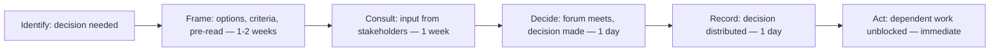

# Decision Process Design

> **Core skill:** The TPM designs the process by which consequential program decisions get made — assigning deciders, setting timelines, defining criteria, and building the forums where the right people decide at the right time with the right information.

## Why This Matters

Programs stall on unmade decisions far more often than they stall on technical problems. The architecture choice that nobody owns. The vendor selection stuck in evaluation. The scope trade-off that gets deferred every week. These are decision-process failures: the decision exists, the information exists, but nobody has been assigned to make it, by a date, in a forum, with criteria.

Decision process design is the TPM's highest-leverage work because one well-designed decision process unblocks weeks of dependent work across multiple teams. The TPM does not make the decision — the TPM makes the decision happen. The distinction is the entire craft: designing the process without owning the outcome, building the forum without controlling the verdict, and ensuring the decider has everything they need to decide on time.

## The Decision Rights Architecture

Every consequential program decision needs five things defined before it can be made.

| Element | Question | Failure Mode |
|---------|----------|---------------|
| Decider | Who has the authority to make this decision? | Decision made by someone without authority; overturned later |
| Timeline | By when must this decision be made? | Decision deferred until the dependency blocks the work |
| Input | Who must be consulted before the decision? | Key stakeholder excluded; veto after the decision |
| Criteria | What should the decision be evaluated against? | Decision made on preference, not on program-relevant criteria |
| Forum | Where will the decision be made and recorded? | Decision made in a hallway; evaporates into ambiguity |

These five elements together are the decision architecture. A program that defines them for every consequential decision makes decisions on time. A program that does not makes decisions in crisis — when the work is already blocked, the options have narrowed to one, and the decider is whoever is in the room.

## The Decision Taxonomy

Not all decisions need the same process. The TPM matches the process to the decision's weight.

| Decision Tier | Examples | Process | Forum |
|---------------|----------|---------|-------|
| Strategic | Program scope change, major architecture shift, budget reallocation | Full decision process: pre-read, options framing, criteria, formal decider, recorded | Steering committee or sponsor |
| Technical | Technology choice, integration approach, performance target | Technical review: architecture RFC, trade-off analysis, technical decider | Architecture review board or tech lead |
| Tactical | Sprint scope adjustment, sequencing change, minor trade-off | Lightweight: issue raised, options discussed, decider decides, status updated | Program sync or engineering lead |
| Operational | Tool choice, process adjustment, communication format | Default to owner; escalate if contested | Team-level decision |

The tier determines the overhead. Applying the strategic process to a tactical decision wastes time and attention. Applying the tactical process to a strategic decision produces decisions that are overturned.

## The Decision Register

The TPM maintains a decision register — a living list of every consequential decision the program faces, its status, and its owner. The register is the TPM's decision-tracking tool and the program's defense against decision-by-forgetting.

| Decision | Tier | Status | Decider | Due Date | Dependencies Blocked | Last Update |
|----------|------|--------|---------|----------|----------------------|-------------|
| Select database for service X | Technical | Open | Architect (Jane) | Oct 15 | Service X development; integration testing | Oct 1 — options being evaluated |
| Scope trade-off: feature A vs. performance work | Strategic | In progress | Sponsor (Mark) | Oct 8 | Q4 roadmap; team allocation | Oct 3 — options framed; pre-read distributed |
| Vendor contract for monitoring | Tactical | Decided | TPM (self) | Sep 28 | Monitoring implementation | Sep 28 — Vendor B selected; contract in legal |

The register is reviewed weekly. Decisions approaching their deadline without progress are escalated. Decisions past their deadline are escalated immediately — because a past-due decision is a blocked workstream.

## Designing the Decision Timeline

Every decision has a deadline, and the deadline is set by the dependency it blocks, not by convenience.



The timeline works backward from the block date: if the dependent work starts on November 1, the decision must be made by October 15 to allow two weeks for any re-planning. The framing must start by October 1. The decision must be identified by September 15. The TPM who starts framing on October 20 has already guaranteed a blocked workstream.

## Decision Process for Strategic Decisions

Strategic decisions follow the full process. Any step skipped is a decision risk.

| Step | Duration | Activity | Output |
|------|----------|----------|--------|
| 1. Decision charter | Day 1 | TPM defines: what must be decided, by whom, by when, based on what criteria, with input from whom | Decision charter document |
| 2. Option framing | 1-2 weeks | Options developed, priced, and compared against criteria | Option framing document (pre-read) |
| 3. Stakeholder input | 1 week | Pre-read distributed; stakeholders provide input before the forum | Consolidated stakeholder input |
| 4. Decision forum | 1 meeting | Decider reviews options, hears input, decides | Recorded decision |
| 5. Communication | 1 day | Decision distributed to all affected stakeholders | Decision record |
| 6. Action tracking | Ongoing | Dependent work unblocked; decision actions tracked | Status updates until actions close |

## When There Is No Clear Decider

Some decisions span organizational boundaries and lack a clear decider. The TPM's first move is to find the decider; the second is to escalate the meta-question.

| Situation | TPM Action |
|-----------|------------|
| Two possible deciders with overlapping authority | Convene both; ask them to agree on who decides, or escalate to their shared leader |
| No decider — decision falls between org charts | Escalate to the program sponsor: "This decision needs an owner. Options: [person A], [person B], or [sponsor]." |
| Decider refuses to decide | Escalate: the refusal is itself a decision — to block the dependent work. Make that consequence visible. |
| Decider delegates but the delegate lacks authority | Accept the delegation but confirm: "I will work with [delegate] on the options. You will make the final call by [date]. Confirm?" |

The meta-question — "who decides who decides?" — is the TPM's escalation when the decision architecture itself has a gap. It is solved by the program sponsor or the steering committee, and it is solved once per decision type, not once per decision.

## Practical Applications

### Decision Charter Template

```markdown
# Decision Charter — [Decision Name]

## What Must Be Decided
- [One-sentence description of the decision]

## Decider
- Name: [person with authority]
- Backup: [if decider unavailable]

## Timeline
- Framing complete by: [date]
- Stakeholder input by: [date]
- Decision due by: [date]
- Work blocked if not decided by: [date with consequences]

## Input Required From
- [Stakeholder 1]: [what input, by when]
- [Stakeholder 2]: [what input, by when]

## Decision Criteria
1. [Criterion 1 — e.g., total cost over 2 years]
2. [Criterion 2 — e.g., alignment with platform strategy]
3. [Criterion 3 — e.g., team capacity to adopt]

## Forum
- Where: [meeting name]
- When: [date]
- Format: [pre-read + 30 min discussion + decision]
```

### Decision Process Design Checklist

- [ ] Every consequential program decision has a named decider and a due date
- [ ] The decision tier is assigned: strategic, technical, tactical, or operational
- [ ] The decision register is maintained and reviewed weekly
- [ ] Strategic decisions follow the full process: charter, framing, input, forum, record, action
- [ ] Decision deadlines are set by the dependency they block, not by convenience
- [ ] Meta-questions — "who decides?" — are escalated to the sponsor immediately

## Common Pitfalls

| Pitfall | Why It Is a Problem | Better Approach |
|---------|---------------------|-----------------|
| **Decision-by-default** | Nobody is assigned, so the decision is made by whoever acts first — often the wrong person | Assign a decider and a deadline for every consequential decision |
| **Over-process for small decisions** | Tactical decisions get the strategic process; attention and patience burn out | Tier decisions; match process to weight |
| **Deadline divorced from dependency** | Decision due "sometime in Q4" while the dependent work starts October 1 | Set deadlines by working backward from the blocked work |
| **Criteria by assumption** | The TPM assumes the criteria; the decider has different criteria and rejects the framing | Define criteria with the decider before framing options |
| **Decision register as decoration** | Maintained at program start; abandoned after first crisis | Review the register weekly; escalate overdue decisions immediately |

## Success Indicators

- Decisions are made before the work they unblock is scheduled to start
- The decision register is reviewed weekly; no decision is past due without an escalation
- Deciders have everything they need to decide — options, criteria, input — at the decision forum
- The meta-question is resolved once per decision type; no repeated "who decides?" debates

## Related Topics

- [[02_Decision_Framing]]: framing options against the criteria defined in the process
- [[03_Facilitating_Decision_Meetings]]: running the decision forum designed in the process
- [[05_Decision_Deadlines_and_Accountability]]: enforcing the timeline defined in the process
- [[01_Program_Structure_and_Charter/00_overview|Program Structure and Charter]]: governance defines decision rights
- [[career-path/06_Software_Architect/01_Architecture_Fundamentals/04_Architecture_Decision_Making|Architecture Decision Making (Architect)]]: the technical decision process

## Summary

Decision process design is the TPM's architecture for program velocity: assigning every consequential decision a decider, a deadline, input requirements, evaluation criteria, and a decision forum — then maintaining a living decision register that flags overdue decisions before they block work. The TPM does not make the decisions; the TPM makes the decisions happen on time, with the right people, in the right forum, with the right information. A well-designed decision process is the difference between a program that flows and a program that stalls on unmade choices.