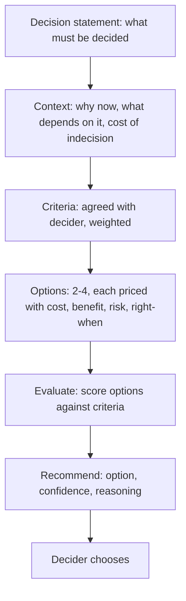

# Decision Framing

> **Core skill:** The TPM frames decisions for deciders — presenting options neutrally with priced trade-offs, evaluating them against agreed criteria, and recommending with stated confidence so that the decider can choose without having to first reconstruct the analysis.

## Why This Matters

A well-framed decision is half-decided. The decider reads the framing document and understands the landscape: what must be decided, what the options are, what each option costs, what each option risks, and which conditions would make each option the right choice. The decider's job is reduced to judgment — the one thing that cannot be delegated — because the analysis has already been done.

Poorly framed decisions put the analysis burden on the decider during the meeting. The decider asks questions the document should have answered, requests data the document should have included, and defers the decision to get the missing information. A decision deferred for missing information is a decision-framing failure — the information existed; the framing did not include it.

The TPM's framing discipline: every option is priced, every trade-off is visible, and the recommendation is honest about what it knows and what it does not. The framing document is the decision artifact that survives the meeting — and its quality determines whether the decision sticks.

## The Framing Document Structure

Every decision-framing document has five sections. The structure is non-negotiable because it forces completeness.

| Section | Content | Rule |
|---------|---------|------|
| 1. Decision statement | What is being decided, in one sentence | Must be specific enough that "yes" or "no" is a complete answer |
| 2. Context | Why this decision matters now, what depends on it, what happens if it is deferred | The cost of indecision is stated here |
| 3. Options | 2-4 options, each with cost, benefit, risk, and "right when" condition | Every option must be genuinely defensible under some condition |
| 4. Evaluation | Options scored against agreed criteria | The criteria are stated before the scores |
| 5. Recommendation | The TPM's recommended option, with confidence and reasoning | Recommendation is stated; confidence is honest |

## Pricing Options: The Trade-Off Table

The heart of the framing document is the trade-off table. Every option gets a row; every relevant dimension gets a column.

| Option | Cost (time, money, people) | Benefit (what improves) | Risk (what could go wrong) | Right When (condition that makes this the best choice) |
|--------|---------------------------|------------------------|---------------------------|-------------------------------------------------------|
| A: Status quo | $0, 0 weeks | No disruption | Problem continues; cost of inaction compounds | The problem is about to disappear on its own |
| B: Incremental fix | 4 eng-weeks, $5k | Problem reduced 60% | Partial fix may need rework later | The problem is moderate; full fix is over-investment |
| C: Full rebuild | 20 eng-weeks, $50k | Problem eliminated; platform improved | Migration risk; capacity cost | The problem is structural and growing; platform is strategic |
| D: Buy solution | $20k/year, 2 eng-weeks integration | Fastest time-to-value | Vendor lock-in; fit risk | The problem is generic; not core differentiator |

The "right when" column is the honesty mechanism. An option that has no plausible right-when condition is a straw man, and straw men are detected by deciders and damage the framer's credibility. Every option in the table must be one the TPM would genuinely recommend under some circumstances — even if not the current ones.

## Criteria: Agreed Before Scoring

Decision criteria must be agreed with the decider before options are scored. A criteria disagreement discovered during the decision meeting is a framing failure.

| Criterion | Weight | What It Measures | Option A | Option B | Option C |
|-----------|--------|------------------|----------|----------|----------|
| Total cost (2 years) | High | All-in cost: build + operate | 0 | $5k | $50k |
| Time to value | High | Weeks until benefit realized | ∞ | 4 weeks | 20 weeks |
| Strategic alignment | Medium | Fit with platform strategy | Low | Medium | High |
| Risk of failure | Medium | Probability × impact | Low | Low | Medium |
| Team capacity | Medium | Can we staff this? | N/A | Yes | Stretch |

Criteria with weights prevent the most common decision-framing failure: scoring options without telling the decider what matters most. A decider who values speed will choose differently from one who values strategic alignment — and both choices are valid if the criteria are explicit.

## The Recommendation: With Honest Confidence

The TPM's recommendation is not advocacy — it is the synthesis of the analysis, stated with honest confidence.

| Confidence Level | Meaning | Example |
|------------------|---------|---------|
| High | The analysis is robust; the recommendation is unlikely to change with new information | "We recommend B with high confidence. The cost-benefit is clear and the risk is well-understood." |
| Medium | The analysis is sound but one or two variables could shift the recommendation | "We recommend C with medium confidence. It is the best strategic choice, but the team capacity risk is real. If we cannot staff it, B becomes the right choice." |
| Low | Significant uncertainty; the recommendation is a best guess with known gaps | "We recommend A with low confidence. The data on the problem's growth rate is thin. We need 4 more weeks of measurement before committing to B or C." |

A recommendation with low confidence is not a failure — it is an honest assessment that tells the decider "this decision needs more information, and here is what information." A recommendation with falsely high confidence is a failure — the decision is made on false premises and collapses later.

## The "Do Nothing" Option

Every framing document includes a "do nothing" or "status quo" option. It is not a straw man — it is the baseline against which every other option is measured. The do-nothing option is priced honestly: here is the cost of inaction, here is what continues unchanged, here is when the problem forces a decision anyway.

The do-nothing option matters because it forces the question: "Is the problem bad enough to justify the cost of fixing it?" If the answer is no, the decision is deferred — and that is a valid outcome, as long as the deferral is explicit and the re-evaluation trigger is set.



## Practical Applications

### Decision Framing Template

```markdown
# Decision Framing — [Decision Name] — [Date]

## Decision Statement
- What is being decided: [one sentence]
- Decider: [name]
- Decision due: [date]
- Work blocked if not decided: [consequence]

## Context
- Why this decision matters now: [2-3 sentences]
- Cost of deferral: [what happens if we do not decide]

## Decision Criteria (agreed with decider)
| Criterion | Weight | What It Measures |
|-----------|--------|------------------|
| [1]       | High/Medium/Low | [description] |

## Priced Options
| Option | Cost | Benefit | Risk | Right When |
|--------|------|---------|------|------------|
| A: Status quo | [cost] | [benefit] | [risk] | [condition] |
| B: [name] | [cost] | [benefit] | [risk] | [condition] |
| C: [name] | [cost] | [benefit] | [risk] | [condition] |

## Evaluation Against Criteria
| Option | Criterion 1 (weight) | Criterion 2 (weight) | Total |
|--------|---------------------|---------------------|-------|
| A      |                     |                     |       |

## Recommendation
- Recommended option: [letter]
- Confidence: High / Medium / Low
- Reasoning: [three sentences max]
- Key uncertainty: [what would change the recommendation]

## Appendix
- [Data sources, detailed calculations, prior art]
```

### Decision Framing Checklist

- [ ] The decision statement is specific enough for a yes/no answer
- [ ] The cost of indecision is stated explicitly
- [ ] Criteria are agreed with the decider before options are scored
- [ ] 2-4 options are presented, each with cost, benefit, risk, and right-when condition
- [ ] Every option is genuinely defensible under some condition — no straw men
- [ ] The recommendation is stated with honest confidence and reasoning
- [ ] The framing document is distributed as a pre-read before the decision meeting

## Common Pitfalls

| Pitfall | Why It Is a Problem | Better Approach |
|---------|---------------------|-----------------|
| **One-option framing** | "Here is the solution" — not a decision, a demand | Present 2-4 options; the decider chooses |
| **Straw-man options** | Fake alternatives that make the recommendation look better by comparison | Every option must be defensible under some plausible condition |
| **Criteria by surprise** | Criteria revealed in the meeting; decider disagrees with them and defers | Agree criteria with the decider before framing |
| **Overconfident recommendation** | "We are certain" when uncertainty is real; decision collapses at first obstacle | State confidence honestly; name the key uncertainty |
| **No cost of indecision** | The decider sees no urgency; decision is deferred | State explicitly what happens if the decision is not made by the deadline |
| **Framing-as-advocacy** | The TPM advocates for a side; the decider senses bias and discounts the analysis | Frame neutrally; recommend with reasoning; let the decider judge |

## Success Indicators

- Deciders make decisions in the decision forum, not defer for missing information
- The decider's questions are about judgment, not about facts the document should have included
- Stakeholders cite the framing document's trade-off table in later discussions
- Decisions made from framed options are not revisited because the framing was incomplete
- The recommendation's confidence proves accurate — high-confidence recommendations hold; low-confidence ones evolve as predicted

## Related Topics

- [[01_Decision_Process_Design]]: the process that determines when and how framing happens
- [[03_Facilitating_Decision_Meetings]]: the meeting where the framed decision is decided
- [[04_Decision_Documentation]]: the decision record that captures what was decided from the framing
- [[05_Stakeholder_Alignment/05_Stakeholder_Negotiation|Stakeholder Negotiation]]: the negotiation counterpart where trade-offs are priced
- [[career-path/03_Staff_Engineer/04_Influence_and_Alignment/01_Writing_Proposals_That_Get_Adopted|Writing Proposals That Get Adopted (Staff)]]: the staff engineer's proposal framing discipline

## Summary

Decision framing is the TPM's pre-decision craft: defining what must be decided and why it matters now, pricing 2-4 genuine options with cost, benefit, risk, and right-when conditions, evaluating them against criteria agreed with the decider, and recommending with honest confidence. A well-framed decision is half-decided — the decider's job is reduced to judgment because the analysis is already on the page. Poorly framed decisions defer for missing information; well-framed ones produce decisions that stick.