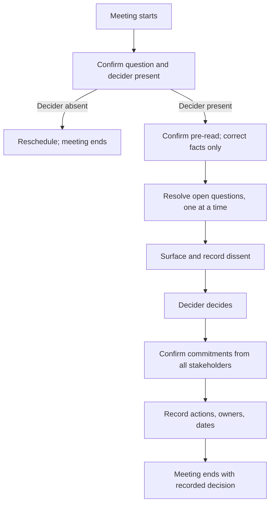

# Facilitating Decision Meetings

> **Core skill:** The TPM runs meetings that produce decisions, not more discussion — protecting the pre-read investment, keeping the conversation on the framing, surfacing dissent without letting it derail the decision, and ensuring the room leaves with a recorded choice, not another meeting.

## Why This Matters

The decision meeting is where the program's decision process delivers or fails. A meeting that produces a decision unblocks dependent work across the program. A meeting that produces another meeting compounds the delay and burns stakeholder patience. The difference is facilitation — not content expertise, but process discipline.

The TPM's facilitation stance is neutral on the decision and absolute on the process. The TPM does not argue for an option — the framing document already did that. The TPM protects the meeting's format: the pre-read was read, the criteria are agreed, the options are priced, and the meeting's job is to resolve open questions and decide. A meeting that re-reads the framing document is a failed meeting; a meeting that resolves the open questions and produces a recorded decision is a successful one.

## The Decision Meeting Format

Every decision meeting follows a timed format. The format is communicated in advance, and the TPM enforces it in the room.

| Segment | Duration | Activity | TPM Role |
|---------|----------|----------|----------|
| 1. Confirm the question | 2 min | Restate the decision statement; confirm the decider is present and ready | Gatekeeper: if the decider is absent, the meeting is rescheduled |
| 2. Confirm the pre-read | 2 min | "Has everyone read the framing document? Are there factual corrections?" | Protector: do not re-present the document; correct facts only |
| 3. Resolve open questions | 15-20 min | Each open question from the framing is discussed and resolved | Facilitator: one question at a time; capture resolutions |
| 4. Surface dissent | 5-10 min | Anyone who disagrees with the emerging choice states their position | Facilitator: ensure dissent is heard and recorded, not silenced |
| 5. Decision | 2 min | Decider states the decision, rationale, and any conditions | Recorder: capture verbatim |
| 6. Confirm commitment | 3 min | Each stakeholder states their commitment to the decision | Facilitator: ask each person; record explicit commitments |
| 7. Next steps | 2 min | Actions, owners, dates; decision record distribution | Recorder: capture and confirm |

Total: 30-40 minutes. A decision meeting that runs longer is usually re-arguing the framing document — a facilitation failure.

## The Pre-Read Contract

The decision meeting depends on a pre-read contract: the framing document is distributed at least 48 hours before the meeting, and the meeting operates on the assumption that it was read. The contract has three rules:

| Rule | What It Means | Enforcement |
|------|---------------|-------------|
| Read before, decide during | The meeting is for deciding, not for reading | If someone has not read the pre-read, the meeting proceeds; they catch up later |
| Questions, not re-briefing | Questions are about what was unclear in the document, not about what was in it | "That is covered in section 3 of the framing document. Do you have a specific question about it?" |
| Facts corrected, not re-argued | Factual errors in the pre-read are corrected; opinions about the options are for the decision discussion | "Thank you for the correction. Noted. Now, let's resolve the open questions." |

The pre-read contract is cultural, not contractual. It is established in the first decision meeting and reinforced in every subsequent one. A program where the pre-read contract holds makes decisions in 30 minutes. A program where it does not makes decisions in three meetings.

## Facilitation Techniques

| Situation | Facilitation Move |
|-----------|-------------------|
| Someone re-argues the framing | "That analysis is in the framing document. Is there a specific fact you believe is incorrect, or are you making a case for a different option?" |
| Discussion drifts to unrelated topics | "That is important, but it is not what we are deciding today. I will capture it for [the right forum]. Let's return to [the decision]." |
| One voice dominates | "Thank you. I want to make sure we hear from everyone. [Name], what is your view?" |
| Dissent is unspoken but visible | "I sense there is disagreement in the room. Is there anyone who sees this differently? Now is the time." |
| Decider hesitates to decide | "We have resolved the open questions. The options are priced and the criteria are agreed. [Decider], do you have enough to decide, or do you need additional information?" |
| Meeting is stuck | "We have two positions. Let me restate them, and then [decider], would you like to choose, or do you need a follow-up on a specific question?" |

## Handling Dissent in the Room

Dissent in the decision meeting is not a problem — it is evidence that the process is working. Dissent that is silenced produces fake commitment. Dissent that is surfaced and recorded produces real commitment — because the dissenter was heard, their alternative was considered, and the decision was made with their objection on the record.

| Facilitation Move | Example |
|--------------------|---------|
| Invite dissent explicitly | "Before we decide, is there anyone who would choose a different option? I want to make sure every view is on the table." |
| Restate the dissenter's position accurately | "So your position is that option B is premature because the data on migration cost is incomplete. Is that right?" |
| Ask the dissenter what would change their mind | "What information would make option A acceptable to you? When could we have that information?" |
| Record dissent in the decision | "Noted. The decision is option A. [Name]'s dissent — that option B was premature pending migration cost data — is recorded. We will revisit if migration costs exceed [threshold]." |
| Ask for explicit commitment | "[Name], you argued for B. We chose A. Can you commit to making A work?" |

The dissenter who is heard, recorded, and asked to commit is far more likely to support the decision than the dissenter who is silenced and expected to comply.

## When the Decision Meeting Fails

Not every decision meeting produces a decision. The TPM recognizes failure early and converts it to a defined next step — not an open-ended deferral.

| Failure Mode | TPM Response |
|--------------|--------------|
| Decider absent | "The decider is not present. We cannot decide today. I will reschedule for [date]. In the meantime, please send any additional input to me by [date]." |
| Missing information that changes the options | "We are missing [information]. I will get it by [date]. We will reconvene on [date] to decide." |
| Criteria disagreement | "We disagree on the criteria. Let's take that offline with the decider. I will schedule a criteria alignment session for [date]." |
| New option surfaces in the meeting | "That option was not in the framing. I will price it and circulate an updated framing document by [date]. We will decide on [date]." |
| Genuine deadlock | "We have two positions and cannot resolve. [Decider], would you like to decide now, or shall we escalate to [sponsor/steering committee] with both positions priced?" |

Every failure converts to a specific next step with a date. "Let's discuss this later" is not a facilitation move — it is an abdication.



## Practical Applications

### Decision Meeting Agenda Template

```markdown
# Decision Meeting — [Decision Name] — [Date]

**Pre-read:** [link to framing document] — distributed [date]

## Agenda (40 min)
1. [2 min] Confirm decision question and decider presence
2. [2 min] Confirm pre-read; factual corrections only
3. [20 min] Resolve open questions (from framing document appendix)
4. [8 min] Surface and discuss dissent
5. [2 min] Decision: decider states choice, rationale, conditions
6. [3 min] Confirm commitment: each stakeholder states commitment
7. [3 min] Actions, owners, dates; decision record distribution

**Rules:**
- The pre-read is assumed read; we do not re-present it
- The meeting's job is to resolve open questions and decide
- Dissent is recorded, not silenced
- Decisions are recorded before we leave the room
```

### Facilitation Checklist

- [ ] The framing document was distributed at least 48 hours before the meeting
- [ ] The decider is confirmed present before the meeting starts
- [ ] The agenda with timed segments is communicated in advance
- [ ] The meeting does not re-present the pre-read
- [ ] Open questions are resolved one at a time
- [ ] Dissent is explicitly invited, accurately restated, and recorded
- [ ] The decision is recorded verbatim before the meeting ends
- [ ] Each stakeholder states their commitment explicitly
- [ ] Actions are captured with owners and dates

## Common Pitfalls

| Pitfall | Why It Is a Problem | Better Approach |
|---------|---------------------|-----------------|
| **Re-reading the pre-read** | The meeting becomes a briefing; no time left to decide | Enforce the pre-read contract; correct facts only |
| **Decider absent** | Meeting discusses; no decision; another meeting scheduled | Confirm decider before the meeting; reschedule if absent |
| **Discussion without conclusion** | The conversation drifts; 60 minutes later, nothing is decided | Timed segments; TPM redirects to the decision question |
| **Silencing dissent** | Dissent goes underground; surfaces later as passive resistance | Invite dissent explicitly; record it; ask for commitment |
| **Verbal decision only** | "We decided" means different things to different attendees by the next day | Record the decision verbatim before the meeting ends |
| **No commitment check** | Decision is made; some attendees silently reserve the right to undermine it | Ask each stakeholder to state their commitment explicitly |

## Success Indicators

- Decision meetings end with a recorded decision, not another meeting
- The pre-read contract holds: meetings start from the framing, not from scratch
- Dissent is surfaced and recorded; dissenters commit visibly to the decision
- Meetings run to time — 30-40 minutes — because the format is enforced
- Attendees arrive having read the pre-read because they know the meeting will not re-read it

## Related Topics

- [[02_Decision_Framing]]: the framing document that is the meeting's pre-read
- [[04_Decision_Documentation]]: recording the decision made in the meeting
- [[06_Managing_Decision_Disagreement]]: handling dissent in the decision process
- [[01_Decision_Process_Design]]: the process that schedules and structures the meeting
- [[05_Stakeholder_Alignment/03_Executive_Communication_for_TPMs|Executive Communication for TPMs]]: the steering committee is the executive decision meeting

## Summary

Facilitating decision meetings is the TPM's in-room craft: protecting the pre-read investment, running a timed format that resolves open questions and surfaces dissent, ensuring the decider decides with everything they need, and producing a recorded decision with explicit commitments before anyone leaves. The TPM is neutral on the outcome and absolute on the process — and a meeting that produces a decision is the process working. A meeting that produces another meeting is the process failing, and the TPM owns the failure.