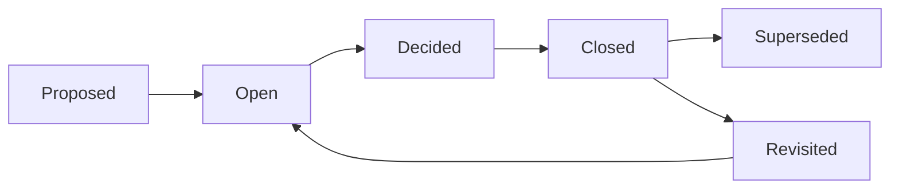

# Decision Documentation

> **Core skill:** The TPM records every consequential program decision — what was decided, by whom, based on what rationale, with what options considered and what dissent recorded — so that the decision survives the meeting, is findable when questioned, and is revisitable when conditions change.

## Why This Matters

An unrecorded decision is a decision that will be re-made. Three months after the architecture choice, someone asks why we chose PostgreSQL over DynamoDB. Nobody remembers. Someone proposes switching. The same arguments replay — without the data, without the criteria, without the dissent that was recorded the first time. The cost is not just the re-litigation; it is the risk that a worse decision is made the second time because the original rationale is lost.

Decision documentation is the TPM's institutional memory function. The decision record is the artifact that says: "On this date, this person decided this, for these reasons, considering these alternatives, with this dissent recorded, subject to these conditions." It is linked from the program RAID log. It is findable by anyone who needs to understand why the program made a particular choice. And it is the foundation for re-review: when conditions change, the record tells you whether the decision should be revisited.

## The Decision Record: Required Fields

Every decision record has eight required fields. A record missing any of them is incomplete — and will fail its function when questioned later.

| Field | Content | Why It Matters |
|-------|---------|----------------|
| Decision ID | Unique identifier, linked from RAID log | Findability; cross-referencing |
| Decision statement | What was decided, in one sentence | The artifact's title; the answer to "what did we decide?" |
| Decider | Name and role of the person who made the decision | Authority; who to question if the decision is contested |
| Date decided | When the decision was made | Temporal context; was this before or after the re-org? |
| Rationale | Why this choice was made, in 2-4 sentences | The reasoning that survives when memory does not |
| Options considered | What alternatives were evaluated, including the status quo | Shows the decision was a choice, not a default |
| Dissent | Who disagreed, on what grounds, with what alternative | Honesty; the dissenter's position preserved for re-review |
| Conditions / re-review triggers | Under what circumstances the decision should be revisited | Prevents re-litigation without new information |

## The Decision Record Template

```markdown
# Decision Record — [DR-###] — [Decision Statement]

| Field | Value |
|-------|-------|
| **Decision ID** | DR-[program]-[number] |
| **Decision** | [One-sentence statement of what was decided] |
| **Status** | Decided / Superseded / Revisited |
| **Decider** | [Name], [Role] |
| **Date Decided** | [YYYY-MM-DD] |
| **Decision Forum** | [Steering Committee / Architecture Review / Program Sync] |
| **Rationale** | [2-4 sentences explaining why this choice] |
| **Options Considered** | [Option A: description + why rejected]; [Option B: description + why rejected]; [Status quo: description + why rejected] |
| **Criteria Used** | [Criterion 1]; [Criterion 2]; [Criterion 3] |
| **Dissent** | [Name]: [grounds for disagreement]; [alternative they advocated] |
| **Commitments** | [Name]: [stated commitment to the decision] |
| **Conditions / Re-Review Triggers** | [Condition that would cause re-review] |
| **Actions** | [Action 1] — [Owner] — [Due date] |
| **Linked Artifacts** | [Link to framing document]; [Link to meeting notes] |
```

## Where Decision Records Live

Decision records must be findable. A decision recorded in a meeting note that nobody can locate is an unrecorded decision.

| Location | Purpose | Audience |
|----------|---------|----------|
| Program RAID log | The decision register — a row per decision with status | Program team; TPM |
| Decision log (wiki / shared drive) | The full decision record with all fields | Anyone who needs the rationale |
| Program status report | Decisions made this period, with DR-ID links | All stakeholders |
| Meeting notes | The decision as recorded in the meeting where it was made | Meeting attendees; audit trail |

The RAID log is the index; the decision log is the content. The status report is the broadcast. The meeting notes are the evidence.

## Writing the Rationale

The rationale is the most important field in the decision record — and the one most often written poorly. A good rationale explains the choice in terms of the decision criteria; a bad rationale restates the choice.

| Bad Rationale | Good Rationale |
|---------------|----------------|
| "We chose PostgreSQL because it is the best fit." | "We chose PostgreSQL over DynamoDB because (1) the data model is relational and the query patterns require joins — criterion: technical fit, (2) the team has existing PostgreSQL expertise — criterion: team capacity, (3) DynamoDB's cost at our projected scale would exceed the budget by 30% — criterion: total cost. The migration risk — criterion: risk — is mitigated by the phased rollout plan in the framing document." |

A good rationale lets a reader who was not in the meeting understand why the decision was made — and evaluate whether the conditions that produced it still hold.

## Recording Dissent

Dissent in the decision record is not an attack on the decision — it is an insurance policy. It preserves the dissenter's reasoning so that if conditions change and the dissenter was right, the record shows it and the decision can be revisited without re-litigating.

| What to Record | Example |
|----------------|---------|
| Who dissented | "Jane Chen, Engineering Director" |
| On what grounds | "Jane dissented on the grounds that the migration cost estimate is preliminary and could double with the API compatibility work discovered during the pilot." |
| What alternative they advocated | "She advocated for option C (vendor solution) as a lower-risk alternative pending a more detailed migration assessment." |
| What would change their mind | "Jane committed to option B if the pilot confirms migration costs within 20% of the estimate." |

Dissent recorded this way serves the program: it respects the dissenter, it preserves the alternative for re-review, and it sets the conditions under which the decision should be revisited.

## The Decision Lifecycle: Status Tracking

Decision records have a status field that tracks the decision's lifecycle.

| Status | Meaning | When It Moves |
|--------|---------|---------------|
| Proposed | Decision identified; framing in progress | Moves to "Open" when framing is complete and meeting is scheduled |
| Open | Decision framed; awaiting decision meeting | Moves to "Decided" when the decider chooses |
| Decided | Decision made; actions in progress | Moves to "Closed" when all actions complete |
| Closed | Actions complete; decision is operational | Moves to "Superseded" if replaced by a later decision; "Revisited" if conditions triggered re-review |
| Superseded | Decision replaced by a later one | Final state |
| Revisited | Decision re-opened due to trigger condition | Moves back to "Open" |



## Practical Applications

### Decision Documentation Checklist

- [ ] Every consequential program decision has a decision record
- [ ] The decision record includes all eight required fields
- [ ] The rationale explains the choice in terms of the decision criteria
- [ ] Dissent is recorded with the dissenter's grounds, alternative, and mind-change condition
- [ ] The decision is linked from the program RAID log
- [ ] Decisions made this period appear in the program status report with DR-IDs
- [ ] Decision records are findable by anyone who needs them — not buried in meeting notes
- [ ] Decision status is tracked through the lifecycle: Proposed → Open → Decided → Closed

### Decision Record Template (Short Form)

```markdown
# DR-[###]: [Decision Statement]

**Decider:** [Name], [Role]
**Date:** [YYYY-MM-DD]
**Status:** [Proposed / Open / Decided / Closed]

**Decision:** [One sentence]

**Rationale:** [2-4 sentences, against criteria]

**Options Considered:**
- A: [description] — [why not chosen]
- B: [description] — **CHOSEN** — [why]
- C: [description] — [why not chosen]

**Dissent:** [Name]: [grounds]; [alternative]; [mind-change condition]

**Re-Review Trigger:** [condition]

**Actions:** [Action] — [Owner] — [Due]
```

## Common Pitfalls

| Pitfall | Why It Is a Problem | Better Approach |
|---------|---------------------|-----------------|
| **Decision in meeting notes only** | Unfindable; rationale buried in discussion transcript | Separate decision record, linked from meeting notes |
| **Rationale-as-restatement** | "We chose X because X is best" — provides no reasoning for future readers | Explain in terms of criteria; show why alternatives were rejected |
| **Dissent erased** | The record shows unanimous agreement; the dissenter's concern is lost | Record dissent with grounds, alternative, and mind-change condition |
| **No re-review trigger** | Decision is treated as permanent; conditions change but nobody knows to revisit | Set explicit re-review conditions tied to measurable triggers |
| **Decision log abandoned** | Started at program initiation; last updated three months ago | Review the decision log weekly; it is part of the program status cycle |

## Success Indicators

- Every decision record is findable by its DR-ID within one search
- A reader who was not in the meeting can restate the rationale from the record
- Dissenters see their position accurately captured in the record
- Decisions are revisited when conditions trigger re-review — not re-litigated from scratch
- The decision log is current at every program review

## Related Topics

- [[01_Decision_Process_Design]]: the process that produces the decisions documented here
- [[03_Facilitating_Decision_Meetings]]: the meeting where the decision is recorded
- [[07_Decision_Follow_Through]]: tracking the actions from the decision record
- [[04_Risk_and_Issue_Leadership/00_overview|Risk and Issue Leadership]]: the RAID log where decisions are indexed
- [[career-path/06_Software_Architect/01_Architecture_Fundamentals/04_Architecture_Decision_Making|Architecture Decision Making (Architect)]]: the architect's ADR discipline

## Summary

Decision documentation is the TPM's institutional memory function: recording every consequential decision with its decider, rationale, options, dissent, and re-review triggers in a findable, linked format that survives the meeting. An unrecorded decision is a decision that will be re-made — at the cost of re-litigation and the risk of a worse outcome. The decision record is the artifact that lets the program answer "why did we choose this?" months later, when nobody remembers — and it is the foundation for honest re-review when conditions change.