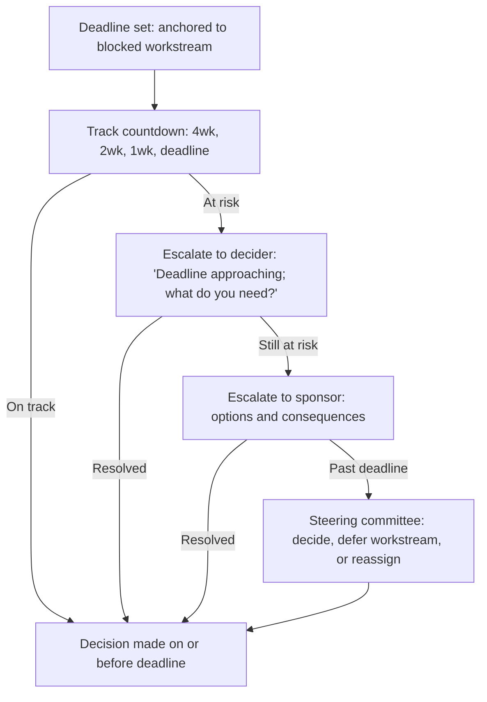

# Decision Deadlines and Accountability

> **Core skill:** The TPM sets and enforces decision deadlines — anchoring every deadline to the work it unblocks, escalating when deadlines approach without progress, and holding deciders accountable for deciding on time, not for deciding correctly.

## Why This Matters

A decision without a deadline is a decision that will not be made — until the dependency it blocks becomes a crisis, and the decision is forced with one option and no analysis. The TPM's deadline discipline is what prevents decision-by-crisis: setting the deadline before the dependent work is scheduled to start, tracking progress toward the deadline, escalating when the deadline is at risk, and making visible the cost of indecision when the deadline passes.

Accountability for decisions is not about blaming deciders who choose poorly — it is about ensuring deciders choose at all, on time, with the information they need. The TPM's accountability mechanism is the decision register, reviewed weekly, with overdue decisions surfaced immediately at the program level and escalated to the steering committee when they threaten dependent work.

## Setting Decision Deadlines

Decision deadlines are set by the work they unblock, not by convenience, not by when the decider is available, and not by when the analysis "feels complete."

| Deadline Type | How It Is Set | Example |
|---------------|---------------|---------|
| Dependency-driven | Work backward from the blocked workstream's start date; add buffer for replanning | "The database team starts schema design on Nov 1. The database selection must be decided by Oct 15 to allow 2 weeks for replanning." |
| Event-driven | Anchored to an external event: contract renewal, conference, regulatory deadline | "The vendor contract expires Dec 31. The renewal-or-switch decision must be made by Nov 15 to allow 6 weeks for transition." |
| Sequence-driven | Anchored to a predecessor milestone in the program plan | "M2 completes on Oct 30. The M3 scope decision must be made by Oct 15 to allow M3 planning." |
| Risk-driven | Set to prevent a risk from materializing while the decision is pending | "The security finding must be resolved within 30 days. The remediation approach decision must be made by day 15 to allow 15 days for implementation." |

The deadline is communicated with the consequence of missing it: "If this decision is not made by [date], [dependent workstream] will be delayed by [duration] at a cost of [impact]." The consequence is not a threat — it is a fact that the decider needs to weigh against the cost of deciding with incomplete information.

## The Decision Countdown

Every decision has a timeline from identification to deadline. The TPM tracks the countdown and escalates at pre-defined triggers.

| Countdown Marker | When (before deadline) | TPM Action |
|------------------|------------------------|------------|
| 4 weeks out | Decision identified; assigned to decider | Decision registered; framing timeline shared with decider |
| 2 weeks out | Framing should be complete | Check: is framing on track? If not, escalate to decider: "We need the framing by [date] to meet your deadline." |
| 1 week out | Stakeholder input due; pre-read distributed | Confirm: are all inputs received? Is the decision meeting scheduled? |
| 3 days out | Decision meeting should be held | If meeting not scheduled: escalate to decider with proposed time |
| At deadline | Decision due | If not decided: escalate to program sponsor with consequences stated |
| Past deadline | Decision overdue | Immediate escalation to steering committee: "[Decision] is past due. [Workstream] is blocked. Options: decide now, defer the workstream, or reassign the decider." |

## Accountability Without Authority

The TPM holds deciders accountable without having authority over them. The mechanism is visibility, not command.

| Accountability Mechanism | How It Works | Why It Is Effective |
|--------------------------|--------------|---------------------|
| Decision register visibility | Overdue decisions appear in the weekly status report with the blocked workstream named | Deciders do not want their name next to a blocked workstream in a report their peers read |
| Consequence communication | When a deadline is at risk, the TPM communicates the consequence to the decider and the affected workstream leads | The cost of indecision becomes visible to the people who will pay it |
| Sponsor escalation | Overdue decisions are escalated to the program sponsor with options and consequences | The sponsor has the authority to reassign the decision or make it themselves |
| Steering committee visibility | Persistently overdue decisions become steering committee agenda items | Executive attention is the ultimate accountability mechanism for deciders who are executives themselves |

The TPM never blames the decider publicly. The TPM states the fact: "Decision DR-012 on database selection is past due. The schema design workstream is blocked. The decider is [name]. Escalation: sponsor briefed; steering committee agenda for [date]." The facts are sufficiently uncomfortable — adding judgment reduces the TPM's neutrality and effectiveness.

## When Deciders Defer

Deciders defer decisions for legitimate and illegitimate reasons. The TPM distinguishes and responds accordingly.

| Reason for Deferral | Is It Legitimate? | TPM Response |
|---------------------|-------------------|--------------|
| Missing information that would change the decision | Yes — it is better to defer than to guess | "What information? Who will get it? By when? New deadline: [date]." |
| Decider wants more stakeholder input | Yes — if the missing input is from someone who would change the decision | "Which stakeholders? I will schedule the input. New deadline: [date]." |
| Decider is avoiding the decision | No — this is the most common cause of decision delay | "The decision is due [date]. The consequence of not deciding is [impact]. Do you have what you need to decide, or shall I escalate?" |
| Decider hopes the decision becomes unnecessary | No — this is magical thinking and the TPM must name it | "The conditions that would make this decision unnecessary are [conditions]. They have not occurred. The deadline remains [date]." |

The TPM's escalation escalation: first, name the deferral pattern to the decider privately. Second, if the pattern continues, name it to the sponsor. Third, if it persists past the deadline, name it in the steering committee with the blocked workstream's cost visible.

## The Cost of Indecision

The cost of indecision is the TPM's most powerful accountability tool — and it must be priced honestly, not inflated for effect.

| Cost Type | How to Calculate | Example |
|-----------|------------------|---------|
| Schedule cost | Duration the dependent workstream is delayed | "Each week the decision is late delays the database migration by one week. The migration is on the critical path." |
| Resource cost | Team idle time or context-switching cost | "The five-person schema team is partially allocated pending the decision. Idle cost: ~$25k/week." |
| Opportunity cost | Value the program could be delivering if unblocked | "The Q4 revenue feature depends on this decision. Every week of delay costs approximately $50k in deferred revenue." |
| Risk cost | Risk that increases while the decision is pending | "The current database approaches end-of-life support in 6 weeks. Each week of indecision increases the risk of running unsupported." |

The cost of indecision is stated neutrally: "Here is what the delay costs. You are the decider. Do you decide now, or do you accept the cost of more time?" The decider chooses — but the choice is now visible as a trade-off between analysis completeness and schedule cost, rather than a free deferral.



## Practical Applications

### Deadline Accountability Template

```markdown
# Decision Countdown — [DR-###] — [Decision Name]

**Decision:** [one sentence]
**Decider:** [name], [role]
**Deadline:** [date]
**Blocked Workstream:** [workstream name] — starts [date] — delay cost: [impact/week]

## Countdown
| Marker | Date | Status | Action |
|--------|------|--------|--------|
| 4 weeks out | [date] | [✓ / at risk / missed] | [action] |
| 2 weeks out | [date] | [✓ / at risk / missed] | [action] |
| 1 week out | [date] | [✓ / at risk / missed] | [action] |
| Deadline | [date] | [✓ / at risk / missed] | [action] |

## Escalation History
| Date | Escalated To | Reason | Response |
|------|-------------|--------|----------|
| [date] | [name] | [reason] | [response] |
```

### Decision Deadlines Checklist

- [ ] Every decision in the register has a deadline anchored to the work it unblocks
- [ ] The consequence of missing the deadline is documented and communicated
- [ ] The countdown is tracked: 4 weeks, 2 weeks, 1 week, deadline
- [ ] At-risk deadlines are escalated to the decider before they are missed
- [ ] Overdue decisions appear in the weekly status report with the blocked workstream named
- [ ] Persistently overdue decisions are escalated to the steering committee
- [ ] The cost of indecision is priced honestly and communicated neutrally

## Common Pitfalls

| Pitfall | Why It Is a Problem | Better Approach |
|---------|---------------------|-----------------|
| **Deadline divorced from dependency** | "Decide by Q4" while the work starts October 1; decision is late before anyone notices | Anchor every deadline to the blocked workstream's start date |
| **No cost of indecision** | Deciders treat the deadline as aspirational because there is no visible consequence | Price and communicate the cost of delay per week |
| **Escalating too late** | Deadline passes; TPM escalates; workstream is already blocked | Escalate at the 1-week and 3-day markers, not after the deadline |
| **Public blame** | "The decider is holding us up" — burns the TPM's relationship with the decider | State facts neutrally: decision, deadline, status, blocked workstream, cost |
| **Accepting indefinite deferral** | "We'll decide when we have more data" — no date, no owner, no accountability | "What data? Who will get it? By when? New deadline: [date]." |

## Success Indicators

- Decisions are made on or before their deadlines — consistently, across the program
- The decision register has no overdue decisions that are not escalated
- Deciders pre-emptively flag when they need more time — before the TPM escalates
- Blocked workstreams start on schedule because the decisions that unblock them were made on time
- The cost of indecision is understood and cited by deciders themselves

## Related Topics

- [[01_Decision_Process_Design]]: the process that sets the timeline
- [[07_Decision_Follow_Through]]: what happens after the deadline is met
- [[03_Facilitating_Decision_Meetings]]: the meeting that happens at the deadline
- [[04_Risk_and_Issue_Leadership/00_overview|Risk and Issue Leadership]]: overdue decisions are program risks
- [[05_Stakeholder_Alignment/04_Managing_Stakeholder_Expectations|Managing Stakeholder Expectations]]: deadline accountability is expectation management for deciders

## Summary

Decision deadlines and accountability is the TPM's enforcement discipline: anchoring every decision deadline to the work it unblocks, tracking the countdown, escalating before the deadline is missed, and making the cost of indecision visible so that deciders treat the deadline as a commitment, not a suggestion. The TPM holds deciders accountable through visibility, not authority — and when visibility fails, escalation to the sponsor and steering committee converts indecision into a decision about indecision.