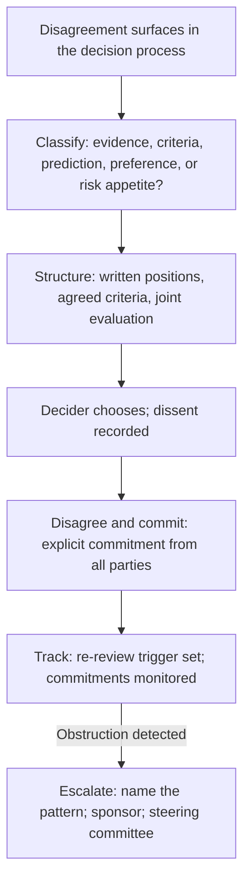

# Managing Decision Disagreement

> **Core skill:** The TPM manages disagreement within the decision process — classifying the source, structuring the argument around criteria and evidence, recording dissent without erasing it, and producing commitment from those who argued against the decision.

## Why This Matters

Disagreement is not a threat to the decision process — it is evidence that the process is working. A decision with no dissent is either trivial or suppressed. A decision with surfaced, structured, and recorded dissent is a decision that has been tested — and a decision that has been tested is more likely to survive execution because its weaknesses were examined before commitment.

The TPM's disagreement management discipline is distinct from stakeholder conflict resolution. Stakeholder conflict is about interests — what different groups want from the program. Decision disagreement is about choices — which option best serves the program's outcomes given the criteria and the evidence. The TPM manages both, but the tools are different: conflict resolution uses interest-based negotiation; decision disagreement uses criteria-based evaluation.

## The Disagreement Taxonomy

Classify before you manage. Different types of disagreement need different resolution approaches.

| Disagreement Type | What It Looks Like | Root Cause | Resolution Approach |
|--------------------|--------------------|------------|---------------------|
| Evidence disagreement | "Your data on migration cost is wrong" | Different data sources, methodologies, or interpretations | Joint data review; agree on data before arguing conclusions |
| Criteria disagreement | "You are optimizing for cost; I am optimizing for reliability" | Different values; different weighting of trade-off dimensions | Agree criteria and weights before evaluating options |
| Prediction disagreement | "You say the migration will take 8 weeks; I say 16" | Different assumptions about the future; genuine uncertainty | Run a pilot; agree on leading indicators that will resolve the prediction |
| Preference disagreement | "I prefer PostgreSQL" — "I prefer DynamoDB" — with no criteria | Personal preference masquerading as technical judgment | Surface the preference; map it to criteria; let criteria arbitrate |
| Risk appetite disagreement | "That risk is acceptable" — "That risk is unacceptable" | Different tolerance for downside | Explicit risk framing: probability × impact; agree on risk thresholds |

Criteria disagreement is the most common and the most consequential. When two stakeholders disagree on which option is best, they are usually disagreeing on what "best" means — and that is a criteria disagreement. The TPM who surfaces the criteria disagreement before the options are debated prevents the most common form of decision deadlock.

## The Structured Disagreement Process

When a decision faces genuine disagreement that cannot be resolved by clarifying evidence, the TPM runs a structured process.

| Step | Action | Output |
|------|--------|--------|
| 1. Surface the disagreement | "We have a disagreement between [A] and [B] on [question]. Let's structure it." | Named disagreement with identified parties |
| 2. Classify the type | Is it evidence, criteria, prediction, preference, or risk appetite? | Classification that determines the resolution approach |
| 3. Written positions | Each side writes: their position, their evidence, their criteria, and what would change their mind | Two one-page position documents |
| 4. Agree on decision criteria | Both sides agree on the criteria and weights that should determine the choice | A shared criteria list, agreed before any option is evaluated |
| 5. Joint evaluation | Both sides evaluate the options against the agreed criteria | A scored evaluation both sides accept as accurate |
| 6. Decide | The decider chooses based on the joint evaluation | A decision with the dissenter's position preserved |
| 7. Record and commit | Dissent recorded; both sides commit | Recorded decision with explicit commitments |

The "what would change your mind" question in step 3 is the most powerful tool in the process. It forces both sides to articulate their evidence threshold — the condition under which they would switch positions. When both sides can name what would change their mind, the disagreement is no longer a clash of wills — it is a search for evidence.

## Facilitating Disagreement in Decision Meetings

Disagreement in the decision meeting is managed differently from the structured process — faster, more constrained, but with the same principles.

| Situation | Facilitation Move |
|-----------|-------------------|
| Disagreement surfaces during open questions | "We have two positions. [A], state yours in one minute. [B], state yours in one minute. Then we will identify what you disagree on." |
| Both sides argue different questions | "It sounds like [A] is arguing about cost and [B] about reliability. Those are both criteria. Let's agree on the criteria weights before we evaluate the options." |
| One side has new evidence | "That is new information. Does it change any of the scores in the framing document? If so, let's update them now." |
| Disagreement is personal, not substantive | "I want to keep us focused on the decision criteria. [A], what criterion does your position serve? [B], same question." |
| Disagreement cannot be resolved in the meeting | "We cannot resolve this in the time we have. I propose: both sides write their position by [date]. We will use the structured process and reconvene on [date]." |

## The "Disagree and Commit" Discipline

Disagree and commit is the mechanism by which a decision proceeds with dissent on the record. Done badly, it is "shut up and do it." Done well, it is an explicit commitment from the dissenter, recorded and honored.

| Bad Disagree and Commit | Good Disagree and Commit |
|--------------------------|--------------------------|
| Dissent is silenced; the dissenter is expected to comply silently | Dissent is recorded with the dissenter's alternative and reasoning |
| Commitment is assumed, not asked | The dissenter explicitly states: "I argued for B. We chose A. I will make A work." |
| The dissenter's concerns are never revisited | The decision record includes a re-review trigger: "If [condition], we revisit." |
| If the decision fails, the dissenter is blamed or the dissenter says "I told you so" | The re-review evaluates both positions against the outcome data |

The TPM's role in disagree-and-commit: ensure the dissent is recorded accurately, ask the dissenter for explicit commitment, set the re-review conditions, and hold both sides accountable for their commitments. The TPM never uses "disagree and commit" to silence dissent — that is process abuse, and it destroys the trust that keeps dissent surfacing.

## When Disagreement Becomes Obstruction

Not all disagreement is constructive. The TPM distinguishes genuine disagreement from obstruction and responds accordingly.

| Signal | Interpretation | TPM Response |
|--------|---------------|--------------|
| Same objection, no new evidence | Obstruction, not disagreement | "That objection was addressed in the framing document. Is there new evidence? If not, the decider has the information they need." |
| Objection after the decision | Re-litigation | "The decision was made on [date] with that objection recorded. The re-review trigger is [condition]. Has it been met?" |
| Objection in every forum | The dissenter is campaigning, not dissenting | "I have recorded your dissent. Continuing to raise it outside the decision forum undermines the decision. Let's discuss this with [sponsor]." |
| Objection coupled with non-commitment | The dissenter is reserving the right to sabotage | "You stated your dissent. Can you commit to making this decision work? If not, we need to escalate to [sponsor]." |

The TPM's escalation for obstruction: name the pattern to the dissenter privately, escalate to the sponsor if it continues, and escalate to the steering committee if it threatens the program. The pattern is always named in behavioral terms: "You have raised the same objection in three forums without new evidence. The decision is made. Continuing to raise it is obstructing execution."



## Practical Applications

### Disagreement Brief Template

```markdown
# Disagreement Brief — [DR-###] — [Decision Name]

## The Disagreement
- Between: [Person A] and [Person B]
- On: [specific question they disagree on]
- Type: [evidence / criteria / prediction / preference / risk appetite]

## Position A: [Person A]
- Position: [what they advocate]
- Evidence: [supporting data]
- Criteria served: [which criteria does this position optimize for?]
- What would change their mind: [condition]

## Position B: [Person B]
- Position: [what they advocate]
- Evidence: [supporting data]
- Criteria served: [which criteria does this position optimize for?]
- What would change their mind: [condition]

## Agreed Criteria
| Criterion | Weight | A's Score | B's Score |
|-----------|--------|-----------|-----------|
| [1]       | [H/M/L] | [score]   | [score]   |

## Decision
- Chosen: [option]
- Dissent: [who, grounds, alternative]
- Re-review trigger: [condition]
- Commitment: [each party's stated commitment]
```

### Managing Disagreement Checklist

- [ ] The disagreement type is classified before resolution is attempted
- [ ] Both sides have written their positions with evidence and mind-change conditions
- [ ] Decision criteria are agreed before options are evaluated
- [ ] Dissent is recorded in the decision record, not erased
- [ ] The dissenter states explicit commitment to the decision
- [ ] A re-review trigger is set for when the dissenter's concerns would be revisited
- [ ] Obstruction is distinguished from disagreement and escalated if persistent

## Common Pitfalls

| Pitfall | Why It Is a Problem | Better Approach |
|---------|---------------------|-----------------|
| **Suppressing disagreement** | Dissent goes underground; surfaces later as passive resistance or sabotage | Surface, structure, record, and commit |
| **Arguing without criteria** | Both sides are right on different dimensions; the deadlock is artificial | Agree criteria and weights before evaluating options |
| **Fake disagree-and-commit** | "Fine, whatever" — not commitment, just exhaustion | Ask for explicit commitment: "Can you state that you will make this work?" |
| **Treating all disagreement as obstruction** | Genuine concerns are silenced; the decision loses the dissenter's insight | Distinguish obstruction from disagreement by evidence and behavior |
| **No re-review trigger** | Dissenter's concerns are never checked against reality; trust erodes | Set a measurable trigger for re-review in the decision record |

## Success Indicators

- Disagreements surface early in the process, not after the decision is made
- Both sides can state the other's position accurately before the decision
- Decisions record dissent, and re-reviews revisit it with outcome data
- Dissenters commit explicitly and execute fully
- Obstruction is rare because the process channels disagreement into decisions

## Related Topics

- [[02_Decision_Framing]]: the framing document that surfaces criteria and options
- [[03_Facilitating_Decision_Meetings]]: managing disagreement in the decision forum
- [[04_Decision_Documentation]]: recording dissent in the decision record
- [[05_Stakeholder_Alignment/06_Stakeholder_Conflict_Resolution|Stakeholder Conflict Resolution]]: the stakeholder-side counterpart
- [[career-path/03_Staff_Engineer/04_Influence_and_Alignment/03_Managing_Disagreement|Managing Disagreement (Staff)]]: the staff engineer's disagreement discipline

## Summary

Managing decision disagreement is the TPM's process for turning dissent into better decisions: classifying the disagreement type, structuring it through written positions and agreed criteria, recording dissent without erasing it, and producing explicit commitment from those who argued against the outcome. Disagreement is not a threat to the decision process — it is how the process tests decisions before they meet reality. The TPM who suppresses disagreement gets fake consensus; the TPM who channels it into structured resolution gets tested decisions and real commitment.