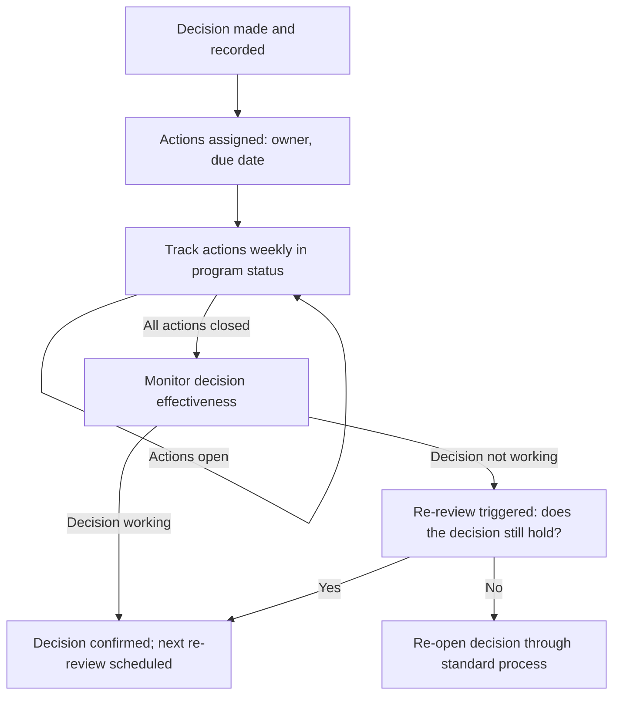

# Decision Follow Through

> **Core skill:** The TPM ensures that decisions become action — tracking post-decision actions to closure, monitoring whether the decision is having its intended effect, and revisiting decisions when conditions change or outcomes diverge from expectations.

## Why This Matters

A decision without follow-through is a decision that never happened. The architecture choice was made, but the migration plan was never written. The scope trade-off was agreed, but the backlog was never updated. The vendor was selected, but the contract was never signed. These are not decision failures — they are follow-through failures: the decision was real, the commitment was sincere, and the action dissolved into the next urgent task.

The TPM's follow-through discipline is what separates decision facilitation from decision theater. The decision meeting is not the end of the process — it is the midpoint. What happens after the meeting — the actions tracked, the outcomes measured, the re-review triggered — determines whether the decision delivers its intended effect or becomes a line in a log that nobody reads.

## The Post-Decision Action Cycle

Every decision produces actions. The TPM tracks them from the decision meeting to closure.

| Action Type | Examples | Tracking Mechanism |
|-------------|----------|--------------------|
| Communication | Distribute the decision record; update the program status; brief affected teams | Decision record distribution list; status report update |
| Implementation | Write the migration plan; update the backlog; sign the contract | Program action log with owners and dates |
| Process change | Update the architecture review process; change the deployment checklist | Process documentation update; team communication |
| Measurement | Set up the metrics to track the decision's effect; define the baseline | Metrics dashboard; baseline measurement |
| Re-review scheduling | Set a calendar reminder for the re-review date; monitor the re-review trigger | Decision register; calendar event |

## The Decision-to-Action Gap

The gap between decision and action has predictable causes. The TPM addresses each one in the follow-through plan.

| Gap Cause | Why It Happens | TPM Countermeasure |
|-----------|----------------|-----------------|
| Action-without-owner | "Someone should update the backlog" — nobody is assigned | Every action has a named owner and a due date, assigned in the decision meeting |
| Owner-without-bandwidth | The owner was assigned but has no capacity | Check capacity before assigning; if overloaded, escalate to the owner's manager |
| Action-decay | The action was important at the meeting; two weeks later, urgency has evaporated | Actions appear in the weekly status report until closed |
| Decision-amnesia | The decision was made; three weeks later, teams act as if nothing changed | Decision distributed to all affected teams within 24 hours; referenced in status |
| Outcome-invisibility | Nobody measures whether the decision worked | Measurement plan defined at the decision; baseline captured; metrics tracked |

## The Follow-Through Cadence

Post-decision follow-through has a cadence that matches the program's communication rhythm.

| Cadence | Activity | Output |
|---------|----------|--------|
| Within 24 hours | Decision record distributed to all affected stakeholders; actions assigned with owners and dates | Decision record in the decision log; actions in the program action tracker |
| Weekly | Decision actions reported in program status: open, on track, at risk, closed | Status report section: "Decisions This Period" and "Decision Actions" |
| At action due dates | Owner confirms completion or escalates delay | Action status update; escalation if delayed |
| At re-review trigger | Decision re-evaluated against outcome data | Re-review brief: "Did the decision have the intended effect?" |
| At program closure | Decision log reviewed; lessons captured | Decision effectiveness assessment in program retrospective |

## Monitoring Decision Effectiveness

Not all decisions produce their intended effect. The TPM monitors whether the decision is working and triggers re-review when the evidence warrants.

| Monitor Type | What to Measure | When to Act |
|--------------|-----------------|-------------|
| Adoption | Are teams following the decision? (e.g., using the chosen database, following the new process) | If adoption is below threshold at the checkpoint |
| Outcome | Did the decision produce the expected benefit? (e.g., performance improved, cost decreased) | If the benefit is not materializing by the forecast date |
| Side effects | Did the decision create unintended consequences? (e.g., the new database fixed performance but broke a reporting pipeline) | Immediately — side effects are risks |
| Assumption validity | Do the assumptions that produced the decision still hold? (e.g., the cost estimate assumed 10x growth; growth is 2x) | When assumptions materially change |

## Revisiting Decisions

Some decisions should be revisited. The re-review trigger — set in the decision record — determines when.

| Re-Review Trigger Type | Example | TPM Action |
|------------------------|---------|------------|
| Time-based | "Re-review in 6 months" | Calendar reminder; schedule the re-review meeting |
| Metric-based | "Re-review if p99 latency exceeds 200ms" | Monitor the metric; trigger when threshold crossed |
| Event-based | "Re-review when the vendor contract is up for renewal" | Track the event; trigger 2 months before |
| Assumption-based | "Re-review if migration costs exceed estimate by 25%" | Track actuals against estimates; trigger at threshold |

When re-review is triggered, the TPM does not re-open the decision from scratch. The TPM presents the decision record, the outcome data, and the question: "Given what we know now, does the decision still hold?" If yes, the decision is confirmed with a new re-review date. If no, the decision is re-opened through the standard decision process.



## Practical Applications

### Follow-Through Action Tracker Template

```markdown
# Decision Actions — [DR-###] — [Decision Name]

**Decision Date:** [date]
**Decision:** [one sentence]

## Actions
| Action ID | Action | Owner | Due Date | Status | Notes |
|-----------|--------|-------|----------|--------|-------|
| A1 | [action] | [name] | [date] | [Open / On Track / At Risk / Closed] | [notes] |

## Communication
- [ ] Decision record distributed to: [list]
- [ ] Program status updated: [date]
- [ ] Affected teams briefed: [teams] — [date]

## Monitoring Plan
| Metric | Baseline | Target | Checkpoint | Current |
|--------|----------|--------|------------|---------|
| [metric] | [value] | [value] | [date] | [value] |

## Re-Review
- Trigger: [condition]
- Next re-review date: [date]
- Outcome of last re-review: [confirmed / re-opened]
```

### Decision Follow-Through Checklist

- [ ] Decision record distributed to all affected stakeholders within 24 hours
- [ ] Every action has a named owner and a due date
- [ ] Owner capacity to execute actions is confirmed
- [ ] Decision actions appear in the weekly program status until closed
- [ ] A monitoring plan defines what to measure and when
- [ ] Baseline metrics are captured before the decision takes effect
- [ ] Re-review triggers are set, tracked, and acted upon
- [ ] Decisions that are not having their intended effect are re-opened

## Common Pitfalls

| Pitfall | Why It Is a Problem | Better Approach |
|---------|---------------------|-----------------|
| **Action-without-owner** | "Someone should..." — and nobody does | Assign every action to a named owner with a due date at the decision meeting |
| **Follow-through-as-afterthought** | The meeting ends; actions are captured but never tracked | Actions appear in the weekly status report until closed |
| **No monitoring plan** | Nobody knows whether the decision worked | Define metrics, baseline, and checkpoints at the decision |
| **Re-review trigger never fires** | The trigger is set but nobody tracks it | Track re-review triggers in the decision register; review at status cycles |
| **Re-opening without evidence** | Decision revisited because someone changed their mind, not because conditions changed | Re-review is triggered by the agreed condition; re-opening follows the standard process |
| **Premature closure** | Actions marked closed before the effect is verified | Verify: "Has the intended outcome been observed? If not, what is still needed?" |

## Success Indicators

- Decision actions close on or before their due dates
- The gap between decision and observable behavior change is measured and shrinking
- Decision outcomes are measured against baselines; the data drives re-review
- Re-reviews happen on schedule and are evidence-based, not opinion-based
- No decision is revisited without its re-review trigger firing

## Related Topics

- [[04_Decision_Documentation]]: the decision record that defines actions and re-review triggers
- [[05_Decision_Deadlines_and_Accountability]]: the deadline discipline that extends to action deadlines
- [[01_Decision_Process_Design]]: the end-to-end process that includes follow-through
- [[07_Benefits_and_Outcome_Measurement/04_Benefits_Tracking_and_Reporting|Benefits Tracking and Reporting]]: measuring whether decisions produce benefits
- [[04_Risk_and_Issue_Leadership/00_overview|Risk and Issue Leadership]]: unclosed decision actions are program risks

## Summary

Decision follow-through is the TPM's execution discipline: turning the decision meeting's output into tracked actions with owners and dates, monitoring whether the decision is producing its intended effect, and revisiting decisions when re-review triggers fire or outcomes diverge. A decision without follow-through is a decision that never happened — the meeting produced words, but the program did not change. The TPM who tracks decisions to closure is the TPM whose programs move; the TPM who stops at the meeting is the TPM whose programs discuss.