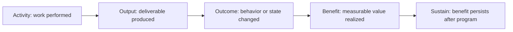

# Benefits and Outcome Measurement

> **Core capability:** The TPM keeps the program connected to value — defining measurable outcomes, tracking whether delivery is achieving them, and ensuring the program closes with an honest assessment of what was realized versus what was promised.

## Why This Matters

Programs succeed at delivering outputs and fail at realizing outcomes with alarming regularity. The platform launched, but adoption is zero. The migration completed, but costs didn't decrease. The feature shipped, but the metric didn't move. The TPM's benefits discipline is the guardrail: defining success in terms of changed state, measuring progress toward that change, and forcing the uncomfortable conversation when delivery and value diverge.

This area is also where the TPM's career compounds: programs that demonstrably delivered outcomes are the evidence for the next promotion, the next program, and the next scope expansion.

## Topics in This Capability Area

| Topic | Core Skill | When It Matters |
|-------|------------|-----------------|
| [[01_Output_vs_Outcome_vs_Benefit]] | Distinguishing activity, output, outcome, and benefit | Program definition; never conflate them |
| [[02_Benefits_Identification_and_Mapping]] | Defining and tracing benefits to program workstreams | Program initiation |
| [[03_Outcome_Metrics_and_Measurement]] | Defining measurable leading and lagging indicators | Before delivery begins |
| [[04_Benefits_Tracking_and_Reporting]] | Tracking benefit realization through the program lifecycle | Every review cycle |
| [[05_Benefits_Realization_at_Program_Closure]] | Assessing realized benefits honestly at program end | Program closure |
| [[06_Benefits_Sustainment]] | Ensuring benefits persist after the program ends | Post-program; handoff to operations |
| [[07_Program_ROI_and_Value_Communication]] | Communicating program value to leadership and stakeholders | Investment decisions; portfolio reviews |

## The Benefits Chain

The TPM's discipline: measuring at every link, not just the first.

## Practical Applications

### Benefits Measurement Checklist

- [ ] Program outcomes are defined in measurable terms, not activity descriptions
- [ ] Every major workstream has a traced benefit in the benefits map
- [ ] Leading indicators are tracked during delivery, not waiting for lagging measures
- [ ] Program closure includes an honest benefits realization assessment
- [ ] Benefits sustainment has an owner after the program transitions to operations
- [ ] Program ROI is communicated in terms stakeholders use to make investment decisions

## Common Pitfalls

| Pitfall | Why It Is a Problem | Better Approach |
|---------|---------------------|-----------------|
| **Activity-as-outcome** | "Completed migration" vs "Reduced operating cost by 30%" | Define outcomes in changed-state terms |
| **Benefits theater** | Benefits claimed but unmeasured; nobody checks | Measure and report honestly; closure as accountability |
| **Ship-and-leave** | Program ends; benefits erode because nobody sustains | Sustainment owner assigned at program initiation |
| **ROI inflation** | Overstated benefits erode trust for the next program | Conservative benefit estimation; measured actuals |

## Success Indicators

- Program outcomes are cited by stakeholders as the reason the program mattered
- Benefit measures trend in the right direction during and after the program
- Program closure reports are honest about what was and was not realized
- Sustained benefits are visible in the next planning cycle

## Related Capabilities

- [[01_Program_Structure_and_Charter/00_overview|Program Structure and Charter]]: outcomes defined in the charter drive benefits
- [[04_Risk_and_Issue_Leadership/00_overview|Risk and Issue Leadership]]: benefit risk is a category of program risk
- [[career-path/14_Product_Manager/05_Product_Analytics/00_overview|Product Analytics (PM)]]: outcome measurement from the product perspective
- [[career-path/13_Project_and_Program_Manager/00_overview|Project and Program Manager]]: the formal benefits management discipline

## Summary

Benefits and outcome measurement is the TPM's value discipline: distinguishing output from outcome, tracing benefits to workstreams, measuring leading indicators during delivery, assessing realization honestly at closure, and ensuring sustainment after the program ends. The TPM who only tracks activity manages a program; the TPM who tracks outcomes delivers value — and has the evidence to prove it.