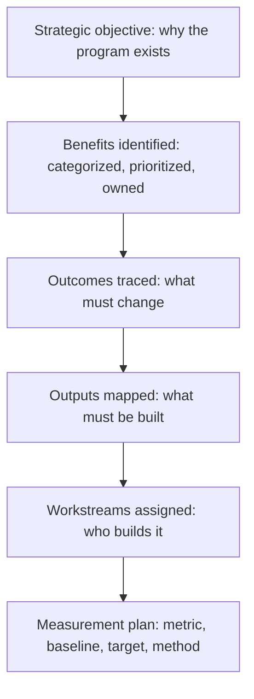

# Benefits Identification and Mapping

> **Core skill:** The TPM identifies the benefits the program is expected to produce, maps each benefit to the workstreams that will deliver it, and traces the chain from program activity through output and outcome to measurable value — so that every workstream knows what value it exists to create.

## Why This Matters

A program without a benefits map is a program where workstreams operate independently, each optimizing for its own output, with no shared understanding of what value the program is supposed to produce. The result: the platform team builds a great platform nobody adopts; the migration team completes the migration but costs stay the same; the feature team ships features that do not move the metric. Each workstream succeeded at its output. The program failed at its benefits.

Benefits identification and mapping is the TPM's value architecture: a document that says "the program exists to produce these benefits, each benefit depends on these outcomes, each outcome depends on these workstream outputs, and here is how we will measure whether the chain is holding." The benefits map is the program's theory of change — and the TPM's job is to test that theory continuously, not to assume it.

## The Benefits Map: Structure

The benefits map traces the causal chain from program activity to measurable value.

| Layer | Content | Example | Question Answered |
|-------|---------|---------|-------------------|
| Strategic objective | The business goal the program serves | "Increase market share in the SMB segment by 5%" | "Why does this program exist at the portfolio level?" |
| Benefit | The measurable value the program will produce | "$2M annual revenue from SMB feature set" | "What value will this program create?" |
| Outcome | The changed state that generates the benefit | "SMB customer onboarding time reduced from 14 days to 2 days" | "What must change for the benefit to materialize?" |
| Output | The deliverable that enables the outcome | "Self-service onboarding portal" | "What must we build?" |
| Workstream | The team and work that produces the output | "Onboarding Experience workstream" | "Who builds it?" |

## The Benefits Identification Process

Benefits are identified at program initiation, not discovered at program closure. The identification process engages the stakeholders who will judge the program's success.

| Step | Activity | Output |
|------|----------|--------|
| 1. Stakeholder value interviews | Ask each stakeholder: "What value does this program need to produce for you to consider it a success?" | List of expected benefits per stakeholder |
| 2. Benefit categorization | Classify benefits by type: financial, strategic, operational, risk reduction, compliance | Categorized benefit list |
| 3. Benefit prioritization | Stakeholders rank benefits by importance; conflicts are surfaced and resolved | Prioritized benefit list with stakeholder agreement |
| 4. Outcome tracing | For each benefit, identify the outcome that produces it and the output that enables the outcome | Benefits map: benefit → outcome → output → workstream |
| 5. Measurement definition | For each outcome and benefit, define the metric, baseline, target, and measurement method | Measurement plan |
| 6. Owner assignment | Assign a benefit owner responsible for tracking realization | Benefit ownership matrix |

## Benefit Categories

| Category | Definition | Examples | Measurement Type |
|----------|------------|----------|------------------|
| Financial | Direct monetary value: revenue increase, cost reduction | Cost savings, revenue growth, margin improvement | Dollar value |
| Strategic | Competitive or market position value | Market share, customer acquisition, brand strength | Strategic metrics (share, NPS, retention) |
| Operational | Internal efficiency or capability value | Faster delivery, higher quality, better reliability | Process metrics (cycle time, defect rate, uptime) |
| Risk reduction | Value from reduced probability or impact of adverse events | Fewer incidents, compliance gaps closed, security posture improved | Risk metrics (incident count, audit findings, vulnerability count) |
| Compliance | Value from meeting regulatory or contractual obligations | GDPR compliance, SOC2 certification, contractual obligations met | Binary (compliant / not compliant) |

Most programs claim benefits in multiple categories. The TPM ensures each benefit category has its own measurement approach — financial benefits are measured differently from risk reduction benefits, and conflating them produces benefits reports that nobody believes.

## The Benefits Dependency Map

Benefits rarely come from a single workstream — and a single workstream rarely produces a single benefit. The benefits dependency map shows the relationships.

| Benefit | Depends On (Outcome) | Enabled By (Output) | Delivered By (Workstream) | Conflicts With | Measured By |
|---------|---------------------|---------------------|--------------------------|----------------|-------------|
| $2M SMB revenue | SMB onboarding time: 14d → 2d | Self-service onboarding portal | Onboarding Experience | None | Monthly SMB revenue; onboarding completion rate |
| $200k cost reduction | Infra cost per transaction: -30% | Cloud migration of 12 services | Platform Modernization | SMB feature work competes for platform team capacity | Monthly infra bill; cost per transaction |
| Zero critical incidents | Mean time to recovery: 4h → 30min | Automated incident response | Site Reliability | None | Incident count; MTTR |

Conflicts between benefits are surfaced in the map. When two benefits compete for the same team's capacity, the benefits map makes the trade-off visible — and forces the prioritization conversation that otherwise happens implicitly (and usually to the detriment of the lower-profile benefit).

## The Benefits Owner

Every benefit has an owner. The owner is not the TPM — the TPM tracks benefits; the owner is accountable for their realization.

| Owner Type | When to Use | Example |
|------------|-------------|---------|
| Product lead | Revenue, adoption, customer satisfaction benefits | SMB revenue target owned by the SMB product lead |
| Engineering lead | Operational, reliability, technical debt benefits | Infrastructure cost reduction owned by the platform engineering lead |
| Business stakeholder | Strategic, market position benefits | Market share target owned by the VP of SMB |
| Security / Compliance lead | Risk reduction, compliance benefits | Zero critical incidents owned by the CISO |

The benefit owner signs off on the benefit target at program initiation, receives benefit progress reports during the program, and is accountable for benefit realization at program closure. A benefit without an owner is a benefit that will be reported but never delivered — because nobody's performance depends on it.



## Practical Applications

### Benefits Map Template

```markdown
# Benefits Map — [Program Name]

## Strategic Objective
- [One sentence: the business goal this program serves]

## Benefits Map
| Benefit | Category | Target | Owner | Outcome Required | Output Required | Workstream | Metric | Baseline | Measurement Method |
|---------|----------|--------|-------|------------------|-----------------|------------|--------|----------|--------------------|
| [benefit] | [Financial/Strategic/Operational/Risk/Compliance] | [value by date] | [name] | [changed state] | [deliverable] | [team] | [metric] | [baseline value] | [how measured] |

## Benefit Dependencies
| Benefit | Depends On | Conflicts With | Resolution |
|---------|------------|----------------|------------|
| [benefit A] | [benefit B must be realized first] | [benefit C competes for same team] | [how conflict resolved] |

## Benefit Owners
| Benefit | Owner | Owner's Stake | Sign-off Date |
|---------|-------|---------------|---------------|
| [benefit] | [name, role] | [why they care] | [date] |
```

### Benefits Identification Checklist

- [ ] Every stakeholder's definition of program value is captured during initiation
- [ ] Benefits are categorized: financial, strategic, operational, risk, compliance
- [ ] Benefits are prioritized with stakeholder agreement; conflicts are resolved
- [ ] Every benefit is traced through outcome → output → workstream
- [ ] Every benefit has a metric, baseline, target, and measurement method
- [ ] Every benefit has an owner who signed off on the target
- [ ] Benefit dependencies and conflicts are surfaced in the map

## Common Pitfalls

| Pitfall | Why It Is a Problem | Better Approach |
|---------|---------------------|-----------------|
| **Benefits identified at closure** | The program delivers; someone asks "what value did we create?" — and invents it | Identify benefits at initiation; track throughout |
| **Uncategorized benefits** | "The program will improve things" — vague, unmeasurable, nobody accountable | Categorize every benefit; define a metric for each |
| **Benefits without owners** | The TPM tracks benefits; nobody owns delivering them | Assign a benefit owner with a performance stake in the outcome |
| **Benefit-as-output** | "Deliver the platform" listed as a benefit | Distinguish: the platform is the output; the cost reduction is the benefit |
| **Conflict ignored** | Two benefits compete for the same team; the lower-profile benefit silently starves | Surface conflicts in the benefits map; force the prioritization decision |

## Success Indicators

- Every workstream lead can state the benefit their work exists to produce
- The benefits map is referenced in program reviews, not filed and forgotten
- Benefit owners actively engage with benefit progress reports
- Benefit conflicts are resolved in governance, not by silent resource starvation
- Program closure reports cite the benefits map against actual outcomes

## Related Topics

- [[01_Output_vs_Outcome_vs_Benefit]]: the distinction that makes the benefits map possible
- [[03_Outcome_Metrics_and_Measurement]]: defining the metrics for each benefit in the map
- [[04_Benefits_Tracking_and_Reporting]]: tracking the map through the program lifecycle
- [[01_Program_Structure_and_Charter/00_overview|Program Structure and Charter]]: the charter defines the strategic objective
- [[career-path/13_Project_and_Program_Manager/00_overview|Project and Program Manager]]: the formal benefits management framework

## Summary

Benefits identification and mapping is the TPM's value architecture: identifying the measurable value the program exists to create, mapping each benefit through outcomes to workstream outputs, categorizing and prioritizing benefits with stakeholder agreement, assigning owners accountable for realization, and surfacing the dependencies and conflicts between benefits. A program without a benefits map is a program where workstreams optimize for output and hope value follows. A program with a benefits map knows what value it exists to produce — and measures whether it is producing it.