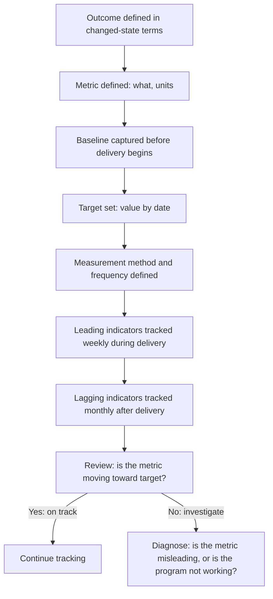

# Outcome Metrics and Measurement

> **Core skill:** The TPM defines measurable leading and lagging indicators for every program outcome — establishing baselines before delivery begins, setting targets that represent success, and building the measurement infrastructure that reports progress honestly through the program lifecycle.

## Why This Matters

An outcome without a metric is an aspiration. "Reduce operating costs" is not an outcome — it is a direction. "Reduce operating costs by 30 percent, from a baseline of $0.12 per transaction to $0.08 per transaction, measured monthly via the cloud billing dashboard" is an outcome. The difference is the metric, the baseline, the target, and the measurement method — and without all four, the program cannot know whether it succeeded.

The TPM's measurement discipline is not data science — it is operational definition. For every outcome in the benefits map, the TPM defines what will be measured, how it will be measured, what the starting point is, what the success threshold is, and when the measurement will be taken. Programs that define these five things before delivery begins can answer "is it working?" at any point. Programs that do not can only answer "is it done?"

## The Metric Definition: Five Required Fields

Every outcome metric needs five fields defined before measurement begins.

| Field | Definition | Example | Failure Mode |
|-------|-----------|---------|---------------|
| Metric | What is being measured, with units | "Infrastructure cost per transaction (USD)" | Vague metric: "cost" — which cost? |
| Baseline | The starting value before the program's effect | "$0.12/txn (Q1 2026 average)" | No baseline: change is unmeasurable because the starting point is unknown |
| Target | The value that represents success, with a date | "$0.08/txn by Q4 2026" | Target absent: "reduce costs" — by how much? by when? |
| Measurement method | How the metric is calculated and sourced | "Cloud billing dashboard → total infra cost / total transactions; measured monthly" | Method unknown: the metric exists in theory but cannot be produced |
| Measurement frequency | How often the metric is captured and reported | "Monthly, reported in the program status report" | Frequency mismatch: measured annually for a program that runs 6 months |

## Leading vs Lagging Indicators

Outcomes are tracked with both leading and lagging indicators. Leading indicators tell you whether you are on track during delivery. Lagging indicators tell you whether you succeeded after delivery.

| Indicator Type | When It Moves | What It Tells You | Example |
|----------------|---------------|-------------------|---------|
| Leading | During delivery — before the outcome is fully realized | Are the conditions for the outcome being created? | Number of services migrated (leading for cost reduction); feature adoption rate (leading for revenue) |
| Lagging | After delivery — when the outcome has had time to materialize | Was the outcome achieved? | Infrastructure cost per transaction (lagging for cost reduction); quarterly revenue from new features (lagging for revenue) |
| Proxy | When the true metric is unavailable or too slow | What is the best available signal of the outcome? | Customer support ticket volume (proxy for product quality); page load time (proxy for user experience) |

The TPM tracks leading indicators weekly during delivery and lagging indicators monthly after delivery. A program that tracks only lagging indicators discovers failure months after the decision to intervene would have been cheap. A program that tracks only leading indicators risks optimizing for the proxy instead of the outcome.

## The Measurement Baseline

The baseline is the most important and most neglected part of outcome measurement. A program that starts without a baseline can measure change but cannot attribute it — because it does not know where it started.

| Baseline Quality | How to Establish | Example |
|------------------|------------------|---------|
| Strong | Historical data from the same measurement method over the same period | "Infrastructure cost per transaction averaged $0.12 over the 6 months before program start" |
| Adequate | A point-in-time measurement at program start | "Infrastructure cost per transaction was $0.13 in the month of program start" |
| Weak | An estimate based on partial data or a different measurement method | "We estimate infrastructure cost per transaction at approximately $0.10-$0.15 based on last quarter's total bill" |
| None | No baseline — change is unmeasurable | N/A — this is a measurement failure before the program begins |

The TPM pushes for a strong baseline and accepts an adequate one when strong is unavailable. A weak baseline must be accompanied by a plan to improve it. No baseline is a risk that must be escalated — because the program is committing to deliver an outcome it cannot measure.

## Building the Measurement Dashboard

The TPM builds or commissions a measurement dashboard that tracks every outcome metric and its leading indicators.

| Dashboard Element | Content | Update Frequency |
|-------------------|---------|------------------|
| Outcome metrics | Lagging indicators with baseline, target, current, and trend | Monthly |
| Leading indicators | Early signals that correlate with outcome movement | Weekly |
| Milestone correlation | Outcome metrics overlaid on program milestones | Per milestone |
| Variance analysis | Current vs. target; explanation of variance | Monthly |
| Forecast | Projected outcome achievement date based on current trend | Monthly |

The dashboard is shared with stakeholders at the cadence defined in the communication plan. A dashboard that is built and never viewed is measurement theater — it consumes effort and produces no alignment.

## When Metrics Mislead

Metrics can mislead. The TPM watches for the signals that a metric is being gamed, has drifted from the outcome, or is measuring the wrong thing.

| Misleading Signal | What It Means | TPM Response |
|-------------------|---------------|--------------|
| Goodhart's Law in effect | "When a measure becomes a target, it ceases to be a good measure" — the team optimizes for the metric, not the outcome | Audit the metric against the outcome; add counter-balancing metrics |
| Metric improvement without outcome improvement | The metric is moving in the right direction but the underlying outcome is not | Investigate the disconnect; the metric may be measuring the wrong thing or the lag between metric and outcome may be longer than expected |
| Metric plateau | The metric stopped improving before reaching the target | Investigate: is further improvement possible with the current approach, or is the target unrealistic? |
| Metric volatility | The metric swings wildly; trend is unreadable | Increase measurement frequency; investigate data quality; use a rolling average |



## Practical Applications

### Outcome Metric Definition Template

```markdown
# Outcome Metric Definition — [Outcome Name]

## Metric
- Name: [metric name]
- Units: [units]
- Definition: [precise description of what is measured and how it is calculated]

## Baseline
- Value: [baseline value]
- Period: [baseline period — e.g., "6 months before program start"]
- Source: [data source]
- Confidence: [High / Medium / Low — quality of the baseline data]

## Target
- Value: [target value]
- Date: [target achievement date]
- Interim milestones: [intermediate targets with dates]

## Measurement
- Method: [how the metric is calculated and sourced]
- Frequency: [how often it is captured]
- Owner: [who is responsible for producing the measurement]

## Leading Indicators
| Indicator | Relationship to Outcome | Frequency | Current |
|-----------|------------------------|-----------|---------|
| [indicator] | [how it predicts the outcome] | [weekly/monthly] | [value] |

## Risks
- [What could cause the metric to mislead? What could prevent measurement?]
```

### Outcome Metrics Checklist

- [ ] Every program outcome has a defined metric with units
- [ ] A baseline has been captured before delivery begins
- [ ] A target has been set with a date: value by when
- [ ] The measurement method and frequency are defined and operational
- [ ] Leading indicators are tracked weekly during delivery
- [ ] Lagging indicators are tracked monthly after delivery
- [ ] The measurement dashboard is shared with stakeholders at the defined cadence
- [ ] Metric health is reviewed: is the metric still measuring the outcome, or has it drifted?

## Common Pitfalls

| Pitfall | Why It Is a Problem | Better Approach |
|---------|---------------------|-----------------|
| **Metric without baseline** | Change is unmeasurable; the program cannot prove it produced the outcome | Capture the baseline before delivery begins, even if it is point-in-time |
| **Target without a date** | "Reduce costs by 30%" — by when? Target floats indefinitely | Set a target date: "Reduce costs by 30% by Q4 2026" |
| **Lagging-only measurement** | The program discovers failure months after the intervention window closed | Track leading indicators weekly during delivery |
| **Proxy-as-outcome** | The team optimizes for the proxy; the outcome does not improve | Validate the proxy against the outcome; use multiple indicators |
| **Dashboard-as-decoration** | Measurement infrastructure built; nobody looks at it | Integrate the dashboard into the program review cadence; discuss metrics in status |

## Success Indicators

- Every outcome has a metric, baseline, target, measurement method, and frequency
- Leading indicators are reported in weekly status; lagging indicators in monthly reviews
- The measurement baseline is cited in program reviews as the reference point
- Metric anomalies are investigated, not ignored — the TPM asks "why did this move?"
- Stakeholders trust the metrics because the measurement method is transparent

## Related Topics

- [[01_Output_vs_Outcome_vs_Benefit]]: the distinction that determines what to measure
- [[02_Benefits_Identification_and_Mapping]]: the benefits map that defines the outcomes
- [[04_Benefits_Tracking_and_Reporting]]: reporting the metrics through the program lifecycle
- [[career-path/14_Product_Manager/05_Product_Analytics/00_overview|Product Analytics (PM)]]: product metric definition and measurement

## Summary

Outcome metrics and measurement is the TPM's operational definition discipline: defining every outcome as a measurable metric with a baseline, target, measurement method, and frequency — then building the leading and lagging indicators that report progress honestly through the program lifecycle. The TPM who cannot produce a baseline-to-current trend for every program outcome is managing activity, not outcomes. The TPM who can is managing the only thing that justifies the program's existence: measurable value.