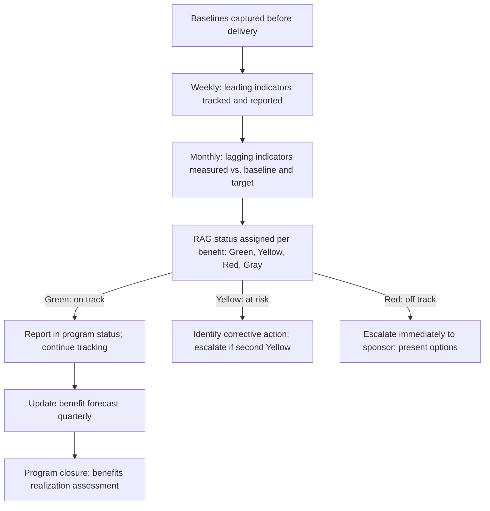

# Benefits Tracking and Reporting

> **Core skill:** The TPM tracks benefit realization through the program lifecycle — reporting leading indicators during delivery, lagging indicators after delivery, and variance from the benefits forecast — so that stakeholders know whether the program is on track to deliver its intended value, not just its intended output.

## Why This Matters

Most programs report status as a list of outputs: milestones completed, features shipped, migrations done. Benefits tracking adds a second dimension: given what we have delivered so far, are we on track to realize the benefits we promised? This dimension is what separates program management from project management — and it is the dimension that stakeholders care about most.

Benefits tracking is not done once at program closure. It is done at every program review, because the gap between delivery progress and benefit progress is the earliest signal of program failure. A program that has delivered 80 percent of its outputs but realized 10 percent of its benefits is a program that is either measuring the wrong things, delivering the wrong things, or operating on a benefits forecast that was always fiction. The TPM who reports this gap early gives stakeholders time to correct course. The TPM who reports only output progress hides the gap until it is too late to correct.

## The Benefits Tracking Cadence

Benefits are tracked at three cadences, each serving a different purpose.

| Cadence | What Is Reported | Audience | Purpose |
|---------|-----------------|----------|---------|
| Weekly | Leading indicators: early signals of benefit trajectory | Program team; TPM | Are the conditions for benefit realization being created? |
| Monthly | Lagging indicators: outcome metric movement toward target | Program stakeholders; steering committee | Are outcomes materializing as expected? |
| Per milestone | Benefit forecast update: projected vs. promised | Steering committee; sponsor | Is the program still on track to deliver its committed benefits? |
| At closure | Benefit realization assessment: actual vs. target | All stakeholders; portfolio governance | Did the program deliver the value it promised? |

## The Benefits Status Report Section

The TPM's weekly program status report includes a benefits section. It is not an appendix — it is the second thing stakeholders read, after the executive summary.

| Section Element | Content | Example |
|-----------------|---------|---------|
| Benefit summary | One-line RAG status per benefit | "Benefit B1 (SMB revenue): GREEN — on track; Benefit B2 (cost reduction): YELLOW — leading indicators lagging" |
| Leading indicator trend | This week's leading indicators with direction | "Services migrated: 8/12 (↑2). Feature adoption: 12% (↑3%). Onboarding time: 11 days (↓3 days)." |
| Outcome metric snapshot | Current lagging indicator values vs. baseline and target | "Cost/txn: $0.10 (baseline $0.12, target $0.08, trending toward target)" |
| Variance and explanation | Any benefit not on track, with cause and corrective action | "B2 YELLOW: Migration pace is behind forecast due to dependency delay (see RAID DR-014). Corrective: dependency escalated to sponsor; revised migration forecast Q1 2027." |
| Benefit forecast | Projected benefit achievement date based on current trend | "B1: target $2M by Q4 2026 — forecast $1.8M by Q4 2026, $2M by Q1 2027" |

## The Benefit RAG Status

Each benefit has a RAG status defined by its trajectory toward the target.

| Status | Definition | Criteria |
|--------|------------|----------|
| Green | On track to achieve the benefit target by the target date | Leading indicators are at or above forecast; lagging indicators are trending toward target; no risks that would derail the trajectory |
| Yellow | At risk of missing the benefit target; corrective action identified | Leading indicators are below forecast but recoverable; a known risk is materializing; the forecast shows a delay but not a failure |
| Red | Will not achieve the benefit target without significant intervention | Leading indicators are significantly below forecast and not improving; a material risk has crystallized; the forecast shows the target will not be met |
| Gray | Not yet measurable — too early in the program for the benefit to have leading indicators | Delivery has not progressed far enough for the benefit's leading indicators to be meaningful |

A benefit that is Yellow for two consecutive reporting periods is escalated to the sponsor. A benefit that is Red is escalated immediately — because a Red benefit is a program failure in progress, and the sooner stakeholders know, the sooner they can decide whether to intervene or accept the shortfall.

## The Output-Benefit Gap Report

The TPM's most important benefits report is the output-benefit gap: comparing delivery progress against benefit progress. A gap is the earliest and most reliable signal of program trouble.

| Output Progress | Benefit Progress | Interpretation | Action |
|-----------------|------------------|----------------|--------|
| 80% | 80% | Healthy: benefits are materializing in proportion to delivery | Continue tracking |
| 80% | 30% | Warning: the delivered outputs are not producing the expected outcomes | Investigate: are the right outputs being delivered? Is the benefits logic flawed? Are leading indicators lagging? |
| 30% | 80% | Suspicious: benefits reported without the outputs that should produce them | Investigate: are the benefits real? Is the measurement capturing external factors? |
| 100% | 20% | Failure: the program delivered everything and achieved almost nothing | Escalate: the benefits forecast was wrong, the outputs were wrong, or the outcome chain was broken |

## Benefits Reporting to Different Audiences

| Audience | What They Need | Format |
|----------|----------------|--------|
| Program team | Leading indicators: what to act on this week | Dashboard section; weekly sync |
| Steering committee | Outcome metrics, benefit RAG, forecast vs. commitment | One-pager in the steering deck; benefit RAG with variance explanation |
| Executive sponsor | Benefit summary: are we on track to deliver the value we promised? | One-line per benefit: RAG, forecast date, one-sentence variance |
| Portfolio governance | Benefit actuals vs. business case commitments | Quarterly benefits review: actuals, forecast, variance, lessons |
| Benefit owners | Their benefit's leading and lagging indicators with variance detail | Monthly benefit owner report: metric trend, risks, actions needed |



## Practical Applications

### Benefits Status Template

```markdown
# Benefits Status — [Program Name] — [Date]

## Benefit Summary
| Benefit ID | Benefit | RAG | Target | Forecast | Variance | Action |
|------------|---------|-----|--------|----------|----------|--------|
| B1 | [benefit] | [G/Y/R/Gray] | [value by date] | [forecast] | [variance] | [action] |

## Leading Indicators
| Indicator | Linked Benefit | Current | Last Period | Target Trajectory | Trend |
|-----------|----------------|---------|-------------|-------------------|-------|
| [indicator] | [B1] | [value] | [value] | [expected value] | [↑/→/↓] |

## Outcome Metrics
| Metric | Linked Benefit | Baseline | Target | Current | % to Target | Trend |
|--------|----------------|----------|--------|---------|-------------|-------|
| [metric] | [B1] | [value] | [value] | [value] | [%] | [↑/→/↓] |

## Output-Benefit Gap
| Output Progress | Benefit Progress | Gap | Interpretation |
|-----------------|------------------|-----|----------------|
| [%] | [%] | [%] | [analysis] |

## Escalations
- [Benefit ID]: [reason for Yellow/Red] — [action] — [escalated to] — [date]
```

### Benefits Tracking Checklist

- [ ] Benefits RAG status is reported in every program status cycle
- [ ] Leading indicators are tracked weekly; lagging indicators monthly
- [ ] The output-benefit gap is calculated and reported at each milestone review
- [ ] Yellow benefits are escalated if they remain Yellow for two consecutive periods
- [ ] Red benefits are escalated immediately with options for intervention
- [ ] Benefit forecasts are updated quarterly based on actual trajectory
- [ ] Benefit owners receive their benefit's status report monthly

## Common Pitfalls

| Pitfall | Why It Is a Problem | Better Approach |
|---------|---------------------|-----------------|
| **Output-only status** | Reports what was delivered, not whether delivery is producing value | Add a benefits section to every status report with leading indicators and RAG |
| **Benefits reported annually** | The gap between delivery and benefit is discovered too late to correct | Track leading indicators weekly; lagging indicators monthly |
| **RAG inflation** | Benefits reported Green when they are Yellow; stakeholders trust degrades | Define RAG criteria objectively; audit RAG assignments at program reviews |
| **Output-benefit gap ignored** | Gap between delivery progress and benefit progress grows unnoticed | Calculate and report the gap at every milestone review |
| **Benefit owner disengaged** | Benefit status is sent; owner does not read or act on it | Escalate disengaged benefit owners to the sponsor; benefits without engaged owners are at risk |

## Success Indicators

- Benefits RAG status is the second section stakeholders read after the executive summary
- The output-benefit gap is discussed at program reviews with the same weight as milestone status
- Benefit owners respond to Yellow and Red statuses with corrective actions
- Benefit forecasts converge with actuals as the program progresses — early forecasts were honest, not optimistic
- No stakeholder is surprised by a benefit shortfall at program closure

## Related Topics

- [[03_Outcome_Metrics_and_Measurement]]: the metrics definition that enables tracking
- [[02_Benefits_Identification_and_Mapping]]: the benefits map that defines what to track
- [[05_Benefits_Realization_at_Program_Closure]]: the closure assessment that the tracking builds toward
- [[05_Stakeholder_Alignment/03_Executive_Communication_for_TPMs|Executive Communication for TPMs]]: reporting benefit status to executives

## Summary

Benefits tracking and reporting is the TPM's value-accountability discipline: tracking leading indicators weekly, lagging indicators monthly, assigning an honest RAG status to every benefit, calculating the output-benefit gap at every milestone, and reporting benefit trajectory alongside delivery progress in every status cycle. The program that reports only output is managing activity; the program that reports output and benefit trajectory is managing value — and value is what stakeholders funded the program to produce.