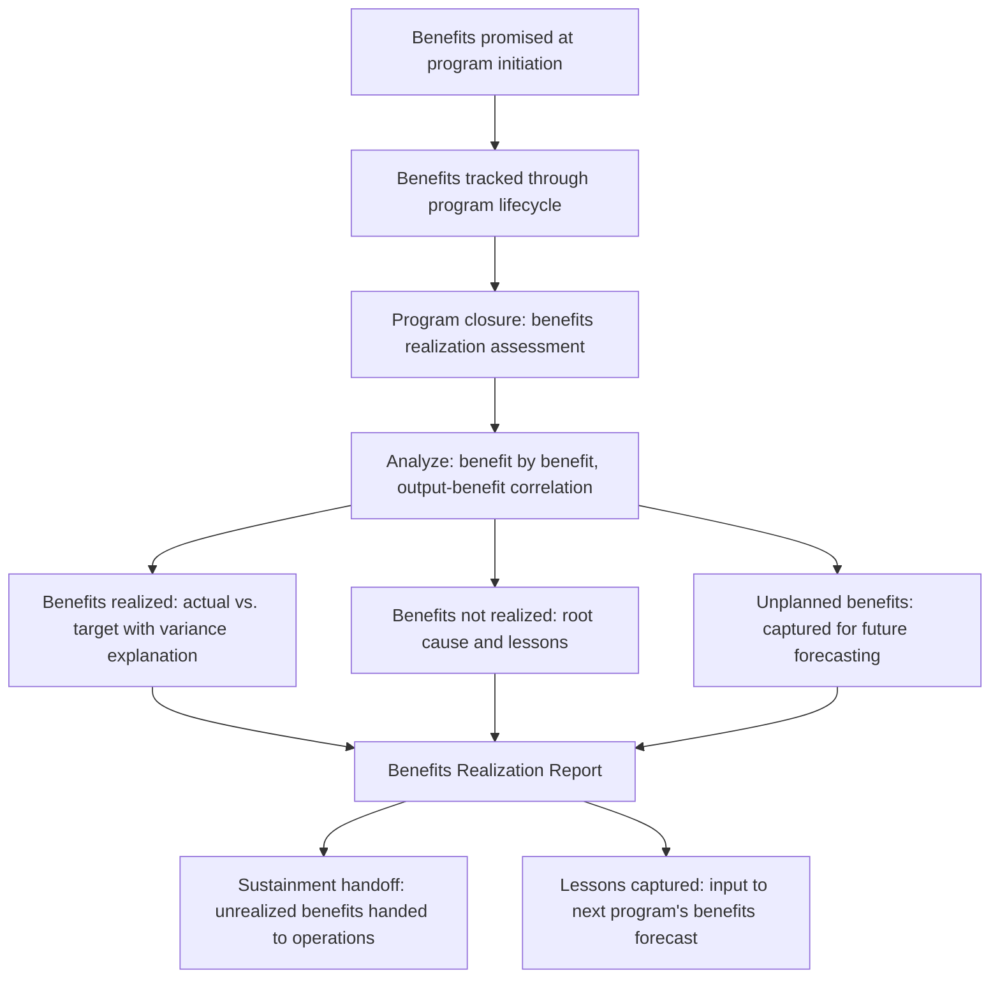

# Benefits Realization at Program Closure

> **Core skill:** The TPM conducts an honest benefits realization assessment at program closure — comparing actual outcomes against the benefits forecast, explaining variance without defensiveness, and capturing the lessons that make the next program's benefits forecast more accurate.

## Why This Matters

Program closure is the moment of truth for benefits. The program spent months or years delivering outputs, tracking leading indicators, and forecasting benefit trajectories. At closure, the question is simple: did the program deliver the value it promised? The answer determines whether the TPM's next program starts with credibility or skepticism — and whether the organization's investment process learns or repeats its forecasting errors.

The benefits realization assessment is not a victory lap. It is an audit. An honest assessment reports the shortfalls alongside the successes, explains the variance between forecast and actual, and delivers the uncomfortable finding that a benefit was never realized or was smaller than promised. The TPM who delivers an honest assessment builds trust for the next program. The TPM who delivers a glossy assessment that ignores the gaps builds skepticism — and the skeptic's lens is applied to every future forecast.

## The Benefits Realization Assessment Structure

| Section | Content | Purpose |
|---------|---------|---------|
| 1. Executive summary | One-page summary: benefits promised vs. benefits realized, with RAG | The answer to "did the program deliver value?" |
| 2. Benefit-by-benefit analysis | Per benefit: target, actual, variance, variance explanation, lessons | The detailed audit trail |
| 3. Output-benefit correlation | Did delivered outputs produce expected outcomes? | Tests the program's theory of change |
| 4. Unplanned benefits | Benefits realized that were not in the original forecast | Captures positive surprises for future programs |
| 5. Benefits not realized | Benefits that were not achieved, with root cause | The uncomfortable section that builds credibility |
| 6. Sustainment handoff | How remaining benefits will be tracked after program closure | Ensures benefits are not abandoned |
| 7. Lessons for future programs | What this program's benefits experience teaches about forecasting and realization | The learning that compounds across programs |

## The Benefit-by-Benefit Variance Analysis

Each benefit gets a variance analysis that explains the gap between promised and realized — and the explanation is honest, not defensive.

| Benefit Variance Report Field | Example |
|-------------------------------|---------|
| Benefit | "Reduce infrastructure cost per transaction by 30% — from $0.12 to $0.08" |
| Target | "$0.08/txn by Q4 2026" |
| Actual at closure | "$0.09/txn — 25% reduction" |
| Variance | "-5 percentage points vs. target" |
| Root cause | "Migration of legacy service X was descoped in Q3 due to dependency risk (DR-034). Service X accounts for 15% of infrastructure spend. Without its migration, the full 30% reduction was unachievable." |
| Was the variance foreseeable? | "Yes — flagged in the Q2 benefits forecast as a risk. The risk crystallized in Q3 when the dependency was not resolved." |
| Could the program have corrected? | "No — the dependency was outside the program's control. The descope decision was approved by the steering committee on [date]." |
| Lesson | "Benefits dependent on descope-risk workstreams should carry a confidence range, not a point target. The target should have been stated as '20-30% reduction, contingent on legacy service migration.'" |

The variance analysis demonstrates that the TPM was tracking — not that the TPM was perfect. A variance that was flagged early and explained honestly builds more credibility than a target that was met with no explanation.

## The Output-Benefit Correlation Analysis

The closure assessment tests the program's theory of change: did the outputs we delivered produce the outcomes we expected?

| Output | Expected Outcome | Actual Outcome | Correlation |
|--------|-----------------|----------------|-------------|
| Self-service onboarding portal | SMB onboarding time: 14d → 2d | SMB onboarding time: 14d → 3d | Strong: the portal reduced onboarding time by 11 days. The target of 2 days was not reached because manual verification was still required for enterprise accounts. |
| Cloud migration of 11 services | Infra cost: -30% | Infra cost: -25% | Strong but incomplete: migrated services showed the expected cost reduction. The full target was not met because legacy service X was not migrated. |
| Automated CI/CD pipeline | Deploy time: 4d → 2h | Deploy time: 4d → 1.5h | Exceeded: the pipeline performed better than forecast due to parallelization that was added mid-program. |

A weak or negative correlation is the most important finding — it means the program's logic was wrong, and that lesson is more valuable than any single benefit realized.

## Benefits Not Realized

The section that most programs skip and the section that most builds credibility.

| Benefit | Target | Actual | Why Not Realized | Was the Forecast Honest? | Lesson |
|---------|--------|--------|------------------|--------------------------|--------|
| "50,000 MAU within 6 months" | 50,000 | 12,000 | The feature set was narrower than planned due to scope cuts; the marketing launch was delayed by 3 months | Partially: the forecast assumed full scope delivery and on-time marketing launch, both of which were flagged as risks | Benefits dependent on scope and launch timing should be forecast as ranges tied to scope scenarios |
| "Zero critical incidents" | 0 | 3 | Two incidents were caused by a vendor outage outside the program's control; one was a program-introduced regression | No: "zero incidents" is an unrealistic target for any migration. A better target would have been "MTTR reduced from 4h to 30min; critical incident count reduced by 80%" | Risk reduction benefits should target probability reduction, not elimination |

Honesty about benefits not realized separates the TPM who manages programs from the TPM who manages value. The TPM who reports only realized benefits is doing public relations. The TPM who reports what was and was not realized is doing program management — and the second one gets trusted with bigger programs.

## Unplanned Benefits

Some benefits materialize that were not in the original forecast. These are captured not as consolation prizes but as evidence that the program produced value beyond its mandate — and as input to future forecasting.

| Unplanned Benefit | How It Was Discovered | Value |
|-------------------|-----------------------|-------|
| "Developer productivity increased 15% due to standardized tooling introduced by the migration" | Developer survey and cycle-time metrics captured as part of the migration's operational metrics | Estimated $300k annual productivity gain |
| "Customer support ticket volume decreased 20% because the new onboarding flow eliminated the top three support drivers" | Support analytics showed the decrease correlated with onboarding launch | Reduced support cost of $50k annually |

Unplanned benefits are evidence that the program's scope had positive externalities — and they are captured so that future programs can plan for them intentionally rather than discover them accidentally.



## Practical Applications

### Benefits Realization Report Template

```markdown
# Benefits Realization Report — [Program Name] — [Closure Date]

## Executive Summary
- Benefits promised: [count]
- Benefits fully realized: [count] ([%])
- Benefits partially realized: [count] ([%])
- Benefits not realized: [count] ([%])
- Unplanned benefits realized: [count]
- Overall benefits RAG at closure: [Green / Yellow / Red]

## Benefit-by-Benefit Analysis
| Benefit | Category | Target | Actual | Variance | Root Cause | Foreseeable? | Correctable? | Lesson |
|---------|----------|--------|--------|----------|------------|--------------|--------------|--------|
| [B1] | [category] | [target] | [actual] | [variance] | [cause] | [Yes/No/Partially] | [Yes/No] | [lesson] |

## Output-Benefit Correlation
| Output | Expected Outcome | Actual Outcome | Correlation Strength | Analysis |
|--------|-----------------|----------------|---------------------|----------|
| [output] | [expected] | [actual] | [Strong/Weak/None] | [analysis] |

## Benefits Not Realized
| Benefit | Why Not Realized | Forecast Honesty Assessment | Lesson for Future Programs |
|---------|------------------|----------------------------|---------------------------|
| [benefit] | [cause] | [Honest/Optimistic/Unrealistic] | [lesson] |

## Unplanned Benefits
| Benefit | Value | How Discovered |
|---------|-------|----------------|
| [benefit] | [value] | [method] |

## Sustainment Handoff
| Benefit | Post-Program Owner | Tracking Method | Next Review Date |
|---------|--------------------|----------------|------------------|
| [benefit] | [name] | [method] | [date] |

## Lessons for Future Programs
1. [Lesson 1]
2. [Lesson 2]
```

### Benefits Realization Checklist

- [ ] Every benefit in the original forecast is reported: realized, partially realized, or not realized
- [ ] Variance is explained honestly: root cause, foreseeability, correctability
- [ ] The output-benefit correlation is analyzed: did outputs produce expected outcomes?
- [ ] Benefits not realized are reported with forecast honesty assessment and lessons
- [ ] Unplanned benefits are captured and valued
- [ ] The sustainment handoff is documented with post-program owners
- [ ] Lessons are captured in a format that feeds the next program's benefits planning

## Common Pitfalls

| Pitfall | Why It Is a Problem | Better Approach |
|---------|---------------------|-----------------|
| **Closure-as-victory-lap** | Only realized benefits reported; gaps ignored; credibility lost for the next program | Report honestly: realized, partially realized, not realized |
| **Variance without explanation** | "30% target; 25% actual" — no root cause, no lesson | Explain variance: what caused it, was it foreseeable, could it have been corrected |
| **Forecast honesty dodged** | Benefits not realized are blamed on external factors without examining the forecast's assumptions | Assess: was the forecast honest given what was known at initiation? If not, why not? |
| **No sustainment handoff** | Program closes; benefits tracking stops; benefits erode with no owner | Hand off to operations with named owners and a tracking schedule |
| **Lessons not captured** | The program's benefits experience is lost; the next program repeats the same forecasting errors | Write lessons in a format that feeds the benefits identification process for the next program |

## Success Indicators

- The benefits realization report is cited by portfolio governance as the honest account of program value
- The output-benefit correlation analysis reveals which program assumptions were correct and which were wrong
- Lessons from this program's benefits experience are visible in the next program's benefits forecast
- Benefit sustainment owners confirm their handoff and begin tracking
- Stakeholders trust the TPM's next benefits forecast because this one was honest

## Related Topics

- [[04_Benefits_Tracking_and_Reporting]]: the tracking that feeds the closure assessment
- [[02_Benefits_Identification_and_Mapping]]: the original benefits forecast assessed at closure
- [[06_Benefits_Sustainment]]: the handoff that follows closure
- [[07_Program_ROI_and_Value_Communication]]: communicating the closure findings to leadership
- [[04_Risk_and_Issue_Leadership/00_overview|Risk and Issue Leadership]]: program closure is a risk closure event

## Summary

Benefits realization at program closure is the TPM's moment of accountability: an honest audit of every benefit promised against every benefit realized, with variance explained without defensiveness, output-benefit correlation analyzed, benefits not realized reported with forecast honesty assessment, and lessons captured for the next program. The TPM who delivers an honest closure report builds the credibility that earns bigger programs. The TPM who delivers a glossy report burns the credibility that the next program needs to survive its first skeptical review.