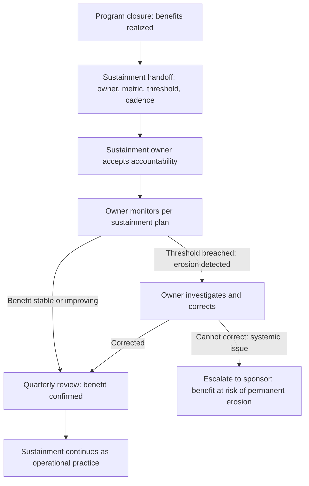

# Benefits Sustainment

> **Core skill:** The TPM ensures that program benefits persist after the program ends — assigning sustainment owners, defining the metrics and thresholds that trigger intervention, and handing off to operations with a plan that survives the TPM's departure.

## Why This Matters

Programs end. Benefits are supposed to persist. The platform migration reduced costs — but six months after the program closed, the old platform was never fully decommissioned, and costs crept back. The onboarding flow reduced time-to-value — but a year later, the flow had been modified by three different teams and the original improvement was lost. The security posture improved — but the new controls were gradually bypassed because nobody owned them after the program ended.

Benefits sustainment is the discipline that prevents benefits erosion. It is not program work — it is the handoff from program to operations that ensures the benefit does not die when the program team disbands. The TPM who delivers a benefit and walks away has delivered a temporary outcome. The TPM who hands off a benefit with an owner, a metric, and an intervention threshold has delivered a lasting one.

## The Sustainment Handoff

The sustainment handoff happens at program closure — or earlier, for benefits that are realized before the program ends. It has five components.

| Component | Content | Example |
|-----------|---------|---------|
| Benefit description | What benefit was realized, with the metric, target, and actual at handoff | "Infrastructure cost per transaction: baseline $0.12, target $0.08, actual at handoff $0.09, trending toward target" |
| Sustainment owner | Named individual accountable for monitoring the benefit after the program | "Jane Smith, Director of Platform Engineering" |
| Sustainment metric | The ongoing metric that will be tracked, with measurement method and frequency | "Infrastructure cost per transaction, measured monthly via the cloud billing dashboard" |
| Intervention threshold | The value at which the sustainment owner must act to correct erosion | "If cost per transaction exceeds $0.10 for two consecutive months, investigate and correct" |
| Sustainment review cadence | How often the benefit will be reviewed, in which forum | "Quarterly platform cost review; included in the VP Engineering's operational metrics dashboard" |

## Selecting the Sustainment Owner

The sustainment owner is the most important decision in the handoff — and the most often neglected. A benefit without an owner is a benefit that will erode.

| Owner Type | When Appropriate | Example |
|------------|------------------|---------|
| Operational team lead | The benefit requires ongoing operational discipline | Platform cost reduction sustained by the platform engineering team |
| Product lead | The benefit is tied to product adoption or customer behavior | SMB revenue sustained by the SMB product lead through ongoing feature investment |
| Engineering manager | The benefit is tied to engineering practices or technical quality | Deploy time reduction sustained by the engineering manager through CI/CD governance |
| Business stakeholder | The benefit is a strategic or financial target that requires business accountability | Revenue growth sustained by the VP of SMB through quarterly business reviews |
| Central governance | The benefit is a compliance or risk reduction that requires institutional ownership | Security posture sustained by the CISO's office through ongoing audit and review |

The TPM does not assign the sustainment owner unilaterally — the owner must accept the accountability. The handoff meeting is where the TPM presents the benefit, the sustainment requirements, and the ask: "Will you own this benefit going forward?" An owner who accepts in the meeting is more likely to act than an owner who was assigned in a document they never read.

## The Sustainment Plan Document

```markdown
# Benefits Sustainment Plan — [Program Name] — [Date]

## Sustainment Summary
- Benefits realized at program closure: [count]
- Benefits handed off for sustainment: [count]
- Benefits still tracking toward target: [count]

## Per-Benefit Sustainment
| Benefit | Metric | Actual at Handoff | Target | Sustainment Owner | Intervention Threshold | Review Cadence | Review Forum |
|---------|--------|--------------------|--------|--------------------|------------------------|----------------|--------------|
| [B1] | [metric] | [value] | [value] | [name, role] | [threshold] | [monthly/quarterly] | [forum] |

## Sustainment Owner Sign-Off
| Benefit | Sustainment Owner | Acceptance Date | Owner's Comments |
|---------|--------------------|-----------------|------------------|
| [B1] | [name] | [date] | [any conditions or concerns] |

## Post-Handoff Review Schedule
| Review Date | Forum | Benefits to Review |
|-------------|-------|--------------------|
| [date — 3 months post-closure] | [forum] | All benefits handed off |
| [date — 6 months post-closure] | [forum] | Benefits that were Yellow at handoff |
| [date — 12 months post-closure] | [forum] | Final sustainment confirmation |
```

## Monitoring Sustainment After Handoff

The TPM does not track benefits forever — but the TPM ensures that the sustainment monitoring is in place before walking away.

| Post-Handoff Period | TPM Responsibility | Sustainment Owner Responsibility |
|---------------------|--------------------|----------------------------------|
| At handoff | Conduct the handoff meeting; secure owner acceptance; document the sustainment plan | Accept ownership; confirm understanding of metric, threshold, and review cadence |
| 3 months post-handoff | Confirm that the first sustainment review occurred | Conduct the review; report benefit status; escalate if erosion detected |
| 6 months post-handoff | Confirm that sustainment reviews are occurring as planned | Conduct reviews; correct erosion if thresholds breached |
| 12 months post-handoff | No further TPM responsibility — sustainment is fully operationalized | Ongoing monitoring integrated into standard operational reviews |

The TPM's final act for sustainment is the 3-month check: did the first review happen? Is the owner tracking the metric? Is the intervention threshold being respected? If the answer to any of these is no, the TPM escalates to the program sponsor — because a sustainment plan that is not being followed is a benefit that is eroding.

## When Benefits Erode

Benefits erode for predictable reasons. The sustainment plan anticipates them and sets intervention thresholds accordingly.

| Erosion Pattern | Why It Happens | Sustainment Countermeasure |
|-----------------|----------------|---------------------------|
| Cost creep | The one-time optimization erodes as new services are added without the cost discipline | Intervention threshold: cost per transaction; quarterly cost review; cost attribution per team |
| Process decay | The new process is gradually bypassed under schedule pressure | Intervention threshold: process compliance rate; automated enforcement where possible |
| Adoption reversal | Users revert to the old way because the new way has friction | Intervention threshold: adoption rate; user feedback loop; continuous improvement owner |
| Technical drift | The architecture decision is eroded by new components that do not follow the standard | Intervention threshold: architecture compliance review; architecture decision record referenced in new designs |
| Ownership vacuum | The sustainment owner leaves; nobody replaces them | Succession plan in the sustainment document; escalation to the owner's manager if owner departs |



## Practical Applications

### Sustainment Handoff Checklist

- [ ] Every realized benefit has a sustainment owner who has accepted accountability
- [ ] The sustainment metric, measurement method, and frequency are defined
- [ ] An intervention threshold is set: the value that triggers corrective action
- [ ] The sustainment review cadence and forum are defined
- [ ] The sustainment plan is documented and signed off by each owner
- [ ] The first post-handoff review is scheduled and the owner confirms they will conduct it
- [ ] The TPM's 3-month and 6-month post-handoff checks are on the calendar
- [ ] Succession is addressed: what happens if the sustainment owner leaves?

### Sustainment Plan Template

```markdown
# Benefits Sustainment Plan — [Program Name]

## Sustainment Owners
| Benefit | Metric | Actual | Target | Owner | Threshold | Review Cadence | Forum |
|---------|--------|--------|--------|-------|-----------|----------------|-------|
| [B1]    | [metric] | [value] | [value] | [name, role, contact] | [threshold: value, condition] | [monthly/quarterly] | [meeting name] |

## Intervention Protocol
- If [metric] exceeds [threshold] for [duration]: [action]
- Escalation path: Owner → Owner's Manager → Program Sponsor

## Post-Handoff TPM Check
- 3 months: [date] — confirm first review occurred
- 6 months: [date] — confirm reviews are ongoing
- 12 months: [date] — confirm sustainment is operationalized

## Owner Sign-Off
| Benefit | Owner Name | Signature / Acceptance | Date |
|---------|------------|------------------------|------|
| [B1]    | [name]     | [✓]                    | [date] |
```

## Common Pitfalls

| Pitfall | Why It Is a Problem | Better Approach |
|---------|---------------------|-----------------|
| **No sustainment handoff** | Program closes; benefits tracking stops; benefits erode with nobody watching | Conduct a formal sustainment handoff for every realized benefit |
| **Owner assigned without acceptance** | The sustainment document names an owner who never agreed to own the benefit | Hold a handoff meeting; ask the owner to accept explicitly |
| **No intervention threshold** | The owner tracks the metric but does not know when to act | Set a specific threshold: value and duration that trigger intervention |
| **TPM tracks forever** | The TPM becomes the permanent sustainment owner for every program they manage | Hand off to operations within 3 months; TPM checks at 3 and 6 months, then exits |
| **Succession not addressed** | The sustainment owner leaves; nobody replaces them; the benefit erodes undetected | Include a succession plan: who takes over if the owner departs |

## Success Indicators

- Every realized benefit has a sustainment owner who accepted accountability
- The first post-handoff review occurs on schedule and reports benefit status
- Sustainment owners escalate erosion before the TPM's check-in discovers it
- Benefits are still tracking at or above the intervention threshold 12 months after handoff
- The sustainment process is incorporated into the organization's operational governance

## Related Topics

- [[05_Benefits_Realization_at_Program_Closure]]: the closure assessment that precedes the handoff
- [[04_Benefits_Tracking_and_Reporting]]: the tracking that transitions from program to operations
- [[07_Program_ROI_and_Value_Communication]]: communicating sustained value to leadership
- [[04_Risk_and_Issue_Leadership/00_overview|Risk and Issue Leadership]]: benefit erosion is a post-program risk

## Summary

Benefits sustainment is the TPM's legacy discipline: ensuring that program benefits persist after the program ends by handing off each benefit to a named owner with a metric, an intervention threshold, and a review cadence — and confirming at 3 and 6 months that the owner is tracking and the benefit is not eroding. The TPM who delivers a benefit and walks away has delivered a temporary outcome. The TPM who hands off a benefit with a sustainment plan has delivered a lasting one — and a lasting benefit is the only kind that justifies the program's investment.