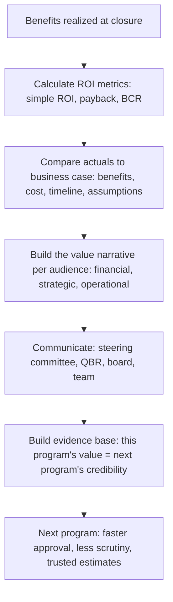

# Program ROI and Value Communication

> **Core skill:** The TPM communicates program value to leadership and stakeholders in terms they use to make investment decisions — translating outcomes into financial and strategic return, comparing actuals against the business case, and building the evidence base that justifies the next program's funding.

## Why This Matters

Programs are investments. Leadership funds them expecting a return — financial, strategic, or risk-reduction. The TPM who communicates program value in the language of return makes the next funding decision easier. The TPM who communicates in the language of activity — "we completed 12 milestones, delivered 8 features, resolved 45 risks" — leaves leadership to translate activity into value on their own. And leadership, being busy, often does not translate — they remember the program was "busy" but cannot recall what it was worth.

ROI and value communication is the TPM's upward translation discipline: converting the benefits realization data into the financial and strategic terms that leadership uses to allocate capital. It is not spin. It is not inflating the numbers. It is presenting the honest value the program created in the format that leadership needs to compare it against other investments — and building the credibility that makes the TPM's next program proposal land with trust instead of skepticism.

## ROI Calculation for Programs

Program ROI is not a single number — it is a family of calculations that answer different questions.

| ROI Metric | Formula | Question Answered | When to Use |
|------------|---------|-------------------|-------------|
| Simple ROI | (Benefit Value − Program Cost) / Program Cost × 100% | "What was the return on the investment?" | Programs with clear financial benefits and costs |
| Payback period | Program Cost / Annual Benefit Value | "How long until the program pays for itself?" | Programs where time-to-value matters |
| Net present value (NPV) | Sum of discounted future benefits minus program cost | "What is the program worth in today's money?" | Multi-year benefits; comparing programs with different time horizons |
| Benefit-cost ratio | Total Benefit Value / Program Cost | "How many dollars of value per dollar spent?" | Portfolio comparison; prioritization |
| Avoided cost | Cost that would have been incurred without the program | "What did we not have to spend because of this program?" | Risk reduction, compliance, and infrastructure programs |

The TPM does not need to be a financial analyst — but the TPM needs to know which ROI metric matters to which stakeholder and be able to produce it from the benefits data.

## Communicating Value to Different Audiences

| Audience | What They Care About | How to Communicate Value |
|----------|---------------------|--------------------------|
| CFO / Finance | Financial return: cost, revenue, margin impact | ROI metrics; benefit-cost ratio; payback period; comparison to business case |
| CEO / GM | Strategic impact: market position, competitive advantage, growth | Strategic narrative: "This program enabled our SMB market entry, which is projected to contribute 5% of revenue by 2027" |
| CTO / VP Engineering | Technical and operational return: scalability, reliability, velocity | Operational metrics: "Deploy frequency 3x, MTTR reduced 75%, infra cost per transaction down 25%" |
| Board / Investors | Portfolio return: are our investments producing value? | Portfolio narrative: "The $2M investment produced $5M in realized and forecast benefits over 3 years — a 2.5x return" |
| Program team | Meaning and impact: did our work matter? | Outcome narrative: "Because of what you built, 10,000 SMB customers can now onboard in 2 hours instead of 2 weeks" |

## The Value Communication Artifacts

| Artifact | Audience | Content | Frequency |
|----------|----------|---------|-----------|
| Program status (benefits section) | All stakeholders | Benefit RAG, leading indicators, outcome metrics, forecast | Weekly / Monthly |
| Steering committee deck | Executives | Benefit summary, ROI projection, decisions required | Monthly / Quarterly |
| Quarterly business review | Portfolio governance | Benefits actuals vs. business case, ROI metrics, forecast update | Quarterly |
| Program closure report | All stakeholders; portfolio governance | Benefits realization assessment, ROI actuals, lessons | Once, at closure |
| Annual portfolio review | Board / investors | Aggregate program returns across the portfolio | Annually |

## Comparing Actuals to the Business Case

Every program has a business case — the investment thesis that justified its funding. The TPM compares actual outcomes against that thesis.

| Business Case Element | How to Compare | Honesty Requirement |
|-----------------------|----------------|---------------------|
| Benefit forecast | Actual benefit value vs. business case estimate | Report the variance; explain whether the estimate was optimistic, the execution was imperfect, or conditions changed |
| Cost estimate | Actual program cost vs. budget | Report over/under; explain variance |
| Timeline estimate | Actual program duration vs. planned | Report the variance in weeks/months; explain root cause |
| Risk assumptions | Did the risks assumed in the business case materialize? | Report which risks crystallized and whether the mitigations worked |
| Strategic assumptions | Did the market or business conditions assumed in the business case hold? | Report changed conditions and their impact on benefit realization |

The business case comparison is the TPM's accountability to the investment process. An honest comparison — including where the business case was wrong — makes the process better for the next program. A sanitized comparison — where every variance is explained away — makes the process worse, because it teaches the organization that business cases are fiction and actuals are whatever the program chooses to report.

## Building the Evidence Base for the Next Program

The TPM's value communication on this program is the pre-read for the next program's funding request. Leadership that remembers the last program delivered what it promised approves the next one faster. Leadership that remembers the last program's value was unclear or overstated adds scrutiny to the next one — and scrutiny adds cost.

| This Program's Value Communication | Effect on Next Program |
|------------------------------------|------------------------|
| Honest ROI with variance explained | Trust: the TPM's estimates are credible; less scrutiny; faster approval |
| Benefits tracked through closure with audit trail | Confidence: the benefits forecast is based on data, not aspiration |
| Business case comparison with lessons | Learning: the organization's investment process improves; future business cases are more accurate |
| Value communicated in leadership's language | Relevance: leadership sees the TPM as a business partner, not a project administrator |
| Benefits sustainment confirmed at 12 months | Proof: the TPM delivers lasting value, not temporary outputs |



## Practical Applications

### Program Value Communication Template

```markdown
# Program Value Summary — [Program Name] — [Date]

## At a Glance
- Program investment: $[amount] over [duration]
- Benefits realized: $[value] (vs. business case: $[value])
- ROI: [%] (simple); payback period: [months]
- Benefit-cost ratio: [ratio]

## Value by Category
| Category | Value Realized | Business Case | Variance | Explanation |
|----------|----------------|---------------|----------|-------------|
| Financial | $[value] | $[value] | $[value] | [explanation] |
| Strategic | [metric: value] | [metric: value] | [variance] | [explanation] |
| Operational | [metric: value] | [metric: value] | [variance] | [explanation] |
| Risk Reduction | [metric: value] | [metric: value] | [variance] | [explanation] |

## Business Case Comparison
| Element | Business Case | Actual | Variance | Root Cause |
|---------|---------------|--------|----------|------------|
| Benefits | $[value] | $[value] | $[value] | [cause] |
| Cost | $[value] | $[value] | $[value] | [cause] |
| Timeline | [date] | [date] | [duration] | [cause] |

## Value Narrative (for leadership)
[3-5 sentences: what the program achieved, what it was worth, what we learned]

## Evidence for Next Program
- [What this program's experience teaches about estimating, tracking, and delivering value]
```

### ROI and Value Communication Checklist

- [ ] ROI metrics are calculated for the program: simple ROI, payback, benefit-cost ratio
- [ ] Actual benefits are compared against the business case with variance explained
- [ ] Value is communicated in the language of each audience: financial, strategic, operational
- [ ] The value narrative is concise: leadership can restate it in their own words
- [ ] The business case comparison is honest: where it was wrong is reported with lessons
- [ ] The evidence base is packaged for the next program's funding request
- [ ] The program team hears the value narrative: their work mattered, and here is how

## Common Pitfalls

| Pitfall | Why It Is a Problem | Better Approach |
|---------|---------------------|-----------------|
| **Activity-as-value** | "We completed 12 milestones" — leadership cannot compare this to other investments | Communicate value in financial and strategic terms |
| **ROI inflation** | Overstated ROI inflates this program's credibility at the cost of the next program's | Calculate ROI honestly; report the range, not the high end |
| **One-size value communication** | Financial ROI to the engineering team; operational metrics to the board | Tailor the value narrative to the audience's decision language |
| **Business case dodged** | Actuals are reported without comparison to the business case; nobody learns | Compare actuals to the business case; explain variance honestly |
| **No evidence base** | The program's value experience is not captured for the next funding cycle | Package the evidence: this program's ROI, lessons, and improved estimation methods |

## Success Indicators

- Leadership can restate the program's value in one sentence
- The business case comparison is cited as a credible reference for future programs
- The next program's funding request references this program's ROI as evidence
- The program team understands the value their work created, not just the features they shipped
- The TPM is seen as someone who communicates in business terms, not just program terms

## Related Topics

- [[05_Benefits_Realization_at_Program_Closure]]: the realization data that feeds ROI calculation
- [[04_Benefits_Tracking_and_Reporting]]: the tracking that builds the evidence over time
- [[06_Benefits_Sustainment]]: the sustained value that continues the ROI beyond closure
- [[05_Stakeholder_Alignment/03_Executive_Communication_for_TPMs|Executive Communication for TPMs]]: communicating value to the executive audience
- [[career-path/14_Product_Manager/05_Product_Analytics/00_overview|Product Analytics (PM)]]: the product-side value measurement discipline

## Summary

Program ROI and value communication is the TPM's translation discipline: converting benefits realization data into the financial and strategic terms that leadership uses to make investment decisions, comparing actuals honestly against the business case, and building the evidence base that makes the next program's funding request land with credibility instead of scrutiny. The TPM who communicates in the language of value — ROI, payback, strategic impact — earns a seat at the investment table. The TPM who communicates in the language of activity manages programs; the TPM who communicates in the language of value manages the portfolio's confidence in program investment.