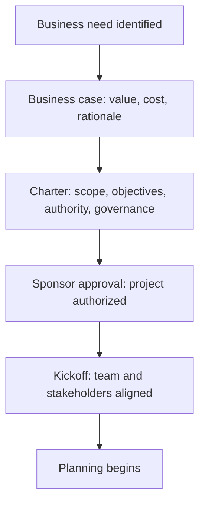

# Initiation and Charter

> **Core capability:** The project manager defines the project's legitimacy, scope, authority, and success conditions before work begins — through a chartered initiation that aligns stakeholders on what will be done, why, and who decides.

## Why This Matters

Projects that start without a charter drift immediately: scope creeps because nobody agreed what's out, decisions stall because nobody knows who decides, and success is impossible to measure because it was never defined. The project charter is the organizational contract that gives the project manager the authority to manage and the project the boundaries to operate within.

Initiation is also where the business case meets reality: is the value proposition credible? Are the constraints understood? Does the organization have the capacity? The project manager who initiates well prevents problems; the one who skips initiation spends the rest of the project fighting them.

## Topics in This Capability Area

| Topic | Core Skill | When It Matters |
|-------|------------|-----------------|
| [[01_Project_Charter]] | Writing the charter that legitimizes and scopes the project | Project start |
| [[02_Business_Case_Development]] | Articulating the value proposition and investment rationale | Before approval |
| [[03_Stakeholder_Identification]] | Identifying who matters and what they need | Project initiation |
| [[04_Project_Objectives_and_Success_Criteria]] | Defining SMART objectives and measurable success | Before planning |
| [[05_Feasibility_and_Constraint_Analysis]] | Assessing technical, organizational, and resource feasibility | Before commitment |
| [[06_Project_Authority_and_Governance]] | Establishing decision rights, sponsor role, and escalation | Initiation |
| [[07_Project_Kickoff]] | Launching the project with the team and stakeholders | After charter approval |

## The Initiation Sequence

Initiation ends when the charter is signed and the team knows why they are here.

## Practical Applications

### Initiation Checklist

- [ ] Project charter is written, sponsor-approved, and visible
- [ ] Scope is bounded: what is in, what is explicitly out
- [ ] Business case articulates value, cost, and rationale for investment
- [ ] Success criteria are measurable and agreed by the sponsor
- [ ] Key stakeholders are identified and engaged
- [ ] Decision rights and governance are established
- [ ] Kickoff has occurred with the core team

## Common Pitfalls

| Pitfall | Why It Is a Problem | Better Approach |
|---------|---------------------|-----------------|
| **Initiation-as-formality** | Charter written to satisfy process, never referenced again | Charter as the project's constitution; refer to it |
| **Scope-by-assumption** | Scope assumed, not documented; creeps immediately | Explicit in-scope and out-of-scope in the charter |
| **Success-criteria-vague** | "Improve performance" — unmeasurable | SMART objectives with baselines and targets |

## Success Indicators

- The team can state the project's objective and boundaries unprompted
- Scope changes are compared against the charter, not absorbed silently
- The sponsor references the charter in governance decisions
- The business case survives contact with the first quarter of delivery

## Related Capabilities

- [[02_Scope_and_Planning/00_overview|Scope and Planning]]: planning begins where initiation ends
- [[06_Governance_and_Change_Control/00_overview|Governance and Change Control]]: governance established at initiation
- [[career-path/12_Technical_Program_Manager/01_Program_Structure_and_Charter/00_overview|Program Structure and Charter (TPM)]]: the program-level counterpart

## Summary

Initiation is the project's foundation: a charter that defines scope and authority, a business case that justifies investment, measurable success criteria, and a kickoff that aligns the team. Projects that start well finish better — and the project manager who initiates thoroughly spends less time fighting scope creep and decision ambiguity.