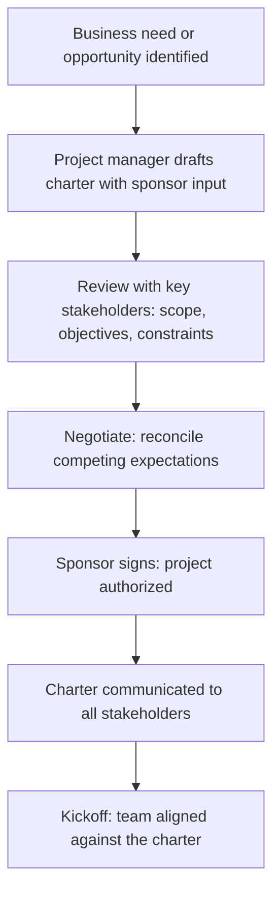

# Project Charter

> **Core skill:** Writing the project charter that legitimizes the project, grants the project manager authority, and defines scope, objectives, constraints, and governance — the organizational contract without which a project has no foundation.

## Why This Matters

The project charter is the project's constitution. It answers the five questions every project must answer before work begins: why are we doing this, what exactly are we delivering, who decides what, what are the boundaries, and what does success look like. Without a signed charter, the project manager has no formal authority to manage — they are coordinating volunteers, not leading a project with organizational backing.

A charter that is written by the sponsor and handed to the project manager is a directive; a charter that the project manager writes and the sponsor signs is a negotiation. The act of writing it surfaces disagreements about scope, budget, authority, and success criteria before those disagreements become project crises. The project manager who treats the charter as a form to file has missed the point — it is the instrument that converts an idea into an authorized initiative with resources and governance.

The charter is also the baseline against which every subsequent decision is tested. When a stakeholder asks for something new, the first question is: does this fit within the chartered scope? When a schedule slips, the charter's constraints tell you how much room you have. The charter does not prevent change — it makes change visible and governable.

## What a Charter Must Contain

| Element | What It Answers | Why It Matters |
|---|---|---|
| **Project purpose and justification** | Why are we doing this? | Aligns stakeholders on the problem or opportunity |
| **High-level scope** | What will we deliver, and what is explicitly excluded? | Bounds the project; prevents scope creep by assumption |
| **Measurable objectives** | How will we know we succeeded? | Provides the target for every planning decision |
| **Key deliverables** | What tangible outputs will the project produce? | Names the outputs the sponsor is funding |
| **Project manager and authority level** | Who is responsible, and what can they decide? | Prevents decision paralysis; establishes escalation paths |
| **Sponsor and governance** | Who approves, funds, and governs the project? | Defines the chain of decision-making |
| **High-level constraints and assumptions** | What limits apply, and what are we assuming? | Names the box the project must operate within |
| **High-level risks** | What threatens the project at initiation? | Flags known dangers before planning begins |
| **Summary budget and schedule** | What resources are committed and by when? | Sets the resource envelope |

## Charter versus Project Management Plan

| Dimension | Project Charter | Project Management Plan |
|---|---|---|
| **Author** | Project manager with sponsor | Project manager with team |
| **Approver** | Sponsor | Project manager; reviewed by governance |
| **Purpose** | Authorize and legitimize the project | Detail how the project will be executed |
| **Detail level** | High-level; boundary-setting | Detailed; execution-focused |
| **Changes** | Rare; requires sponsor re-approval | Regular; controlled through change management |
| **Audience** | Organization, governance, stakeholders | Project team and direct stakeholders |
| **Lifetime** | One charter per project | Evolves throughout the project |

## The Charter Writing Process



## Practical Applications

### Charter Readiness Checklist

- [ ] Project purpose is stated in one paragraph that any stakeholder can understand
- [ ] Scope is explicit: what is in, what is out, and the boundary between them
- [ ] Objectives are SMART: specific, measurable, achievable, relevant, time-bound
- [ ] Project manager authority is defined: what decisions are yours, what goes to the sponsor
- [ ] Sponsor is named and has signed the charter
- [ ] Key assumptions are documented and their risks acknowledged
- [ ] High-level risks are listed with initial response strategies
- [ ] Budget and schedule are stated in ranges with confidence levels
- [ ] Governance structure is named: who sits on the steering committee, escalation path

### Charter Section Template

```markdown
# Project Charter: [Project Name]

## 1. Project Purpose
[One paragraph on the problem or opportunity this project addresses. Why now?]

## 2. High-Level Scope
**In scope:** [bullet list of what the project will deliver]
**Out of scope:** [bullet list of what is explicitly excluded]

## 3. Measurable Objectives
- Objective 1: [SMART statement with metric, baseline, and target]
- Objective 2: [SMART statement with metric, baseline, and target]

## 4. Key Deliverables
- [Deliverable name and brief description]
- [Deliverable name and brief description]

## 5. Project Manager and Authority
**Project Manager:** [name]
**Authority level:** [what the PM can decide without escalation]
**Escalation path:** [when and how to escalate to the sponsor]

## 6. Sponsor and Governance
**Sponsor:** [name and role]
**Steering committee:** [members or roles]
**Decision rights:** [who decides scope, budget, schedule changes]

## 7. Constraints
- [Constraint 1: budget, schedule, resource, quality, or regulatory]
- [Constraint 2]

## 8. Assumptions
- [Assumption 1: stated and acknowledged as uncertain]
- [Assumption 2]

## 9. High-Level Risks
| Risk | Impact | Initial Response |
|---|---|---|
| [Risk description] | [High/Medium/Low] | [Response strategy] |

## 10. Summary Budget and Schedule
**Budget range:** [$X to $Y] with [confidence level]
**Target completion:** [date or range]
**Key milestones:** [list of major phase gates]

## Signatures
**Sponsor:** ________________  Date: ________
**Project Manager:** ________________  Date: ________
```

## Common Pitfalls

| Pitfall | Why It Is a Problem | Better Approach |
|---|---|---|
| **Charter-as-formality** | Written to satisfy process, never referenced again; project drifts | Charter as the project's constitution; refer to it in every governance decision |
| **Scope-by-ambiguity** | Scope described in vague terms; everything and nothing is in scope | Explicit in-scope and out-of-scope lists; test scope decisions against the charter |
| **Missing authority definition** | Project manager cannot act without constant escalation; decision paralysis | Define what the PM can decide and what requires sponsor approval |
| **No named sponsor** | No one accountable for funding and governance; project starves | Sponsor named in the charter with explicit responsibilities |
| **Objectives without metrics** | "Improve customer experience" — impossible to know when done | SMART objectives with baseline and target values |
| **Assumptions unstated** | Hidden assumptions become silent project killers when they prove false | List assumptions explicitly; track them; trigger replanning when invalidated |

## Success Indicators

- The sponsor can state the project's purpose, scope, and success criteria without referring to notes
- The project manager knows exactly what decisions require escalation and what do not
- Stakeholders reference the charter when proposing scope changes
- The team understands why the project exists and what they are collectively delivering
- The charter is the first document consulted in governance meetings, not the last

## Related Topics

- [[02_Business_Case_Development]] — the value proposition and investment rationale behind the charter
- [[04_Project_Objectives_and_Success_Criteria]] — defining measurable objectives
- [[06_Project_Authority_and_Governance]] — decision rights and governance structures
- [[01_Scope_Definition]] — detailed scope from the charter's high-level boundary
- [[career-path/12_Technical_Program_Manager/01_Program_Structure_and_Charter/00_overview|Program Structure and Charter (TPM)]] — the program-level charter counterpart

## Summary

The project charter is the project's founding document: a contract between the sponsor and the project manager that defines purpose, scope, objectives, authority, constraints, and governance. It legitimizes the project in the organization, grants the project manager the authority to manage, and provides the baseline against which every subsequent decision is judged. A project without a signed charter is an ungoverned idea — the charter turns ideas into authorized, resourced, and accountable initiatives.