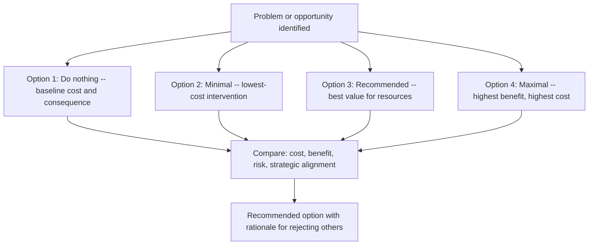

# Business Case Development

> **Core skill:** Building the documented economic justification for the project — articulating the value proposition, quantifying costs and benefits, analyzing alternatives, and establishing the rationale that persuades the sponsor to invest organizational resources.

## Why This Matters

Every project consumes resources that could be used elsewhere. The business case is the project manager's answer to the question: why spend them here? It is not a sales pitch — it is a structured analysis that names the problem or opportunity, estimates the cost of the proposed solution, quantifies the expected benefits, examines alternative approaches, and declares the assumptions on which the analysis rests. Without it, a project is funded on optimism.

The business case also establishes the project's value baseline. When the project faces a difficult trade-off — cut scope, extend schedule, or request more budget — the business case tells you which trade-offs preserve the value and which destroy it. A project that costs more than the benefit it enables should be stopped. The business case makes that conversation possible by giving it numbers.

The project manager may not own the business case alone — it is often co-developed with the sponsor, finance, and subject-matter experts — but the project manager is responsible for ensuring it exists, is credible, and is maintained as the project's reference point for value decisions.

## The Structure of a Business Case

| Component | The Question It Answers | Key Output |
|---|---|---|
| **Problem or opportunity statement** | What condition requires action, and why now? | One-paragraph problem statement |
| **Analysis of options** | What alternative solutions were considered? | Options compared on feasibility, cost, and benefit |
| **Recommended solution** | Which option is proposed and why? | Clear recommendation with rationale |
| **Cost estimate** | What will this cost in money, people, and time? | Ranged cost estimate with confidence levels |
| **Benefit estimate** | What value will the organization gain? | Quantified benefits in financial and non-financial terms |
| **Return on investment** | Is the value worth the cost? | ROI, payback period, NPV, or equivalent metric |
| **Risks and assumptions** | What could make the case invalid? | Named risks with triggers and assumptions with owners |
| **Implementation approach** | How will the solution be delivered? | High-level delivery approach and governance |

## Cost Categories to Consider

| Cost Type | Examples | Estimation Approach |
|---|---|---|
| **Direct project costs** | Labor, licenses, equipment, travel | Bottom-up from resource plan; include contingency |
| **Indirect costs** | Overhead, facilities, shared services | Percentage allocation or activity-based |
| **Transition costs** | Training, migration, parallel running | Separately estimated; often missed |
| **Ongoing operational costs** | Maintenance, support, hosting, renewals | Annualized over the expected life of the output |
| **Opportunity cost** | What the organization forgoes by choosing this project | Qualitative; comparative analysis with other options |
| **Disengagement cost** | Decommissioning the old system or process | One-time cost; easily forgotten |

## Benefit Categories

| Benefit Type | Examples | Measurability |
|---|---|---|
| **Financial — revenue** | New product sales, market share gain | Quantifiable; model with ranges |
| **Financial — cost reduction** | Automation savings, vendor consolidation | Quantifiable; baseline and target |
| **Financial — avoidance** | Regulatory penalty avoided, risk mitigated | Quantifiable with probability weighting |
| **Non-financial — strategic** | Market position, capability building | Qualitative; link to strategic objectives |
| **Non-financial — stakeholder** | Customer satisfaction, employee retention | Qualitative; proxy metrics where possible |
| **Non-financial — compliance** | Regulatory compliance, security posture | Binary achieved/not-achieved; cost of non-compliance |

## The Options Analysis



## Practical Applications

### Business Case Readiness Checklist

- [ ] Problem or opportunity is stated in terms the sponsor and governance body recognize
- [ ] At least three options are analyzed, including "do nothing"
- [ ] Costs are estimated in ranges with stated confidence levels
- [ ] Benefits are quantified where possible; unquantifiable benefits are named explicitly
- [ ] ROI or equivalent value metric is calculated with sensitivity to key assumptions
- [ ] Key assumptions are listed with owners and triggers for reconsideration
- [ ] The recommended option has a clear rationale for why it is preferred over alternatives
- [ ] The business case has been reviewed by someone with financial expertise
- [ ] The sponsor has endorsed the business case before the charter is finalized

### Business Case Summary Template

```markdown
# Business Case: [Project Name]

## Problem Statement
[One paragraph. What condition requires action? Why now? What is the cost of inaction?]

## Options Considered

| Option | Description | Cost Estimate | Benefit Estimate | Risk |
|---|---|---|---|---|
| 1: Do nothing | [Description] | [Cost] | [Benefit] | [Risk] |
| 2: Minimal | [Description] | [Cost] | [Benefit] | [Risk] |
| 3: Recommended | [Description] | [Cost] | [Benefit] | [Risk] |
| 4: Maximal | [Description] | [Cost] | [Benefit] | [Risk] |

## Recommended Solution
[Description of the recommended option and why it is preferred.]

## Financial Analysis
- **Total estimated cost:** [$X to $Y] at [confidence]%
- **Expected annual benefit:** [$A to $B]
- **Payback period:** [N months/quarters/years]
- **Net present value (NPV):** [$N]
- **Key sensitivity:** [which assumption, if wrong, most affects the outcome]

## Key Assumptions
- [Assumption 1] — Owner: [name], Trigger: [condition for reconsideration]
- [Assumption 2] — Owner: [name], Trigger: [condition for reconsideration]

## Risks to the Business Case
| Risk | Probability | Impact on Business Case | Mitigation |
|---|---|---|---|
| [Risk] | [H/M/L] | [High/Medium/Low] | [Mitigation action] |
```

## Common Pitfalls

| Pitfall | Why It Is a Problem | Better Approach |
|---|---|---|
| **Benefits double-counted** | Same benefit attributed to multiple projects; portfolio overstates value | Map each benefit to exactly one project; validate with finance |
| **Costs understated to win approval** | Project approved on false premises; overruns damage credibility | Ranged estimates with confidence levels; independent cost review |
| **Do-nothing option absent** | No baseline to compare against; value of the project is unanchored | Always include the cost of inaction as a reference point |
| **Non-financial benefits ignored** | Strategic or compliance value dismissed because it is hard to quantify | Name non-financial benefits explicitly; link to strategic objectives |
| **Assumptions treated as facts** | Business case collapses when an assumption proves false | List assumptions explicitly; assign owners; define triggers for replanning |
| **Single-point estimates** | A single number for cost or benefit implies false precision | Ranges with confidence intervals; sensitivity analysis on key variables |

## Success Indicators

- The sponsor can articulate the value proposition of the project in financial and strategic terms
- The business case survives contact with the first quarter of delivery without material revision
- Trade-off decisions reference the business case: does this change increase or decrease value?
- The "do nothing" option is understood by all governance members as the baseline
- Assumptions are actively tracked and revisited when their triggers fire

## Related Topics

- [[01_Project_Charter]] — the charter that formalizes the business case into an authorized project
- [[04_Project_Objectives_and_Success_Criteria]] — linking benefits to measurable objectives
- [[05_Feasibility_and_Constraint_Analysis]] — testing whether the business case is achievable
- [[03_Schedule_and_Cost/00_overview|Schedule and Cost]] — the cost estimate becomes the cost baseline
- [[07_Benefits_and_Closure/00_overview|Benefits and Closure]] — tracking benefits realization after delivery

## Summary

The business case is the project's economic argument: a structured analysis that names the problem, compares options, estimates costs and benefits, and establishes the value proposition that justifies organizational investment. It is not a one-time document — it is the ongoing reference point for value decisions throughout the project. The project manager who maintains a credible, assumption-tracked business case can answer the hardest question in any project: is this still worth doing?