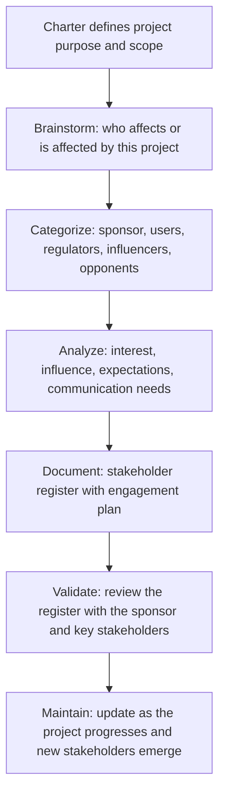

# Stakeholder Identification

> **Core skill:** Systematically identifying every person, group, and organization that affects or is affected by the project — mapping their interest, influence, expectations, and engagement requirements before those stakeholders are surprised by a decision they should have been part of.

## Why This Matters

A project succeeds or fails on its stakeholders. Miss a stakeholder at initiation and they will discover the project when a decision affects them — and they will fight it not because the decision is wrong but because they were excluded from making it. The project manager who identifies stakeholders thoroughly and early converts potential opposition into informed participation and converts silent expectations into documented requirements.

Stakeholder identification is not a one-time exercise. Stakeholders change as the project moves through its lifecycle: new groups are affected by detailed design decisions, regulators appear when a permit is needed, end users become relevant when deployment approaches. The initial identification exercise produces a stakeholder register that grows and refines throughout the project.

The discipline is not only about listing names — it is about understanding interests. A stakeholder who supports the project's objectives but opposes the chosen approach is not an enemy; they are a source of information about a constraint that was missed. The project manager distinguishes between stakeholders who oppose the project and stakeholders who oppose the current plan — and engages both differently.

## Stakeholder Categories

| Category | Description | Examples | Engagement Priority |
|---|---|---|---|
| **Sponsor** | Funds and champions the project; owns the business case | Executive sponsor, budget holder | Highest; ongoing, direct |
| **Governance body** | Approves scope, budget, and major changes | Steering committee, portfolio board | High; scheduled, formal |
| **Decision makers** | Make binding choices within their domain | Head of engineering, compliance officer | High; consulted before decisions |
| **Key influencers** | Do not decide but shape decisions through expertise or authority | Senior architect, union representative | Medium-high; informed, consulted |
| **Direct users** | Will use the project's outputs day to day | Operations staff, customer service team | Medium; involved in requirements and validation |
| **Indirect beneficiaries** | Gain value from the output without using it directly | Customers, downstream teams | Medium; represented in requirements |
| **Regulators and auditors** | Set compliance requirements the project must meet | Government agency, internal audit | As required; formal, documented |
| **Opponents** | Actively resist or are negatively affected by the project | Displaced team, competitor group | Medium; understood, managed |
| **Suppliers and vendors** | Provide resources, tools, or deliverables to the project | Contractors, software vendors | As needed; contractual |

## Interest and Influence Mapping

| Position | Interest High, Influence High | Interest High, Influence Low | Interest Low, Influence High | Interest Low, Influence Low |
|---|---|---|---|---|
| **Strategy** | Manage closely: active partnership and frequent engagement | Keep informed: consult, listen, address concerns | Keep satisfied: meet their needs without overwhelming them | Monitor: minimal effort; watch for changes |
| **Engagement** | Co-create decisions; regular one-on-one meetings | Requirements workshops; regular updates; feedback loops | Formal reporting; governance presentations; invite to key reviews | Broadcast communication; watch for interest changes |
| **Risk if neglected** | Project blocked or defunded | Requirements missed; adoption fails | Surprise veto at a critical gate | Proxy resistance through others; unexpected escalation |

## The Stakeholder Identification Process



## Practical Applications

### Stakeholder Identification Checklist

- [ ] Sponsor is identified, confirmed, and engaged
- [ ] All groups who will use, operate, or maintain the project's outputs are listed
- [ ] Groups who must comply with or enforce the project's outputs are identified
- [ ] Organizational groups whose work, budget, or priorities are affected are named
- [ ] External parties — regulators, vendors, partners — are identified
- [ ] Each stakeholder's interest in the project is articulated in one sentence
- [ ] Each stakeholder's influence level is assessed: high, medium, or low
- [ ] Potential opponents or negatively affected groups are included, not avoided
- [ ] The register has been reviewed by the sponsor for completeness

### Stakeholder Register Template

```markdown
# Stakeholder Register: [Project Name]

| ID | Stakeholder | Role/Category | Interest | Influence | Expectations | Communication Needs | Engagement Strategy |
|---|---|---|---|---|---|---|---|
| S01 | [Name/Group] | Sponsor | [What they care about] | [H/M/L] | [What they expect] | [How and how often] | [Manage closely / Keep informed / etc.] |
| S02 | [Name/Group] | User | [What they care about] | [H/M/L] | [What they expect] | [How and how often] | [Engagement approach] |

## Key Contacts
- **Project Sponsor:** [Name, title, contact]
- **Steering Committee Chair:** [Name, title, contact]
- **Primary User Representative:** [Name, title, contact]

## Stakeholders to Watch
[Stakeholders whose interest or influence may change; triggers for reassessment]
```

## Common Pitfalls

| Pitfall | Why It Is a Problem | Better Approach |
|---|---|---|
| **Sponsor not confirmed** | Project initiated without committed sponsorship; no one accountable for funding or decisions | Confirm the sponsor by name; get charter signed before proceeding |
| **End users omitted** | Requirements built without the people who will use the output; adoption fails | Identify user representatives at initiation; involve them in requirements |
| **Opponents ignored** | Resistance builds unseen until it surfaces as a blocking issue | List negatively affected groups; understand their concerns; engage proactively |
| **The silent stakeholder** | A high-influence, low-interest stakeholder ignored until they veto a decision | Keep satisfied with formal reporting; never surprise them with a decision |
| **One-and-done identification** | Register created at initiation and never updated; new stakeholders emerge unmanaged | Review and update the register at each phase gate and major change |
| **Stakeholder conflated with role** | The register names a department, not the person; no one accountable | Name individuals where possible; note organizational role as backup |

## Success Indicators

- No stakeholder is surprised by a project decision that affects them
- The stakeholder register is updated at every phase gate without prompting
- Opponents are engaged and their concerns are understood, even if not resolved
- The project manager can name the top five stakeholders and their primary interest without referring to notes
- Communication to each stakeholder group matches their stated needs and preferences

## Related Topics

- [[01_Project_Charter]] — the charter names the sponsor and governance body
- [[05_Stakeholder_Engagement/00_overview|Stakeholder Engagement]] — from identification to ongoing engagement planning
- [[06_Project_Authority_and_Governance]] — governance structures that involve the right stakeholders
- [[03_Requirements_Management]] — requirements emerge from stakeholder needs
- [[career-path/12_Technical_Program_Manager/00_overview|TPM]] — multi-team stakeholder coordination

## Summary

Stakeholder identification is the discipline of knowing who matters to a project before they matter to it. A thorough identification exercise produces a register that names every affected group — from sponsor to end user to regulator — and maps their interest, influence, and engagement needs. The register is not a static artifact; it grows as the project moves through its lifecycle and as new stakeholders emerge. The project manager who identifies stakeholders early and engages them appropriately converts potential opposition into informed participation, and converts silent expectations into documented requirements.