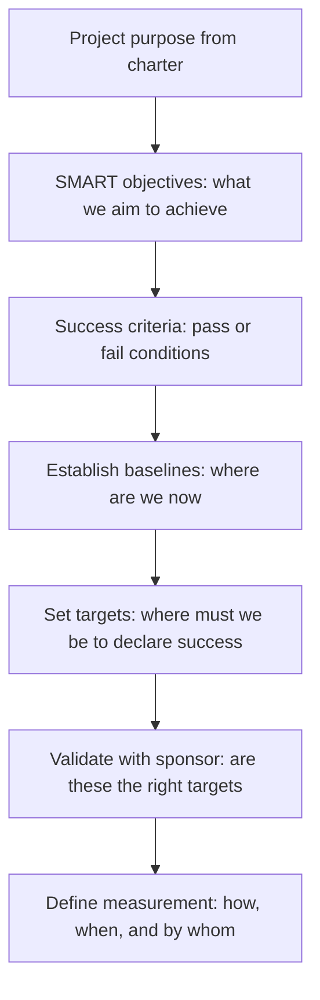

# Project Objectives and Success Criteria

> **Core skill:** Defining measurable, agreed objectives that translate the project's purpose into targets the team can aim at and success criteria the sponsor can use to judge whether the project delivered what was promised.

## Why This Matters

A project without measurable objectives cannot succeed because success was never defined. "Improve the platform," "modernize the stack," and "enhance user experience" are aspirations, not objectives — they cannot be tested, they cannot be tracked, and stakeholders who agreed to them in principle will disagree about what they mean in practice. The project manager's first translation task is to convert the sponsor's intent into objectives that are specific, measurable, achievable, relevant, and time-bound.

Success criteria serve a different but complementary function. Where objectives tell the team what to aim at, success criteria tell governance when to declare the project done. An objective might be "reduce customer onboarding time by 40 percent"; a success criterion might be "three consecutive months with mean onboarding time below 10 minutes." The objective drives the plan; the criterion closes the project.

The discipline of writing good objectives and criteria also surfaces disagreements that would otherwise emerge during execution. When the sponsor and the project manager must agree on exactly what "faster" means — 20 percent, 50 percent, or 200 percent — they negotiate before work begins rather than arguing after the deliverable is built.

## SMART Objectives

| Attribute | The Question It Answers | Weak Example | Strong Example |
|---|---|---|---|
| **Specific** | What exactly will be achieved? | Improve system performance | Reduce API response time for the search endpoint |
| **Measurable** | How will we know it is achieved? | Better user experience | P95 latency reduced from 800ms to 200ms |
| **Achievable** | Is this possible with available resources? | Zero downtime forever | 99.9% uptime with a defined maintenance window |
| **Relevant** | Does this align with the business case? | Rewrite in a trending language | Reduce operational cost by consolidating three services |
| **Time-bound** | By when? | As soon as possible | By Q3 2026, measured for one full quarter |

## Success Criteria versus Objectives

| Dimension | Project Objectives | Success Criteria |
|---|---|---|
| **Purpose** | Define what the team is working toward | Define when the project is done |
| **Timing** | Set during initiation; guide planning | Set during initiation; used during closure |
| **Granularity** | May be multiple objectives across different dimensions | Typically a small set of top-level pass/fail conditions |
| **Ownership** | Project manager and team | Sponsor and governance |
| **Change** | May evolve as understanding deepens | Should change only with sponsor re-approval |
| **Measurement** | Tracked throughout the project | Assessed at closure and benefits review |

## Developing Good Success Criteria



## Practical Applications

### Objectives Quality Checklist

- [ ] Every objective is specific enough that two people would describe the same outcome
- [ ] Every objective has a metric, a baseline, and a target value
- [ ] Objectives cover all dimensions that matter: scope, quality, time, cost, benefit
- [ ] Each objective is assigned to a single accountable owner
- [ ] Success criteria are binary or threshold-based: they can be judged achieved or not
- [ ] Baselines are measured, not assumed — you have the current-state data
- [ ] Targets are validated with the sponsor and key stakeholders
- [ ] Measurement methods are agreed before work begins

### Objectives and Success Criteria Template

```markdown
# Objectives and Success Criteria: [Project Name]

## Project Purpose
[One sentence from the charter: why this project exists.]

## SMART Objectives

| ID | Objective | Metric | Baseline | Target | Deadline | Owner |
|---|---|---|---|---|---|---|
| O1 | [Specific outcome] | [How measured] | [Current value] | [Target value] | [Date or phase] | [Name] |
| O2 | [Specific outcome] | [How measured] | [Current value] | [Target value] | [Date or phase] | [Name] |

## Success Criteria

| ID | Criterion | Pass Condition | Measurement Method | Assessment Timing | Assessor |
|---|---|---|---|---|---|
| SC1 | [What must be true] | [Binary or threshold condition] | [How measured] | [When assessed] | [Who judges] |
| SC2 | [What must be true] | [Binary or threshold condition] | [How measured] | [When assessed] | [Who judges] |

## Measurement Plan
- **Data source:** [system, survey, report that provides the metric]
- **Measurement frequency:** [continuous, weekly, monthly, at closure]
- **Measurement responsibility:** [who collects and reports the data]

## Sponsor Sign-off
**Sponsor:** ________________  Date: ________
**Project Manager:** ________________  Date: ________
```

## Common Pitfalls

| Pitfall | Why It Is a Problem | Better Approach |
|---|---|---|
| **Objectives as aspirations** | "World-class platform" — untestable, untrackable, unactionable | SMART decomposition: every objective has a metric, baseline, and target |
| **No baseline** | Target is set without knowing where you are starting from | Measure the current state before setting targets |
| **Success criteria absent** | Project never formally closes; drift into endless enhancement | Binary or threshold criteria that declare the project done |
| **Objectives written in isolation** | Team discovers objectives they do not believe are achievable | Co-create objectives with the people who must deliver them |
| **Metrics that cannot be measured** | "Employee morale will improve" — no measurement instrument exists | Agree on measurement method and data source before adopting the metric |
| **Too many objectives** | Team cannot focus; everything is priority one | Prioritize: three to five primary objectives with clear primacy |

## Success Indicators

- Every team member can state the project's primary objective and its target without referring to notes
- The sponsor and project manager agree on what "done" looks like before work begins
- Objectives are referenced in every status report: progress against target, not just activity completed
- Success criteria are reviewed at every phase gate and remain credible
- The project closes cleanly because the success criteria were defined at initiation

## Related Topics

- [[01_Project_Charter]] — objectives are stated at high level in the charter and detailed here
- [[02_Business_Case_Development]] — benefits in the business case drive objectives
- [[01_Scope_Definition]] — scope is what will be delivered to meet the objectives
- [[07_Benefits_and_Closure/00_overview|Benefits and Closure]] — success criteria assessed at closure
- [[career-path/12_Technical_Program_Manager/00_overview|TPM]] — program-level objectives and benefit maps

## Summary

Project objectives and success criteria convert the sponsor's intent into measurable targets that the team can aim at and governance can use to judge completion. SMART objectives — specific, measurable, achievable, relevant, time-bound — provide the granularity that planning requires. Success criteria provide the binary or threshold conditions that close the project. The discipline of writing both, with baselines and agreed measurement methods, surfaces disagreements before they become delivery crises and gives every stakeholder the same definition of done.