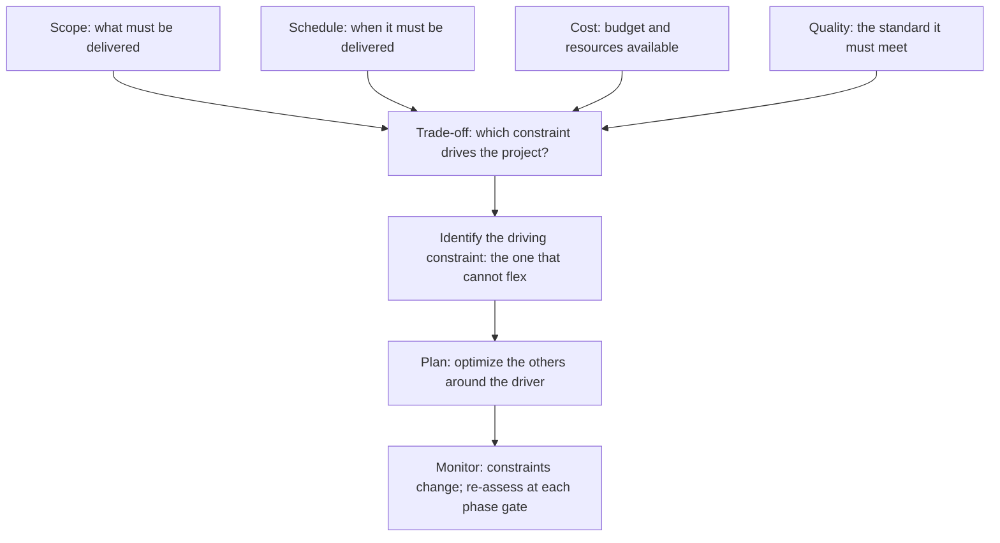

# Feasibility and Constraint Analysis

> **Core skill:** Testing whether the proposed project can succeed within the organization's technical, financial, operational, and regulatory environment — by identifying constraints that bound the solution space and assessing feasibility across multiple dimensions before the organization commits resources.

## Why This Matters

A project that is approved without a feasibility analysis is a bet placed blind. Technical feasibility answers whether the solution can be built with available skills and technology. Operational feasibility answers whether the organization can absorb the change. Financial feasibility answers whether the benefits justify the cost. Schedule feasibility answers whether the deadline is physically possible. The project manager who skips feasibility analysis discovers the answers during execution — when the cost of discovering a "no" is the sunk cost of the project to date.

Constraints define the box the project must operate within, and the analysis names them explicitly: a regulatory deadline that cannot be moved, a budget cap that cannot be exceeded, a technology choice mandated by organizational policy, a resource pool that is shared with other initiatives. Constraints that are assumed rather than documented become the project's silent killers — the team plans against an invisible wall and collides with it mid-execution.

The feasibility analysis is not a hurdle to clear once and forget. It is a living assessment: constraints change when regulations shift, feasibility changes when the skills market tightens, and the analysis should be revisited at each phase gate.

## Feasibility Dimensions

| Dimension | What It Tests | Key Questions | Red Flags |
|---|---|---|---|
| **Technical** | Can we build it with available technology and skills? | Do we have the expertise? Is the technology proven? Are integrations feasible? | Novel technology with no organizational experience; no proof of concept for critical components |
| **Operational** | Can the organization absorb, operate, and sustain the output? | Will current processes support it? Do we have the operational capacity? Will users adopt it? | Change fatigue in the target group; no operational owner identified |
| **Financial** | Is the investment justified and fundable? | Does the business case hold? Is funding committed? Are ongoing costs accounted for? | Benefits three years out against costs starting now; funding dependent on a future budget cycle |
| **Schedule** | Can it be done in the required timeframe? | Is the deadline realistic given the scope? Are dependencies on other projects manageable? | Fixed deadline with unknown scope; dependency on a project with its own schedule risk |
| **Legal and regulatory** | Does it comply with applicable laws and regulations? | Are permits required? Are data regulations implicated? Is intellectual property clear? | Regulatory change anticipated during the project; multi-jurisdiction compliance |
| **Organizational** | Does the organization have the capacity and will? | Is leadership aligned? Are competing priorities managed? Is there change capacity? | Sponsor at war with another executive; organization undergoing a restructuring |
| **Market** | Is there demand for the output, and will it arrive in time? | Is the market window open? Are competitors moving? Will the output still be relevant at delivery? | Market window closing before the project can deliver; shifting customer expectations |

## Constraint Types and Their Implications

| Constraint Type | Examples | How It Constrains | Management Approach |
|---|---|---|---|
| **Fixed** | Regulatory deadline, contractual obligation, budget ceiling | Non-negotiable; the project must fit within it | Plan to the constraint; escalate immediately if impossible |
| **Flexible-with-threshold** | Budget range, schedule window, quality minimum | Negotiable within bounds; hard limit at the threshold | Optimize within the range; flag when approaching the threshold |
| **Policy-driven** | Approved vendor list, technology standards, security requirements | Must comply unless an exception is granted | Plan within policy; seek exceptions early when needed |
| **Resource** | Team capacity, skill availability, facility access | Limits the rate and scope of work | Resource-level the plan; identify alternatives or negotiate access |
| **Interdependency** | Another project's delivery, a system migration, a contract renewal | Schedule dependency outside your control | Track the dependency's progress; build contingency for its delay |

## The Constraint Trade-Off Triangle



## Practical Applications

### Feasibility Assessment Checklist

- [ ] Technical feasibility is assessed: skills, technology maturity, integration complexity
- [ ] Operational feasibility is assessed: change capacity, user readiness, operational ownership
- [ ] Financial feasibility is assessed: funding commitment, ROI credibility, ongoing cost burden
- [ ] Schedule feasibility is assessed: deadline realism, dependency risks, resource availability
- [ ] Legal and regulatory requirements are identified and assessed
- [ ] All known constraints are documented with their type and flexibility
- [ ] Assumptions underlying the feasibility assessment are listed with owners
- [ ] The sponsor has reviewed and accepted the feasibility assessment before charter approval

### Constraint Register Template

```markdown
# Constraint Register: [Project Name]

| ID | Constraint | Type | Description | Flexibility | Impact if Violated | Owner |
|---|---|---|---|---|---|---|
| C01 | Regulatory deadline | Fixed | [Description] | None | [Consequence] | [Name] |
| C02 | Budget ceiling | Flexible-with-threshold | [Description] | Up to +10% with sponsor approval | [Consequence] | [Name] |
| C03 | Technology standard | Policy-driven | [Description] | Exception required | [Consequence] | [Name] |

## Feasibility Assessment Summary

| Dimension | Verdict | Confidence | Key Assumptions |
|---|---|---|---|
| Technical | [Feasible / Feasible-with-risk / Not feasible] | [H/M/L] | [Assumptions] |
| Operational | [Verdict] | [H/M/L] | [Assumptions] |
| Financial | [Verdict] | [H/M/L] | [Assumptions] |
| Schedule | [Verdict] | [H/M/L] | [Assumptions] |
| Legal/Regulatory | [Verdict] | [H/M/L] | [Assumptions] |

## Overall Feasibility Recommendation
[Feasible / Feasible with conditions / Not feasible in current form]

## Conditions and Recommendations
[If feasible with conditions, what must be true for the project to proceed]
```

## Common Pitfalls

| Pitfall | Why It Is a Problem | Better Approach |
|---|---|---|
| **Technical optimism** | "We will figure it out" — no evidence the solution is buildable | Proof of concept for novel components; honest assessment of skill gaps |
| **Constraints assumed identical for all projects** | Organizational constraints applied without testing relevance | Test each constraint against this project specifically |
| **Feasibility-as-gate-only** | Assessed once at initiation, never revisited | Revisit at each phase gate; constraints and assumptions change |
| **Operational feasibility ignored** | Technical solution built that the organization cannot absorb | Assess change readiness, operational capacity, and user adoption risk |
| **Hidden constraints** | "We have always used Oracle" — unstated policy becomes a constraint when the team picks a different database | Surface organizational policies; name them as constraints or seek exceptions |
| **The single-dimension assessment** | Only technical feasibility is assessed; financial and operational are assumed | Multi-dimensional assessment covering all seven dimensions |

## Success Indicators

- No constraint is discovered during execution that should have been identified at initiation
- The project's driving constraint is known and the plan is optimized around it
- Feasibility is revisited at each phase gate without prompting
- Assumptions are tracked, and when one proves false, the feasibility assessment is updated
- The sponsor can name the project's top three constraints and the plan for each

## Related Topics

- [[02_Business_Case_Development]] — financial feasibility builds on the business case
- [[01_Project_Charter]] — constraints are stated in the charter
- [[04_Risk_and_Issues/00_overview|Risk and Issues]] — constraints that prove binding become risks
- [[04_Project_Planning_and_Baselining]] — the plan must respect the identified constraints
- [[career-path/12_Technical_Program_Manager/00_overview|TPM]] — program-level feasibility across multiple projects

## Summary

Feasibility and constraint analysis tests whether the project can succeed before resources are committed. It examines the project across technical, operational, financial, schedule, legal, organizational, and market dimensions — naming the constraints that bound the solution space and the assumptions that must hold for the project to be feasible. The analysis is not a one-time gate; it is a living assessment revisited at each phase gate as constraints shift and assumptions are tested. The project manager who analyzes feasibility thoroughly prevents projects that are approved on optimism and fail on reality.