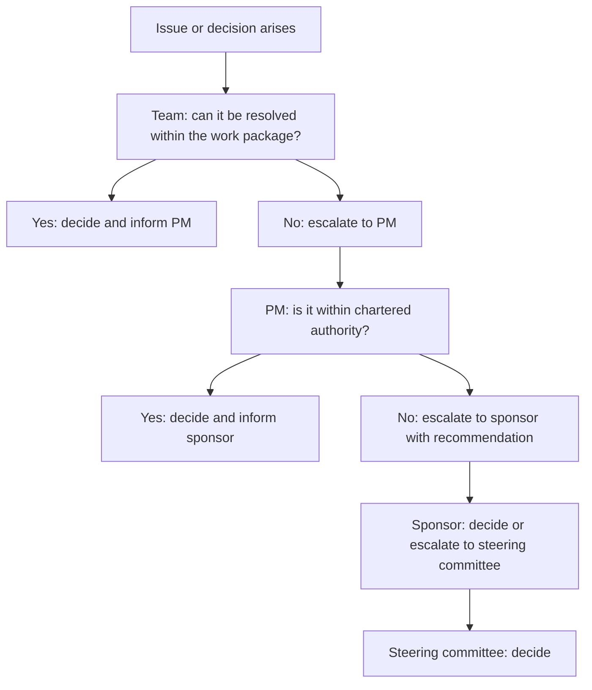

# Project Authority and Governance

> **Core skill:** Establishing the decision rights, escalation paths, and governance structures that define who can decide what — giving the project manager clear authority to manage, the sponsor clear accountability to govern, and the team clear boundaries within which to operate.

## Why This Matters

A project without defined authority is a project that cannot decide. Every choice becomes a negotiation; every change requires a meeting; every disagreement escalates to the highest available person because nobody knows who has the right to resolve it. The project manager who establishes authority and governance at initiation prevents decision paralysis before it starts.

Governance is not bureaucracy — it is decision architecture. It answers the questions that otherwise paralyze projects: who approves scope changes, who resolves resource conflicts, who accepts deliverables, and who decides the project is done. Good governance puts decisions at the lowest appropriate level, reserves the sponsor's attention for the decisions that only the sponsor can make, and gives every participant clarity about what they can decide and what they must escalate.

The project manager's own authority must be explicit: what decisions are delegated to the PM, what require consultation, and what require sponsor approval. Authority that is assumed is authority that will be challenged — and the worst time to discover the boundary is during a crisis.

## Decision Rights Framework

| Decision Area | Typical PM Authority | Typically Requires Sponsor | Typically Requires Governance Body |
|---|---|---|---|
| **Scope changes within chartered boundaries** | PM decides | Sponsor informed | Not required |
| **Scope changes beyond chartered boundaries** | PM recommends | Sponsor approves | Steering committee endorses |
| **Schedule adjustments within contingency** | PM decides | Sponsor informed | Not required |
| **Schedule adjustments beyond contingency** | PM recommends | Sponsor approves | Steering committee informed |
| **Budget reallocation within approved total** | PM decides | Sponsor informed | Not required |
| **Budget increase** | PM recommends | Sponsor approves | Steering committee endorses |
| **Quality trade-offs within acceptance criteria** | PM decides with team | Sponsor informed | Not required |
| **Quality trade-offs affecting acceptance criteria** | PM recommends | Sponsor approves | Steering committee informed |
| **Resource changes within the project team** | PM decides | Sponsor informed | Not required |
| **Resource changes affecting other projects** | PM recommends | Sponsor approves | Steering committee resolves |
| **Risk response within contingency** | PM decides | Sponsor informed | Not required |
| **Risk response requiring additional resources** | PM recommends | Sponsor approves | Steering committee informed |

## Governance Roles

| Role | Responsibilities | Authority | Engagement Frequency |
|---|---|---|---|
| **Sponsor** | Fund the project; approve charter and major changes; champion the project; resolve escalated issues | Approves charter, budget, scope changes beyond PM authority; can cancel the project | As needed; at least at phase gates |
| **Steering Committee** | Provide strategic direction; resolve cross-project conflicts; endorse major decisions | Advisory to the sponsor; may have approval authority for certain categories | Scheduled: monthly or at phase gates |
| **Project Manager** | Lead the project; manage scope, schedule, budget, and team within delegated authority | All decisions within chartered boundaries; escalates those beyond | Continuous |
| **Project Team** | Execute work; raise risks and issues; recommend decisions within their domain | Technical and implementation decisions within their work packages | Continuous |
| **Change Control Board** | Assess and approve or reject scope, schedule, and budget changes | Approves or rejects changes within its remit; escalates those beyond | As needed when changes are proposed |
| **Quality Assurance** | Verify that deliverables meet acceptance criteria and standards | Authority to reject deliverables that do not meet criteria | At deliverable review points |

## The Escalation Path



## Practical Applications

### Governance Setup Checklist

- [ ] Sponsor is named, confirmed, and understands their governance responsibilities
- [ ] Project manager's decision authority is documented and communicated
- [ ] Escalation path is defined: what the team decides, what the PM decides, what goes to the sponsor
- [ ] Steering committee membership is defined: who, roles, meeting frequency
- [ ] Change control process is established: who assesses, who approves, escalation thresholds
- [ ] Phase gate criteria are defined: what must be true to proceed to the next phase
- [ ] Governance documentation is visible to all stakeholders
- [ ] The sponsor has signed the charter that establishes this governance structure

### Authority and Governance Template

```markdown
# Authority and Governance: [Project Name]

## Sponsor
- **Name:** [Sponsor name, title]
- **Responsibilities:** [Funding, charter approval, major change approval, issue escalation target]
- **Engagement:** [Phase gate reviews; ad hoc as needed]

## Project Manager Authority
The project manager has authority to decide the following without escalation:
- [Decision category 1]
- [Decision category 2]
- [Decision category 3]

The project manager must consult the sponsor before deciding on:
- [Decision category that requires consultation]

The project manager must escalate to the sponsor for approval on:
- [Decision category that requires approval]

## Steering Committee
- **Chair:** [Name]
- **Members:** [Names and roles]
- **Meeting frequency:** [Monthly / At phase gates / Ad hoc]
- **Decision authority:** [What the committee can approve, endorse, or reject]

## Change Control Board
- **Members:** [Names and roles]
- **Authority threshold:** [Changes up to $X or Y days; beyond that, escalate to sponsor]
- **Meeting frequency:** [Weekly / As needed]

## Phase Gates
| Gate | Criteria to Pass | Approver | Timing |
|---|---|---|---|
| Initiation to Planning | [Criteria] | Sponsor | [Date or trigger] |
| Planning to Execution | [Criteria] | Steering Committee | [Date or trigger] |
| Execution to Closure | [Criteria] | Sponsor | [Date or trigger] |
```

## Common Pitfalls

| Pitfall | Why It Is a Problem | Better Approach |
|---|---|---|
| **Governance-as-ceremony** | Meetings that produce minutes but no decisions; stakeholders attend but do not engage | Define decision rights per meeting; only include members who can decide |
| **PM authority undefined** | PM escalates everything or decides everything; both failure modes damage the project | Document PM authority explicitly in the charter; review at each phase gate |
| **Sponsor absent** | Sponsor named but never available; decisions stall; PM carries risk without authority | Sponsorship is an active role, not a title; confirm availability before charter approval |
| **Steering committee too large** | Every stakeholder demands a seat; meetings become unmanageable; decisions are watered down | Limit to 5-7 members who represent decision-making authority, not interest groups |
| **Escalation bypassed** | PM is skipped; team or stakeholders go directly to the sponsor | Communicate the escalation path; sponsor redirects bypass attempts to the PM |
| **Phase gates as checkpoints only** | Gates review progress without the power to stop or redirect the project | Each gate is a decision point: proceed, proceed with conditions, or stop |

## Success Indicators

- Decisions are made at the level defined in the governance structure without persistent escalation
- The escalation path is followed; bypasses are rare and redirected
- Steering committee meetings produce decisions, not just status updates
- The sponsor is available when needed and engaged with the project's outcomes
- The project manager's authority is respected and they are not second-guessed on decisions within their remit

## Related Topics

- [[01_Project_Charter]] — authority and governance are established in the charter
- [[06_Governance_and_Change_Control/00_overview|Governance and Change Control]] — governance in execution and change management
- [[03_Stakeholder_Identification]] — governance bodies are key stakeholders
- [[07_Scope_Change_Management]] — change control operates within the governance structure
- [[career-path/12_Technical_Program_Manager/01_Program_Structure_and_Charter/00_overview|Program Structure and Charter (TPM)]] — program-level governance

## Summary

Project authority and governance establish who can decide what. The framework defines the project manager's delegated authority, the sponsor's accountability, the steering committee's strategic oversight, and the escalation path that routes decisions to the right level. Good governance is decision architecture, not bureaucracy — it puts decisions at the lowest appropriate level, reserves leadership attention for the decisions that require it, and gives every participant clarity about their decision rights. A project without defined authority cannot decide; a project with it can move.