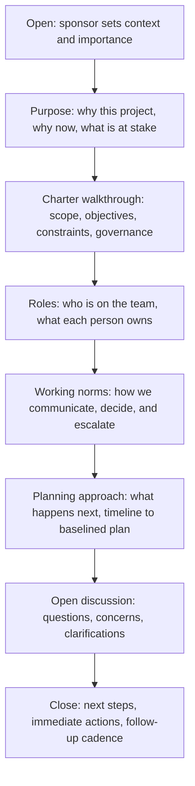

# Project Kickoff

> **Core skill:** Launching the project with the team and stakeholders — communicating the charter, building shared understanding of purpose and scope, establishing working norms, and converting a document into a collective commitment.

## Why This Matters

The project charter authorizes the project; the kickoff animates it. A charter that sits in a document repository is an organizational formality. A charter that is presented, discussed, questioned, and embraced at kickoff becomes the team's shared understanding of why they are here, what they are building, and how they will work together. The kickoff is the moment the project transitions from an idea on paper to a living initiative with people who own it.

The kickoff also serves as the first test of stakeholder alignment. When the project manager presents the charter and a stakeholder says "that is not what I agreed to," the kickoff has succeeded — it surfaced a misalignment early, when it is cheap to fix. When stakeholders nod silently and later resist every decision, the kickoff failed — it did not create the conditions for honest discussion. The project manager designs the kickoff not as a presentation but as a structured conversation that surfaces disagreement before it becomes obstruction.

For the team, the kickoff answers the questions that every team member has on day one: why this project, why now, why me, what are we building, how will we work, and who decides what. A team that leaves kickoff with clear answers moves into planning with purpose; a team that leaves with ambiguity spends the first weeks of planning discovering what the charter already said.

## Kickoff Audiences and Goals

| Audience | What They Need to Leave With | Key Questions to Answer |
|---|---|---|
| **Core project team** | Understanding of purpose, scope, roles, norms, and next steps | Why this project? What are we building? What is my role? How will we work? What do I do next? |
| **Extended stakeholders** | Understanding of purpose, scope, their role in decisions, and communication plan | Why this project? How does it affect me? When and how will I be involved? Who do I contact? |
| **Sponsor** | Confirmation that the charter is understood and the team is aligned | Is the charter understood? Are there unresolved issues? Is the team ready to proceed? |
| **Governance body** | Confirmation that the project is launched with appropriate governance | Is the governance structure understood? Are phase gates scheduled? Are escalation paths clear? |

## The Kickoff Agenda



## Practical Applications

### Kickoff Preparation Checklist

- [ ] Charter is signed by the sponsor and ready to present
- [ ] Core team members are identified and invited
- [ ] Key stakeholders are identified and invited to the appropriate session
- [ ] Agenda is published in advance with pre-reading materials
- [ ] Presentation materials are prepared: charter summary, team roster, timeline overview
- [ ] Working norms proposal is prepared: meeting cadence, communication channels, decision process
- [ ] Sponsor has confirmed they will open the kickoff with context and importance
- [ ] Logistics: room, remote access, time that works across time zones
- [ ] Method for capturing questions, concerns, and action items is prepared

### Kickoff Agenda Template

```markdown
# Project Kickoff: [Project Name]
**Date:** [Date]
**Attendees:** [Team and stakeholders]

## 1. Opening — Sponsor (10 min)
- Why this project matters to the organization
- The sponsor's commitment and expectations

## 2. Project Purpose and Context (15 min)
- The problem or opportunity
- Why now
- What happens if we do not do this

## 3. Charter Summary (20 min)
- High-level scope: what is in and out
- Measurable objectives and success criteria
- Key constraints and assumptions
- Governance and decision rights

## 4. Team and Roles (10 min)
- Core team members and their responsibilities
- Key stakeholders and when they are involved
- Decision rights: who decides what

## 5. Working Norms (10 min)
- Meeting cadence: standups, reviews, governance
- Communication channels and expectations
- How we escalate issues and make decisions

## 6. Planning Approach and Next Steps (10 min)
- Timeline to baselined plan
- Immediate next actions and owners
- First planning session date

## 7. Open Discussion (15 min)
- Questions, concerns, clarifications
- What is unclear or worrying
- What we need to resolve before planning begins

## Action Items
| Action | Owner | Due Date |
|---|---|---|
| [Action] | [Name] | [Date] |
```

## Common Pitfalls

| Pitfall | Why It Is a Problem | Better Approach |
|---|---|---|
| **Kickoff-as-lecture** | PM presents slides for an hour; attendees are passive; no alignment is built | Structured conversation: present, then discuss; question every silent nod |
| **Sponsor absent from kickoff** | Team does not hear the project's importance from the person funding it | Sponsor opens the kickoff with context and commitment |
| **Working norms skipped** | Team starts work without agreeing on how they will work together | Explicitly discuss and agree on meeting cadence, communication, and decision norms |
| **No time for dissent** | Agenda is packed; questions are deferred; disagreement goes underground | Reserve at least 20 percent of the agenda for open discussion; actively solicit concerns |
| **Wrong people in the room** | Key team members or stakeholders absent; decisions made without them are re-litigated | Confirm attendance of all core team members and decision-makers before scheduling |
| **Kickoff as the only alignment event** | One meeting and then silence; alignment decays as the project progresses | Kickoff is the start; follow with regular communication and re-alignment at phase gates |

## Success Indicators

- Every team member can state the project's purpose and their role without referring to notes
- Disagreements surfaced at kickoff are resolved or escalated, not buried
- Working norms established at kickoff are used and referenced throughout the project
- The team leaves kickoff knowing exactly what they do next and when
- Stakeholders who attended know how and when they will be engaged going forward

## Related Topics

- [[01_Project_Charter]] — the charter that the kickoff communicates and socializes
- [[03_Stakeholder_Identification]] — stakeholders identified at initiation attend the kickoff
- [[04_Project_Objectives_and_Success_Criteria]] — objectives presented and questioned at kickoff
- [[01_Scope_Definition]] — detailed scope planning begins after kickoff
- [[05_Stakeholder_Engagement/00_overview|Stakeholder Engagement]] — ongoing engagement after the kickoff

## Summary

The project kickoff converts the charter from a document into a shared understanding. It is designed as a structured conversation — not a presentation — that communicates purpose and scope, establishes roles and working norms, and surfaces disagreement before it becomes obstruction. The sponsor opens with context and commitment; the project manager presents the charter for discussion; the team leaves knowing why they are here, what they are building, how they will work together, and what they do next. A well-designed kickoff prevents the misalignment that a poorly designed one hides.