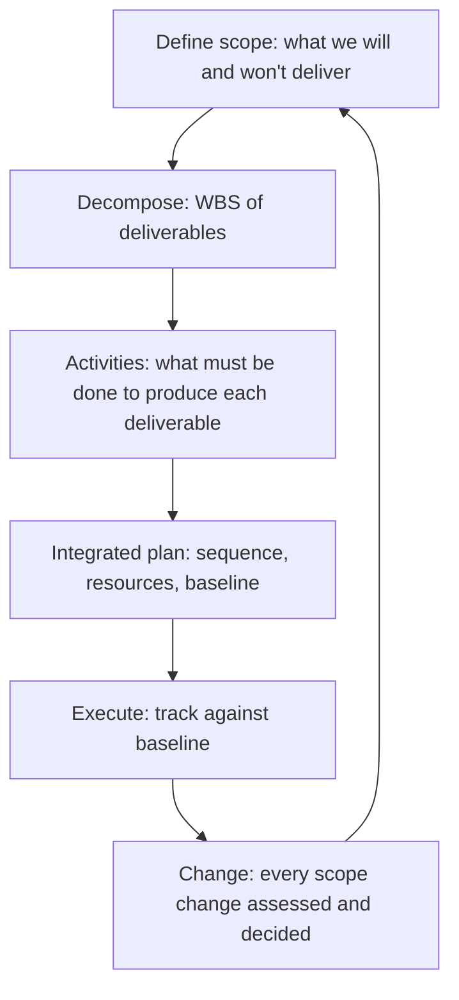

# Scope and Planning

> **Core capability:** The project manager defines the work — decomposing scope into manageable deliverables, building a plan the team believes in, and maintaining the baseline against which progress and change are measured.

## Why This Matters

Scope is the project's most contested boundary. Stakeholders add, teams resist, and the project manager holds the line — not by refusing change, but by making change visible: every addition costs something, and the decision to accept or reject belongs to governance, not to the project manager alone.

Planning is the project manager's craft: a work breakdown structure that names every deliverable, a plan that sequences work realistically, and a baseline that makes variance visible before it becomes a crisis. The plan is not a prediction — it is a communication tool. The project manager who treats it as a prediction hides variance; the one who treats it as a baseline manages it.

## Topics in This Capability Area

| Topic | Core Skill | When It Matters |
|-------|------------|-----------------|
| [[01_Scope_Definition]] | Defining what is in scope, out of scope, and the boundary between | Project initiation; every change |
| [[02_Work_Breakdown_Structure]] | Decomposing scope into manageable, estimable work packages | Planning |
| [[03_Requirements_Management]] | Eliciting, documenting, and managing requirements | Throughout the project |
| [[04_Project_Planning_and_Baselining]] | Building the integrated project plan and setting the baseline | Planning |
| [[05_Resource_Planning]] | Estimating and allocating people, tools, and budget | Planning |
| [[06_Scope_Verification_and_Validation]] | Ensuring deliverables meet requirements and are accepted | Delivery |
| [[07_Scope_Change_Management]] | Managing scope changes through governance and impact analysis | Whenever scope changes |

## The Planning Loop

The plan is alive; the baseline is the reference point.

## Practical Applications

### Scope and Planning Checklist

- [ ] Scope statement is documented with explicit in-scope and out-of-scope
- [ ] WBS decomposes all deliverables to a manageable level
- [ ] Project plan is baselined and version-controlled
- [ ] Resource plan accounts for availability, not just assignment
- [ ] Scope change process is defined and communicated
- [ ] Deliverables have acceptance criteria and verification methods

## Common Pitfalls

| Pitfall | Why It Is a Problem | Better Approach |
|---------|---------------------|-----------------|
| **WBS-by-function** | Work organized by department, not deliverable; ownership gaps | Deliverable-based WBS; every work package has one owner |
| **Plan-as-prediction** | Variance hidden because the plan "should" be right | Baseline as reference; variance as information |
| **Scope-creep-by-nod** | "Small" changes absorbed without governance | Every scope change assessed for schedule, cost, and risk impact |
| **Gold-plating** | Team adds unrequested features; scope inflates silently | Scope verification against requirements; change control |

## Success Indicators

- Scope changes are decisions, not drift — visible and governed
- The WBS covers all deliverables with no gaps
- The project plan is the team's reference, not the PM's private artifact
- Deliverables meet their acceptance criteria on first review

## Related Capabilities

- [[01_Initiation_and_Charter/00_overview|Initiation and Charter]]: scope is bounded in the charter
- [[03_Schedule_and_Cost/00_overview|Schedule and Cost]]: scope drives schedule and cost baselines
- [[06_Governance_and_Change_Control/00_overview|Governance and Change Control]]: change control governs scope changes

## Summary

Scope and planning define what the project will and will not deliver. The WBS decomposes scope into work; the plan sequences it realistically; the baseline makes variance visible; and scope change management keeps additions governed and honest. The plan is a communication tool — the project manager's job is to keep it honest, not to make it perfect.