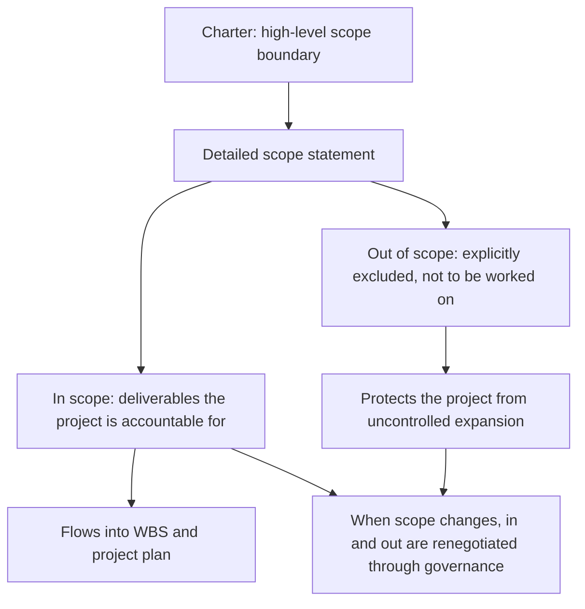

# Scope Definition

> **Core skill:** Defining the project's scope — what will be delivered, what is explicitly excluded, and the boundary between them — so that every stakeholder and team member knows what the project is responsible for and what it is not.

## Why This Matters

Scope is the project's most contested boundary. Every stakeholder has a mental model of what the project will deliver, and those models rarely agree. The project manager's scope definition is the instrument that reconciles them — not by satisfying every expectation but by making expectations explicit so they can be negotiated. Projects fail at scope more than at any other dimension because scope is where interests collide: the sponsor wants more for less, the team wants clarity, users want everything they can imagine, and the project manager holds the line.

Scope definition is not a list of features. It is a statement of what the project is accountable for producing, supported by a clear boundary between in and out. Everything that is in scope must be delivered, resourced, and tracked. Everything that is out of scope will not be delivered unless the scope changes through governance. The out-of-scope list is as important as the in-scope list — it is where the project manager draws the line that protects the team from uncontrolled expansion.

Scope flows from the charter into the detailed scope statement, which feeds the work breakdown structure, which feeds the plan. A scope that is loose at the top creates a cascade of ambiguity through every planning artifact below it. The project manager who defines scope precisely at the start spends less time defending it later.

## Scope Statement Components

| Component | What It Answers | Example |
|---|---|---|
| **Product scope** | What features, functions, and characteristics will the deliverable have? | "The system will process payments in three currencies" |
| **Project scope** | What work must be done to deliver the product scope? | "Design, build, test, and deploy the payment module" |
| **Deliverables** | What tangible outputs will the project produce? | "Payment API, admin dashboard, user documentation" |
| **In scope** | What is explicitly included? | "Integration with Stripe, PayPal, and bank transfer" |
| **Out of scope** | What is explicitly excluded? | "Cryptocurrency payments; international tax calculation" |
| **Acceptance criteria** | How will we know each deliverable is complete and correct? | "P95 latency under 200ms; processes 1000 transactions per minute" |
| **Constraints** | What limits apply to the scope? | "Must use approved payment provider list" |
| **Assumptions** | What are we assuming to be true for this scope to be valid? | "Payment providers' APIs are stable for the project duration" |

## In-Scope versus Out-of-Scope



## Practical Applications

### Scope Definition Checklist

- [ ] Product scope is described: what the deliverable will do, its key features and functions
- [ ] Project scope is described: the work required to produce the product scope
- [ ] All deliverables are listed with brief descriptions
- [ ] In-scope items are explicit and unambiguous
- [ ] Out-of-scope items are explicit: things stakeholders commonly expect that the project will not deliver
- [ ] Acceptance criteria exist for each major deliverable
- [ ] Constraints and assumptions are documented
- [ ] The scope statement has been reviewed with the sponsor and key stakeholders
- [ ] Out-of-scope items that are contentious have been discussed and agreed

### Scope Statement Template

```markdown
# Scope Statement: [Project Name]

## Product Scope
[Description of the product, system, or service the project will produce. Features, functions, characteristics.]

## Project Scope
[Description of the work the project will perform to deliver the product scope. Includes and excludes project activities.]

## Deliverables
| ID | Deliverable | Description | Acceptance Criteria | Owner |
|---|---|---|---|---|
| D1 | [Name] | [Description] | [Criteria] | [Name] |
| D2 | [Name] | [Description] | [Criteria] | [Name] |

## In Scope
- [Item 1]
- [Item 2]

## Out of Scope
- [Item 1]
- [Item 2]

## Constraints
- [Constraint 1]
- [Constraint 2]

## Assumptions
- [Assumption 1]
- [Assumption 2]

## Scope Approval
**Sponsor:** ________________  Date: ________
**Project Manager:** ________________  Date: ________
```

## Common Pitfalls

| Pitfall | Why It Is a Problem | Better Approach |
|---|---|---|
| **Scope-as-list-only** | A feature list without boundaries; anything not listed is assumed in scope by someone | Always pair in-scope with explicit out-of-scope |
| **Out-of-scope avoided** | Project manager avoids naming exclusions to avoid conflict; scope creeps silently | Name the exclusions that stakeholders commonly expect; negotiate them openly |
| **Acceptance criteria absent** | Deliverables listed without how they will be judged complete; disputes at delivery | Criteria written with each deliverable: measurable, testable, agreed |
| **Scope from one perspective** | PM defines scope alone; stakeholders discover they disagree at delivery | Co-create scope with key stakeholders; review and validate before baselining |
| **Scope and solution conflated** | Scope defines the solution, not the outcome; the team has no design freedom | Scope defines what and why; the team defines how |
| **Soft boundaries** | Scope described as "guidelines" rather than a governed boundary | Scope is a governed artifact; changes go through change control |

## Success Indicators

- Every stakeholder can name what is in scope and what is explicitly out of scope for their area of interest
- Scope changes are proposed through governance, not absorbed silently by the team
- Deliverables have acceptance criteria that are tested before the deliverable is presented for sign-off
- The scope statement is referenced in planning, status reporting, and change decisions
- No stakeholder is surprised at delivery by something they expected but was out of scope

## Related Topics

- [[02_Work_Breakdown_Structure]] — scope decomposed into work packages
- [[03_Requirements_Management]] — detailed requirements that elaborate the scope
- [[06_Scope_Verification_and_Validation]] — verifying deliverables against scope
- [[07_Scope_Change_Management]] — managing scope changes through governance
- [[01_Initiation_and_Charter/00_overview|Initiation and Charter]] — scope originates in the charter

## Summary

Scope definition is the discipline of drawing the project's boundary: what will be delivered, what is explicitly excluded, and the acceptance criteria that will judge delivery complete. It converts the charter's high-level scope into a detailed statement that feeds the work breakdown structure and the project plan. The out-of-scope list is as important as the in-scope list — it protects the project from uncontrolled expansion and gives the project manager the line against which scope changes are negotiated. A scope that is precise at the top prevents ambiguity from cascading through every planning artifact below it.