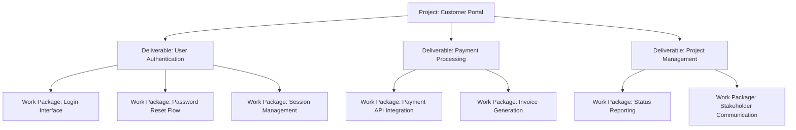

# Work Breakdown Structure

> **Core skill:** Decomposing project scope into a deliverable-oriented hierarchy of work packages — the WBS — so that every piece of work is named, owned, estimable, and assignable, and nothing required to deliver the scope falls between the cracks.

## Why This Matters

The work breakdown structure is the project manager's primary instrument for turning scope into work. It answers the question every plan must answer: what exactly must be produced? A WBS that is organized by deliverable — not by department, not by phase, not by activity — ensures that every work package has a single owner and a clear output. A WBS that is organized by function creates gaps where ownership overlaps and nobody is accountable.

The WBS is also the foundation of estimation. You cannot estimate what you cannot name. A WBS that decomposes scope to the level where work packages are small enough to estimate and large enough to manage — typically 8 to 80 hours of effort — enables credible cost and schedule estimates. A WBS that stops at high-level categories forces estimation at a level of abstraction where precision is impossible.

The 100 percent rule governs the WBS: the sum of the work at each level must equal 100 percent of the work at the parent level. Nothing is double-counted, nothing is omitted. A WBS that violates this rule produces a plan with hidden work — and hidden work becomes unplanned cost and schedule variance.

## WBS Principles

| Principle | What It Means | Why It Matters |
|---|---|---|
| **Deliverable-oriented** | Each node is a deliverable or work package, not a function or department | Every work package has a single owner and a defined output |
| **100 percent rule** | The children of a node represent 100 percent of the parent's scope | No hidden work; no double-counting |
| **Mutually exclusive** | No overlap between work packages at the same level | Clear ownership; no disputes about who does what |
| **Decomposition to manageable size** | Work packages are 8-80 hours of effort | Estimable with confidence; assignable to one person for a defined period |
| **Progressive elaboration** | Deeper levels are elaborated as planning proceeds | Near-term work is detailed; future work is at a higher level |
| **Includes all project work** | Project management, quality, and governance work are included, not only technical deliverables | The plan accounts for all effort, not only visible deliverables |

## WBS Level Guide

| Level | Name | Description | Example | Estimation Granularity |
|---|---|---|---|---|
| 1 | Project | The entire project scope | Customer Portal Project | Total project budget |
| 2 | Major deliverable | A primary output of the project | User Authentication Module | Phase-level estimate |
| 3 | Sub-deliverable | A component of a major deliverable | Login Interface | Work-stream estimate |
| 4 | Work package | The lowest level of decomposition; assignable to one person | Password Reset API | 8-80 hours; estimable |
| 5 | Activity | Tasks within a work package (optional; often in the schedule) | Write unit tests for password reset | Hours; daily tracking |

## WBS Decomposition Pattern



## Practical Applications

### WBS Quality Checklist

- [ ] The WBS is deliverable-oriented: every node names an output, not a department or activity
- [ ] The 100 percent rule is verified: the children of every node sum to the parent's scope
- [ ] Work packages are mutually exclusive: no overlap between packages at the same level
- [ ] The lowest level work packages are between 8 and 80 hours of effort
- [ ] Every work package has a single owner identified
- [ ] Project management, quality, and governance work packages are included
- [ ] The WBS has been reviewed by the team that will execute the work
- [ ] A WBS dictionary exists that describes each work package in detail

### WBS Dictionary Template

```markdown
# WBS Dictionary: [Project Name]

| WBS ID | Work Package Name | Description | Deliverable | Acceptance Criteria | Estimated Effort | Owner | Dependencies |
|---|---|---|---|---|---|---|---|
| 1.1.1 | [Name] | [Description of work] | [Output produced] | [How output is judged complete] | [Hours/days] | [Name] | [WBS IDs] |
| 1.1.2 | [Name] | [Description of work] | [Output produced] | [How output is judged complete] | [Hours/days] | [Name] | [WBS IDs] |
```

## Common Pitfalls

| Pitfall | Why It Is a Problem | Better Approach |
|---|---|---|
| **WBS-by-function** | Work organized by department, not deliverable; ownership gaps at boundaries | Deliverable-based WBS; one owner per work package |
| **Decomposition too shallow** | Work packages are too large to estimate; plan is a guess | Decompose until work packages are 8-80 hours |
| **Decomposition too deep** | Work packages are so small that management overhead exceeds work value | Stop at the level where further decomposition does not improve estimation |
| **100 percent rule violated** | Work is double-counted or omitted; plan does not match reality | Verify at each level: children sum exactly to parent scope |
| **Project management omitted** | PM work not in the WBS; PM effort is unplanned and unbudgeted | Include project management, governance, and quality as explicit work packages |
| **WBS as a solo artifact** | PM creates the WBS alone; team discovers gaps during execution | Co-create the WBS with the team; they know the work better than the PM |
| **No WBS dictionary** | Work package names are ambiguous; team interprets them differently | WBS dictionary defines each work package: description, deliverable, criteria, effort, owner |

## Success Indicators

- Every work package has a single owner who understands and accepts the assignment
- The WBS covers all deliverables in the scope statement with no gaps
- Work packages are estimable with confidence by the people who will do the work
- The team references the WBS to understand their work, not only the schedule
- Scope changes are reflected in the WBS before they are reflected in the schedule

## Related Topics

- [[01_Scope_Definition]] — scope feeds the WBS
- [[03_Requirements_Management]] — requirements drive the detail within work packages
- [[04_Project_Planning_and_Baselining]] — WBS feeds the project schedule
- [[05_Resource_Planning]] — work packages drive resource estimation
- [[03_Schedule_and_Cost/00_overview|Schedule and Cost]] — WBS is the foundation for cost estimation

## Summary

The work breakdown structure decomposes project scope into a deliverable-oriented hierarchy of work packages. Governed by the 100 percent rule — the children of every node represent exactly the parent's scope — the WBS ensures that every piece of work is named, owned, and estimable. Decomposition continues to the level where work packages are 8 to 80 hours: small enough to estimate with confidence, large enough to manage without overhead. The WBS is the foundation of estimation, scheduling, and resource planning — and the project manager who co-creates it with the team produces a plan the team believes in.