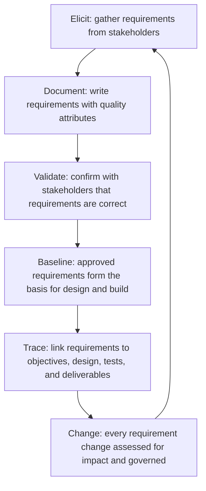

# Requirements Management

> **Core skill:** Eliciting, documenting, validating, and managing requirements throughout the project lifecycle — ensuring that what is built matches what stakeholders need and that requirements changes are visible, assessed, and governed.

## Why This Matters

Requirements are the translation layer between stakeholder intent and team execution. A stakeholder says "we need faster reporting." The requirements discipline converts that into: "the monthly sales report must render in under five seconds for datasets of up to one million rows." Without that translation, the team builds what they think was asked for, the stakeholder judges what they receive against what they imagined, and the gap between them is discovered at delivery — when it is most expensive to close.

Requirements management is not a phase that ends when planning is complete. Requirements evolve as understanding deepens, as stakeholders see early outputs and refine their needs, and as the business environment changes. The discipline is not to prevent change — it is to make change visible, assess its impact, and route it through governance so that additions are decisions, not drift.

The project manager's role in requirements is not to write them — that is a collaboration between stakeholders, business analysts, and the team — but to ensure the process exists, the outputs are traceable to scope and objectives, and changes are managed through governance. A project without requirements management builds to assumption; a project with it builds to agreement.

## Requirements Types

| Type | What It Describes | Example | Elicited From |
|---|---|---|---|
| **Business requirements** | The high-level business need or opportunity | "Reduce customer churn by 15 percent" | Sponsor, business case |
| **Stakeholder requirements** | What specific stakeholders need from the solution | "Account managers need a dashboard showing at-risk accounts" | Stakeholder interviews, workshops |
| **Functional requirements** | What the solution must do | "The system shall flag accounts with no login in 30 days" | Users, subject-matter experts |
| **Non-functional requirements** | Quality attributes and constraints | "Dashboard must load in under 3 seconds; 99.5% availability" | Operations, architecture, compliance |
| **Transition requirements** | What is needed to move from current to future state | "Historical data from the legacy CRM must be migrated with zero data loss" | Operations, data team |
| **Regulatory requirements** | Compliance obligations | "All customer data processing must comply with GDPR" | Legal, compliance |

## Requirements Quality Attributes

| Attribute | What It Means | Weak Requirement | Strong Requirement |
|---|---|---|---|
| **Unambiguous** | Only one interpretation is possible | "The system should be fast" | "P95 search response time shall not exceed 200ms" |
| **Testable** | A test can verify whether it is met | "The interface should be intuitive" | "New users shall complete the onboarding flow in under 5 minutes on first attempt" |
| **Traceable** | Linked to a business objective or stakeholder need | Disconnected feature request | "Requirement R-042 traces to objective O2: reduce support tickets by 30%" |
| **Feasible** | Achievable within constraints | "100% uptime with no maintenance window" | "99.9% uptime excluding scheduled maintenance windows announced 48 hours in advance" |
| **Prioritized** | Its importance relative to other requirements is known | All requirements marked "high" | "R-042 is priority 2 of 5; deferrable to phase 2 if schedule compresses" |
| **Atomic** | Describes exactly one thing | "The dashboard shall show metrics and export to PDF and email alerts" | Three separate requirements, each independently testable |

## The Requirements Lifecycle



## Practical Applications

### Requirements Quality Checklist

- [ ] Every requirement is unambiguous: two readers would describe the same thing
- [ ] Every requirement is testable: a test exists or can be written to verify it
- [ ] Every requirement traces to a business objective or stakeholder need
- [ ] Non-functional requirements are included: performance, availability, security, usability
- [ ] Requirements are prioritized: the team knows which are mandatory and which are deferrable
- [ ] Conflicting requirements are identified and resolved with stakeholders
- [ ] Requirements are baselined before design and build begin
- [ ] A requirements change process is defined and communicated

### Requirements Traceability Matrix Template

```markdown
# Requirements Traceability Matrix: [Project Name]

| Req ID | Requirement | Type | Priority | Source | Objective Traced To | Design Element | Test Case | Status |
|---|---|---|---|---|---|---|---|---|
| R-001 | [Requirement text] | Functional | P1-Must | [Stakeholder] | O1 | [Design ref] | TC-001 | Approved |
| R-002 | [Requirement text] | Non-functional | P2-Should | [Stakeholder] | O2 | [Design ref] | TC-002 | Approved |
| R-003 | [Requirement text] | Regulatory | P1-Must | [Source] | O1 | [Design ref] | TC-003 | In Review |
```

## Common Pitfalls

| Pitfall | Why It Is a Problem | Better Approach |
|---|---|---|
| **Requirements as solution** | Stakeholder specifies the solution, not the need; the team builds the wrong thing correctly | Elicit the need; separate what from how; let the team design the solution |
| **Non-functionals omitted** | Only functional requirements are captured; quality attributes are assumed | Elicit non-functionals explicitly: performance, security, usability, reliability, maintainability |
| **Gold-plating** | Team builds features not in the requirements because they "should" be there | Trace every feature to a requirement; anything untraced is unauthorized scope |
| **Priorities all equal** | Every requirement is priority one; team has no guidance when trade-offs are needed | MoSCoW or equivalent: must-have, should-have, could-have, will-not-have this time |
| **Requirements frozen too early** | No mechanism for valuable change; project delivers what was needed six months ago | Baseline requirements but govern changes; allow change with impact assessment |
| **Stakeholder sign-off as ritual** | Stakeholder signs without reading; discovers disagreement at delivery | Walk through requirements with stakeholders; verify understanding before sign-off |

## Success Indicators

- Every requirement traces to a business objective or stakeholder need
- The team builds only what is in the requirements; untraced features do not appear
- Non-functional requirements are tested as rigorously as functional requirements
- Requirements changes are visible in the traceability matrix and assessed for impact before approval
- Stakeholders validate requirements against their needs, not against the project manager's summary

## Related Topics

- [[01_Scope_Definition]] — requirements elaborate the scope
- [[02_Work_Breakdown_Structure]] — requirements drive work package detail
- [[06_Scope_Verification_and_Validation]] — requirements are the standard for verification
- [[07_Scope_Change_Management]] — requirements changes go through change control
- [[04_Project_Planning_and_Baselining]] — the plan builds from baselined requirements

## Summary

Requirements management translates stakeholder intent into documented, testable, traceable specifications that the team can build against. The discipline spans elicitation, documentation, validation, baselining, tracing, and change management. Good requirements are unambiguous, testable, traceable to objectives, feasible, prioritized, and atomic. The project manager ensures the process exists and changes are governed — so that what is built matches what was agreed, and what was agreed matches what was needed.