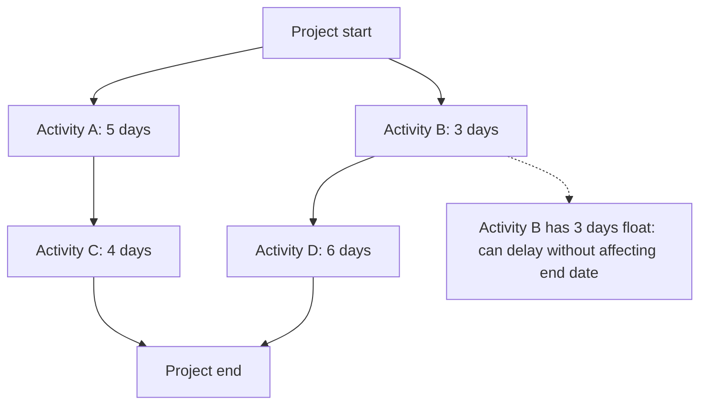

# Project Planning and Baselining

> **Core skill:** Building the integrated project plan — sequencing work from the WBS, estimating durations, identifying dependencies, and setting the baseline against which progress and variance are measured throughout execution.

## Why This Matters

The project plan is the project manager's primary communication tool. It tells the team what to do next, the sponsor when to expect delivery, and governance when variance demands attention. The plan is not a prediction — it is a reference. A plan that is treated as a prediction encourages the project manager to hide variance to protect the illusion of accuracy. A plan that is treated as a baseline makes variance visible as information: something is different from what was expected, and the difference tells you something about the project's reality.

Baselining is the act of freezing the plan so that variance can be measured. Before the baseline, the plan is a draft — it changes as estimation improves and sequencing is refined. After the baseline, the plan is a governed artifact — it changes only through formal change control. This distinction is essential: without a baseline, every replan is a silent revision of history, and no one can say whether the project is ahead, behind, or on track.

The project manager builds the plan with the team — not in isolation. The team knows the work better than the PM ever will; their estimates, their sequencing insights, and their identification of dependencies are the plan's foundation. The PM's role is to integrate, challenge for consistency, and communicate — not to dictate durations.

## The Planning Sequence

| Step | What Happens | Output | Key Decision |
|---|---|---|---|
| 1. Decompose scope | WBS is complete: all work packages named | WBS and WBS dictionary | Is the decomposition deep enough to estimate? |
| 2. Define activities | Each work package is broken into the activities needed to produce it | Activity list | Are activities at the right level for scheduling? |
| 3. Sequence activities | Dependencies between activities are identified | Network diagram | What must finish before what can start? |
| 4. Estimate durations | Effort and duration are estimated for each activity | Duration estimates | Who provided the estimates, and what assumptions? |
| 5. Estimate resources | Resources needed for each activity are identified | Resource requirements | Are resources available when needed? |
| 6. Develop schedule | Activities are placed on a timeline with resource constraints | Project schedule | Does the schedule meet the objectives? |
| 7. Set baseline | The approved schedule is frozen as the baseline | Baselines: scope, schedule, cost | Is the plan credible enough to commit? |

## Dependency Types

| Dependency | Description | Example | Management Implication |
|---|---|---|---|
| **Finish-to-Start (FS)** | Activity B cannot start until Activity A finishes | Code must be written before it can be tested | Most common; drives the critical path |
| **Start-to-Start (SS)** | Activity B cannot start until Activity A starts | Design review cannot start until design work starts | Enables parallel work; lag time specified |
| **Finish-to-Finish (FF)** | Activity B cannot finish until Activity A finishes | Documentation cannot finish until testing finishes | Used when activities must conclude together |
| **Start-to-Finish (SF)** | Activity B cannot finish until Activity A starts | New system handover cannot finish until old system shutdown starts | Rare; used in transition and cutover planning |
| **External** | Dependency on something outside the project | Vendor deliverable; regulatory approval | Track closely; outside PM's direct control |
| **Discretionary** | Dependency chosen by the team, not technically required | "We prefer to finish module A before starting module B" | Can be removed to compress the schedule if needed |

## Critical Path and Float



## Practical Applications

### Planning Quality Checklist

- [ ] The plan includes all work packages from the WBS — no hidden work
- [ ] Activity durations are estimated by the people who will do the work, not the PM
- [ ] Dependencies are explicit: mandatory versus discretionary, internal versus external
- [ ] The critical path is identified and understood
- [ ] Resource availability is accounted for: assignments do not exceed capacity
- [ ] Contingency is explicit and separate from activity estimates
- [ ] The baseline is approved by the sponsor and version-controlled
- [ ] A schedule management plan defines how the schedule will be updated and controlled

### Schedule Baseline Template

```markdown
# Schedule Baseline: [Project Name]

## Baseline Summary
- **Baseline date:** [Date]
- **Planned start:** [Date]
- **Planned finish:** [Date]
- **Total duration:** [N] working days
- **Critical path duration:** [N] working days
- **Contingency reserve:** [N] days/[X]%

## Key Milestones
| Milestone | Baseline Date | Owner |
|---|---|---|
| [Milestone 1] | [Date] | [Name] |
| [Milestone 2] | [Date] | [Name] |

## Baseline Approval
**Project Manager:** ________________  Date: ________
**Sponsor:** ________________  Date: ________

## Change History
| Date | Change Description | New Baseline Date | Approved By |
|---|---|---|---|
| [Date] | [Description] | [Date] | [Name] |
```

## Common Pitfalls

| Pitfall | Why It Is a Problem | Better Approach |
|---|---|---|
| **Estimates from authority** | PM or sponsor dictates durations; plan is not credible to the team | Estimates from the people doing the work; PM challenges for consistency |
| **No critical path** | All activities treated as equally urgent; no focus on what drives the end date | Identify the critical path; manage it actively; protect it from distraction |
| **Contingency hidden in activities** | Every activity padded; total contingency is invisible and unmanaged | Explicit contingency at the project level; activity estimates are most-likely |
| **Baseline skipped** | Plan constantly revised; no ability to measure variance or learn from it | Baseline the approved plan; manage changes through change control |
| **Resource unlimited planning** | Schedule built assuming infinite resources; overloaded at execution | Resource-level the schedule; resolve over-allocations before baselining |
| **External dependencies unmanaged** | Dependencies on other projects or vendors tracked passively | Active dependency tracking; escalation triggers when dependencies slip |

## Success Indicators

- The critical path is known and actively managed; it changes only through analysis
- Variance from baseline is reported honestly in every status report
- The team owns the schedule: they estimated it and they update it
- Contingency is consumed transparently and triggers a replan when exhausted
- External dependencies are tracked with the same rigor as internal activities

## Related Topics

- [[02_Work_Breakdown_Structure]] — WBS feeds the plan
- [[05_Resource_Planning]] — resource estimates and availability drive the schedule
- [[07_Scope_Change_Management]] — baseline changes go through change control
- [[03_Schedule_and_Cost/00_overview|Schedule and Cost]] — the schedule baseline and cost baseline
- [[01_Initiation_and_Charter/00_overview|Initiation and Charter]] — objectives and constraints that bound the plan

## Summary

Project planning and baselining convert the WBS into a sequenced, resourced schedule and freeze it as the governed reference for measuring progress and variance. The plan is built with the team — their estimates, their sequencing, their identification of dependencies — and the baseline is approved by the sponsor. The critical path is identified and actively managed. The plan is not a prediction; it is a communication tool that makes variance visible as information, not failure. The project manager who treats the plan as a baseline manages reality; the one who treats it as a prediction hides it.