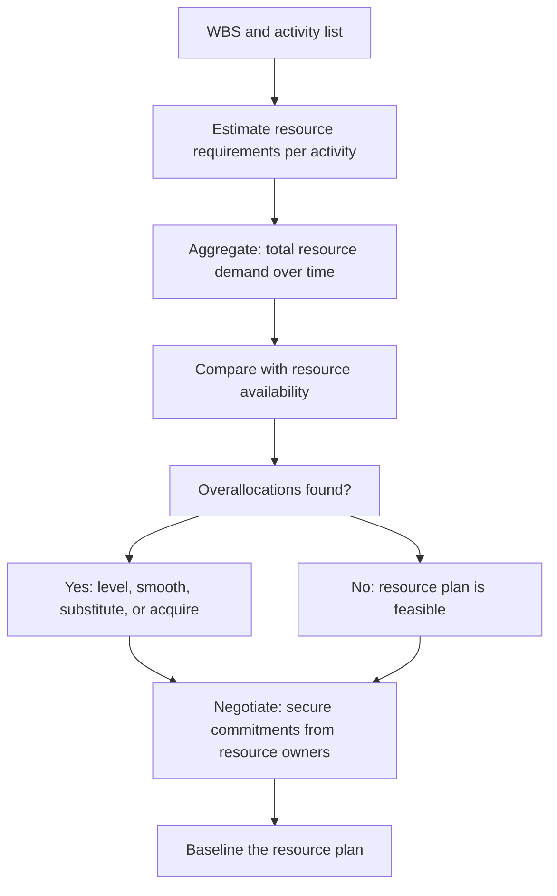

# Resource Planning

> **Core skill:** Estimating the people, equipment, materials, and budget the project needs — matching resource demand to availability, resolving overallocations, and building a resource plan the organization can commit to and the team can execute.

## Why This Matters

A project plan without resources is a wish list. It says what should happen and when, but it does not say whether the people, tools, and money exist to make it happen. The project manager who plans activities without planning resources discovers the gap at execution — when the person assigned to the critical path is also assigned to three other projects, when the test environment is booked by another team, and when the budget runs out before the final deliverable.

Resource planning is not allocation — it is negotiation. The project manager identifies what is needed, discovers what is available, and closes the gap through prioritization, scheduling, or escalation. Every resource conflict that is resolved during planning is a crisis prevented during execution. Every conflict left unresolved becomes a competing claim on the same person's time — and the project that loses that competition is the one whose PM did not secure the commitment.

The resource plan also forces realism into the schedule. A schedule built without resource constraints is optimistic by design — it assumes everyone is available full-time, nobody takes leave, and no other project competes for the same skills. The resource-leveled schedule shows what is actually possible given the people and tools available.

## Resource Categories

| Category | Examples | Estimation Approach | Management Challenge |
|---|---|---|---|
| **People** | Developers, analysts, testers, subject-matter experts | Hours or days per activity; role-based or named individuals | Availability shared across projects; skill shortages |
| **Equipment** | Servers, test environments, lab facilities, devices | Units per activity or phase; scheduling access | Limited availability; scheduling conflicts; procurement lead times |
| **Materials** | Licenses, consumables, third-party data sets, hardware | Units consumed per deliverable | Procurement lead times; vendor dependencies |
| **Budget** | Labor costs, license fees, vendor invoices, travel | Cost per resource unit multiplied by quantity | Funding commitments; budget transfers; exchange rates |
| **Facilities** | Meeting rooms, co-location space, data center access | Days or hours of access | Shared availability; competing bookings |

## Resource Estimation Techniques

| Technique | When to Use | Example | Accuracy |
|---|---|---|---|
| **Bottom-up** | WBS work packages are detailed; team can estimate effort per package | Each work package estimated by the person who will do the work | Highest; requires detailed WBS |
| **Analogous** | Limited detail available; similar past projects exist as reference | "The last payment integration took 60 person-days; this one is similar" | Medium; depends on similarity of reference |
| **Parametric** | Historical data exists that relates size to effort | "Each API endpoint takes 3 person-days on average; we have 12 endpoints" | Medium-high; depends on data quality |
| **Expert judgment** | No historical data; reliance on experienced practitioners | Senior architect estimates based on experience with similar systems | Medium; depends on expert calibration |
| **Three-point** | Uncertainty is high; optimistic, pessimistic, and most-likely estimates needed | Optimistic: 10 days; Most likely: 15 days; Pessimistic: 25 days; PERT: (10+60+25)/6 = 15.8 days | High for the range; expresses uncertainty |

## Resource Leveling and Smoothing

| Technique | What It Does | When to Use | Effect on Schedule |
|---|---|---|---|
| **Resource leveling** | Adjusts the schedule so that resource demand never exceeds availability | When resources are fixed and the schedule can flex | May extend the schedule; critical path may change |
| **Resource smoothing** | Adjusts activities within their float to reduce peaks in resource demand | When the end date is fixed and resources have some flexibility | Does not change the end date; uses float |
| **Resource substitution** | Replaces an overloaded resource with an equivalent available resource | When skills are fungible and substitutes are available | May affect quality or duration; assess skill match |
| **Resource acquisition** | Adds capacity: hire, contract, or borrow from another team | When the schedule cannot flex and existing resources are insufficient | Adds cost; procurement or onboarding lead time |

## The Resource Planning Cycle



## Practical Applications

### Resource Planning Checklist

- [ ] Resource requirements are estimated for every work package or activity
- [ ] Resource types are specified: role, skill level, and any special qualifications
- [ ] Resource availability is confirmed with resource managers or line managers
- [ ] Shared resources are identified and competing demands are surfaced
- [ ] Overallocations are resolved through leveling, smoothing, substitution, or acquisition
- [ ] Resource commitments are documented: who is assigned, when, and at what capacity
- [ ] Non-person resources are identified: equipment, environments, licenses, facilities
- [ ] Procurement lead times are accounted for in the schedule
- [ ] Budget is estimated bottom-up from resource requirements and validated against the business case

### Resource Plan Template

```markdown
# Resource Plan: [Project Name]

## People Resources
| Role | Skills Required | Quantity | Availability Window | Source | Commitment Status |
|---|---|---|---|---|---|
| [Role] | [Skills] | [N] FTE | [Start] to [End] | [Team/Vendor/Hire] | [Confirmed/Requested/At Risk] |

## Equipment and Environment
| Resource | Purpose | Quantity | Availability | Access Schedule | Owner |
|---|---|---|---|---|---|
| [Resource] | [Purpose] | [N] | [When available] | [When needed] | [Name] |

## Budget Summary
| Cost Category | Estimated Cost | Confidence | Funding Source | Commitment Status |
|---|---|---|---|---|---|
| Labor | [$X] | [H/M/L] | [Source] | [Confirmed/Requested] |
| Licenses | [$X] | [H/M/L] | [Source] | [Confirmed/Requested] |
| Vendor/External | [$X] | [H/M/L] | [Source] | [Confirmed/Requested] |
| Contingency | [$X] | N/A | [Source] | [Confirmed/Requested] |
| **Total** | **[$X]** | [H/M/L] | | |

## Resource Risks
| Risk | Resource Affected | Impact | Mitigation |
|---|---|---|---|
| [Risk] | [Resource] | [Description] | [Mitigation action] |
```

## Common Pitfalls

| Pitfall | Why It Is a Problem | Better Approach |
|---|---|---|
| **100 percent allocation assumed** | Plan assumes everyone is full-time on the project; actual availability is 60-70 percent | Account for overhead, other projects, leave, and organizational activities |
| **Named resources, no commitment** | Names in the plan but resource managers have not released them | Secure formal commitments from resource owners before baselining |
| **People only** | Only people are planned; equipment, environments, and materials are forgotten | Resource plan covers all categories: people, equipment, materials, facilities, budget |
| **Skill assumed fungible** | Any developer can do any task; specialized skills create hidden dependencies | Identify specialized skills; plan for knowledge transfer or backup |
| **Procurement lead time ignored** | Plan assumes equipment and vendor resources are available on day one | Account for procurement, contracting, and onboarding lead times in the schedule |
| **Budget as a single number** | One total budget figure; no breakdown by category or phase | Budget broken down by resource category and project phase; tracked against actuals |

## Success Indicators

- Every person in the plan has been confirmed as available by their resource manager
- Resource overallocations are resolved before execution begins
- The budget is estimated bottom-up from resource requirements and is consistent with the business case
- Non-person resources are identified, scheduled, and confirmed
- Resource risks are identified and mitigated before they become execution crises
- The resource plan is updated when scope, schedule, or resource availability changes

## Related Topics

- [[02_Work_Breakdown_Structure]] — WBS drives resource estimation
- [[04_Project_Planning_and_Baselining]] — resources drive the schedule
- [[01_Scope_Definition]] — scope drives resource requirements
- [[03_Schedule_and_Cost/00_overview|Schedule and Cost]] — resource costs drive the budget baseline
- [[05_Feasibility_and_Constraint_Analysis]] — resource constraints assessed at initiation

## Summary

Resource planning translates the WBS and activity list into estimates of the people, equipment, materials, and budget the project requires — and then reconciles demand with availability. The discipline is negotiation: identifying what is needed, discovering what is available, and closing the gap through leveling, smoothing, substitution, or acquisition. A resource plan without confirmed commitments is a wish list; the project manager who secures commitments before baselining prevents resource conflicts from becoming execution crises.