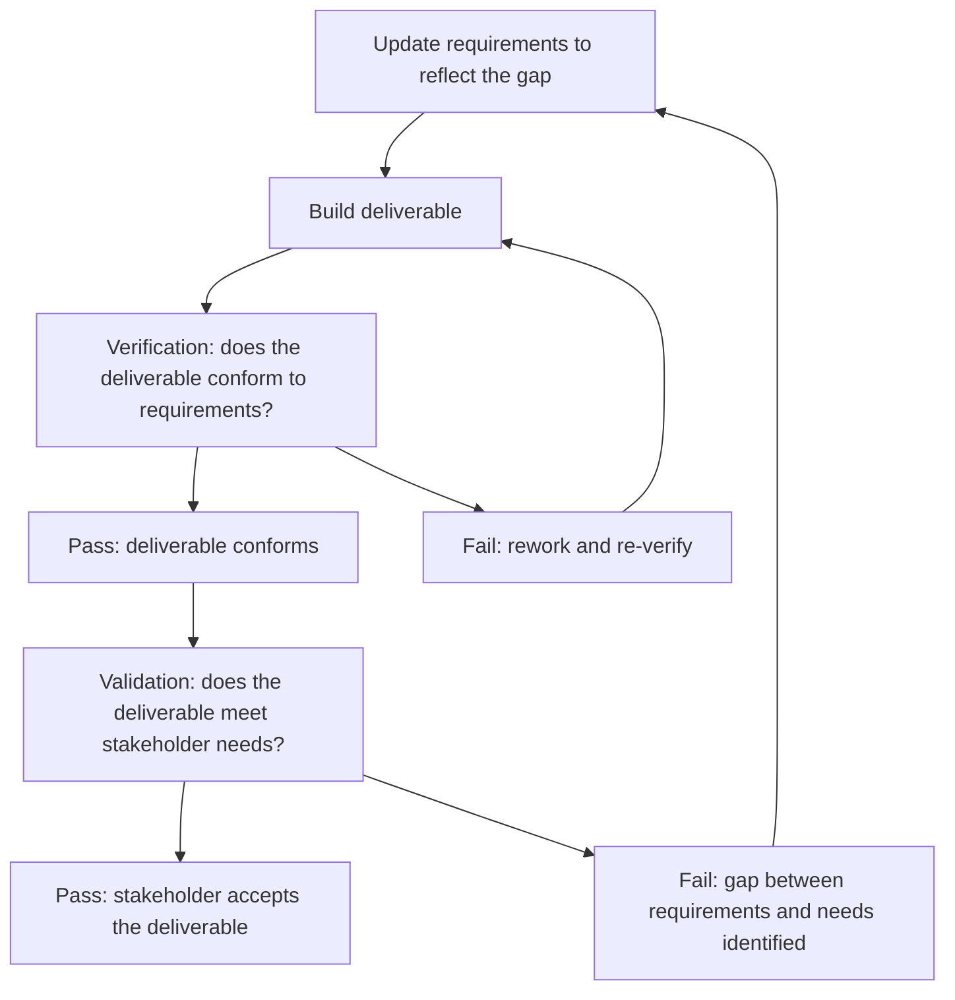

# Scope Verification and Validation

> **Core skill:** Ensuring that project deliverables meet their specified requirements (verification) and that the completed deliverables satisfy stakeholder needs and are formally accepted (validation) — the two-stage quality gate that separates internal confidence from external sign-off.

## Why This Matters

A deliverable that passes internal testing but is rejected by the stakeholder is a verification success and a validation failure. A deliverable that the stakeholder accepts but that does not meet its specified requirements is a validation success and a verification failure — and its defects will surface in production. The project manager distinguishes between verification and validation because they serve different purposes, involve different people, and protect different interests.

Verification is the project team's discipline: does the deliverable conform to its documented requirements and acceptance criteria? It is objective, testable, and internal — the team can verify without the stakeholder present. Validation is the stakeholder's discipline: does the deliverable meet the need that motivated it? It is contextual, judgment-based, and external — only the stakeholder can validate.

Both must happen for every deliverable. Verification without validation risks building the right thing to specification but the wrong thing for the need. Validation without verification risks accepting a deliverable that seems right but has hidden defects. Together they form the quality gate that declares a deliverable complete and accepted.

## Verification versus Validation

| Dimension | Verification | Validation |
|---|---|---|
| **Question answered** | Was the deliverable built correctly? | Was the correct deliverable built? |
| **Standard** | Requirements and acceptance criteria | Stakeholder needs and intended use |
| **Who performs it** | Project team, quality assurance, independent testers | Stakeholders, users, sponsor |
| **When** | Throughout development; at deliverable completion | At deliverable completion; may include user acceptance testing |
| **Method** | Inspection, testing, demonstration, analysis | Demonstration, user acceptance testing, pilot, review |
| **Output** | Verified: conforms / does not conform | Accepted: meets the need / does not meet the need |
| **Decision** | Is it correct? | Is it what we need? |

## Verification Methods

| Method | Description | Best For | Example |
|---|---|---|---|
| **Inspection** | Physical or visual examination of the deliverable | Tangible outputs; documents; user interfaces | Inspecting a report for format and completeness |
| **Testing** | Exercising the deliverable under defined conditions | Software, systems, processes | Running test cases against an API; load testing |
| **Demonstration** | Showing the deliverable in operation | Functional outputs; integrated systems | Live demo of the payment flow to the quality team |
| **Analysis** | Mathematical or logical evaluation | Complex calculations; models; architectures | Reviewing the capacity model against forecast demand |
| **Peer review** | Expert examination by peers | Designs, code, documents | Architecture review by senior engineers |
| **Audit** | Independent examination against standards | Compliance; regulated environments | Security audit against organizational standards |

## Validation Methods

| Method | Description | Best For | Example |
|---|---|---|---|
| **User acceptance testing (UAT)** | Structured testing by end users against their needs | Software; systems with user workflows | Users executing their daily tasks in the new system |
| **Pilot** | Limited deployment to a subset of users before full rollout | High-risk or high-change deliverables | Rolling out to one department before the whole organization |
| **Demonstration to stakeholders** | Showing completed deliverables to stakeholders for feedback | Any deliverable with stakeholder interest | Presenting the completed dashboard to the sponsor |
| **Operational readiness review** | Assessing whether operations can support the deliverable | Deliverables that require ongoing operations | Reviewing runbooks, monitoring, and support staffing |
| **Trial period** | Operating the deliverable for a defined period before formal acceptance | Deliverables with performance or reliability requirements | Running the new payment system in shadow mode for one month |

## The Verification and Validation Sequence



## Practical Applications

### Verification and Validation Checklist

- [ ] Acceptance criteria exist for every deliverable before build begins
- [ ] Verification method is defined for each deliverable: how will we test conformance?
- [ ] Validation method is defined for each deliverable: how will the stakeholder judge it?
- [ ] Verification is performed before the deliverable is presented to the stakeholder
- [ ] Stakeholders are available and scheduled for validation activities
- [ ] Verification and validation results are documented: pass/fail, defects, rework required
- [ ] Formal acceptance is recorded: who accepted, when, and any conditions
- [ ] Defects found during validation are analyzed: were requirements incomplete or did we build incorrectly?

### Deliverable Acceptance Record Template

```markdown
# Deliverable Acceptance Record: [Project Name]

| Deliverable ID | Deliverable Name | Verification Result | Verification Date | Validated By | Validation Result | Validation Date | Acceptance Status |
|---|---|---|---|---|---|---|---|
| D-001 | [Name] | Pass / Fail with conditions | [Date] | [Stakeholder name] | Accepted / Accepted with conditions / Rejected | [Date] | [Status] |

## Acceptance Conditions
[Any conditions attached to acceptance: defects to resolve, follow-up actions, deferred items.]

## Signatures
**Deliverable Owner:** ________________  Date: ________
**Accepting Stakeholder:** ________________  Date: ________
```

## Common Pitfalls

| Pitfall | Why It Is a Problem | Better Approach |
|---|---|---|
| **Verification skipped** | Deliverable presented to the stakeholder without internal testing; defects damage credibility | Verify internally first; only present deliverables that have passed verification |
| **Validation as demonstration only** | Stakeholder watches a demo and signs off; real-world use reveals gaps | Use realistic validation methods: UAT with real scenarios, pilot with real users |
| **Acceptance criteria absent** | No standard to verify against; disputes at delivery about what was agreed | Acceptance criteria defined with each deliverable at planning; agreed with the stakeholder |
| **Stakeholder unavailable for validation** | Deliverable completed but cannot be accepted; schedule stalls | Schedule validation activities at planning; secure stakeholder availability |
| **Verification conflated with validation** | Team verifies and assumes the stakeholder will accept; gap between conformance and need | Two separate activities: verification by the team, validation by the stakeholder |
| **Acceptance without conditions** | Stakeholder accepts but has undocumented reservations; issues surface later | Document acceptance conditions explicitly; track them to resolution |

## Success Indicators

- Every deliverable is verified before it is presented to the stakeholder
- Stakeholders validate against their needs, not against the PM's summary of their needs
- Acceptance is documented with conditions where applicable and tracked to resolution
- Defects found in validation are analyzed for root cause: requirements gap or build error
- No deliverable is accepted that has not passed verification

## Related Topics

- [[01_Scope_Definition]] — acceptance criteria are part of the scope statement
- [[03_Requirements_Management]] — requirements are the standard for verification
- [[07_Scope_Change_Management]] — validation gaps may trigger scope changes
- [[06_Governance_and_Change_Control/00_overview|Governance and Change Control]] — acceptance is a governance decision
- [[04_Project_Objectives_and_Success_Criteria]] — success criteria validated at closure

## Summary

Scope verification and validation form the two-stage quality gate that declares a deliverable complete and accepted. Verification — performed internally by the team — tests whether the deliverable conforms to its requirements and acceptance criteria. Validation — performed externally by the stakeholder — tests whether the deliverable meets the need it was intended to address. Both are necessary: verification without validation risks building the right thing to specification but the wrong thing for the need; validation without verification risks accepting a deliverable that looks right but has hidden defects. The project manager who separates the two and executes both ensures that what is built matches what was specified, and what was specified matches what was needed.