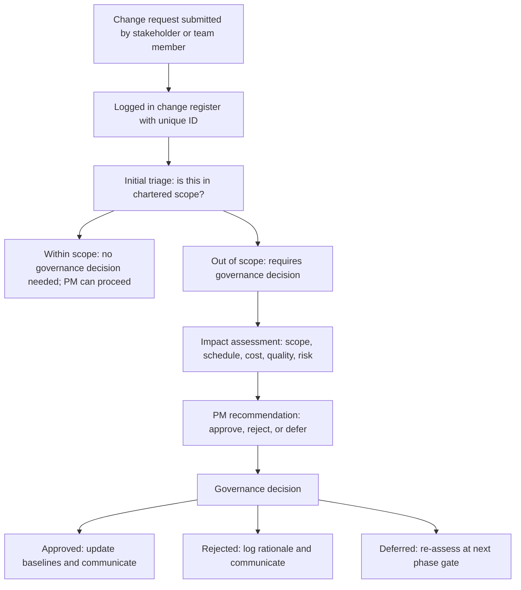

# Scope Change Management

> **Core skill:** Managing scope changes through a governed process — assessing the impact of every proposed change on schedule, cost, quality, and risk, and routing the decision to the appropriate authority so that scope evolves by decision, not by drift.

## Why This Matters

Scope will change. Requirements will be discovered, stakeholders will refine their needs, the business environment will shift, and technical constraints will force trade-offs. The question is not whether scope changes but whether change is governed or ungoverned. Ungoverned change is scope creep: the team absorbs "small" additions without impact assessment, the plan drifts from reality, and the project manager discovers the gap when the deadline is missed and the budget is exhausted. Governed change is scope management: every proposed change is assessed for impact, routed to the right decision-maker, and — if approved — reflected in the plan, budget, and baseline.

The project manager is not the gatekeeper of scope — governance is. The PM facilitates the process: receives change requests, coordinates impact assessment, presents the analysis to the decision-maker, and implements the decision. When the PM acts as the sole approver of scope changes, two things happen: the PM absorbs political pressure that belongs to governance, and the team bypasses the process because the PM becomes the bottleneck.

Scope change management is also where the project manager protects the team. A stakeholder who asks a developer directly for "one small change" is bypassing governance — and the developer who says yes without impact assessment is absorbing work that was never planned, resourced, or scheduled. The process protects the team by making every change request visible and every addition a decision.

## The Change Control Process

| Step | What Happens | Who Is Involved | Output |
|---|---|---|---|
| 1. Identify | A scope change is proposed | Any stakeholder or team member | Change request submitted |
| 2. Log | The change request is recorded in the change log | Project manager | Change request logged with unique ID |
| 3. Assess | Impact on scope, schedule, cost, quality, and risk is analyzed | Project manager with team input | Impact assessment |
| 4. Recommend | A recommendation is made: approve, reject, or defer | Project manager | Recommendation with rationale |
| 5. Decide | The change is approved, rejected, or deferred by the appropriate authority | Sponsor, steering committee, or change control board | Decision recorded |
| 6. Implement | If approved, the change is reflected in the plan, WBS, schedule, and budget | Project manager and team | Updated baselines |
| 7. Communicate | The decision and its impact are communicated to affected stakeholders | Project manager | Stakeholder communication |

## Change Impact Assessment Dimensions

| Dimension | Questions to Assess | Example Impact Statement |
|---|---|---|
| **Scope** | What deliverables, requirements, or work packages are affected? | "Adds one new deliverable: Admin Notification Module. Modifies requirements R-12 and R-15." |
| **Schedule** | How does this affect the critical path and key milestones? | "Extends the critical path by 8 working days. Milestone M3 slips from June 15 to June 25." |
| **Cost** | What is the additional cost in labor, licenses, and other resources? | "Additional 40 person-days of development effort. $5,000 in additional license costs." |
| **Quality** | Does this affect quality targets, acceptance criteria, or non-functional requirements? | "P95 response time target at risk: new feature adds database queries that may breach the 200ms threshold." |
| **Risk** | What new risks does this introduce, and how does it affect existing risks? | "Introduces dependency on third-party SMS provider. Existing risk R-04 (schedule compression) is aggravated." |
| **Resources** | Are additional resources needed, and are they available? | "Requires 0.5 FTE senior developer for 4 weeks. Currently no availability; must acquire or re-prioritize." |
| **Dependencies** | Does this affect dependencies with other projects or external parties? | "New dependency on the Infrastructure Team for SMS gateway provisioning. Their roadmap shows availability in 6 weeks." |

## Change Request Lifecycle



## Practical Applications

### Change Management Checklist

- [ ] A change request template is available and communicated to all stakeholders
- [ ] Every change request is logged with a unique ID
- [ ] Impact assessment is performed before the change is presented for decision
- [ ] Impact assessment covers scope, schedule, cost, quality, risk, resources, and dependencies
- [ ] The decision authority for different change magnitudes is defined and communicated
- [ ] Approved changes are reflected in the WBS, schedule, budget, and risk register
- [ ] Rejected changes are logged with rationale
- [ ] The change log is reviewed at every status meeting and phase gate

### Change Request Template

```markdown
# Change Request: CR-[NNN]

## Requester
- **Name:** [Name]
- **Role:** [Role]
- **Date submitted:** [Date]

## Change Description
[What is being requested. What is the change from the current baseline?]

## Rationale
[Why is this change needed? What value does it add or what risk does it mitigate?]

## Impact Assessment

| Dimension | Impact | Details |
|---|---|---|
| Scope | [None / Low / Medium / High] | [Which deliverables or requirements are affected] |
| Schedule | [+N days / No impact] | [Effect on milestones and critical path] |
| Cost | [+$N / No impact] | [Additional labor, licenses, or other costs] |
| Quality | [None / At risk / Improved] | [Effect on quality targets or acceptance criteria] |
| Risk | [New risks / Modified risks / No impact] | [Risks introduced or affected] |
| Resources | [Additional required / No impact] | [What additional resources and their availability] |
| Dependencies | [New dependencies / Modified / No impact] | [Effect on internal or external dependencies] |

## Recommendation
- [ ] Approve
- [ ] Reject
- [ ] Defer to [phase gate or date]

**Rationale:** [Why this recommendation]

## Decision
**Decision:** [Approved / Rejected / Deferred]
**Decided by:** [Name and role]
**Date:** [Date]
**Conditions:** [Any conditions attached to approval]
```

## Common Pitfalls

| Pitfall | Why It Is a Problem | Better Approach |
|---|---|---|
| **Every change approved** | No filtering; scope inflates; schedule and budget become impossible | Governance assesses value against cost; rejects changes that do not justify their impact |
| **PM as sole gatekeeper** | PM absorbs political pressure; team bypasses the process; decisions lack authority | PM facilitates the process; governance decides on changes beyond delegated authority |
| **Impact assessment skipped** | Change approved on perceived urgency or authority of the requester; hidden costs accumulate | Assess every change across all seven dimensions before the decision |
| **Approved changes not baselined** | Change is approved but the plan, WBS, and budget are not updated; drift between plan and reality | Update all baselines when a change is approved; communicate the new baseline |
| **Change log as a graveyard** | Changes logged but never reviewed; process exists on paper only | Review the change log at every status meeting; report change volume and trends |
| **Team bypass** | Stakeholder asks developer directly; developer says yes to avoid conflict | Communicate the process to all; empower the team to say "I will help you submit a change request" |

## Success Indicators

- Every scope change is a decision, not drift — visible and governed
- Change requests include impact assessment before they reach the decision-maker
- The change log is reviewed regularly and its trends inform project health assessments
- Approved changes are reflected in updated baselines within one reporting period
- The team redirects direct requests to the change process rather than absorbing them silently
- Rejected changes are understood by the requester: the rationale is communicated

## Related Topics

- [[01_Scope_Definition]] — the scope baseline that changes modify
- [[02_Work_Breakdown_Structure]] — WBS updated when scope changes
- [[04_Project_Planning_and_Baselining]] — schedule and cost baselines updated for approved changes
- [[06_Governance_and_Change_Control/00_overview|Governance and Change Control]] — the governance framework for change decisions
- [[01_Initiation_and_Charter/00_overview|Initiation and Charter]] — the charter defines the scope baseline

## Summary

Scope change management is the governed process that converts scope creep into scope decisions. Every proposed change is logged, assessed for impact across seven dimensions — scope, schedule, cost, quality, risk, resources, and dependencies — and routed to the appropriate decision authority. Approved changes update all baselines; rejected changes are logged with rationale; deferred changes are reassessed at the next phase gate. The project manager facilitates the process and protects the team from ungoverned additions. The discipline is not to prevent change — it is to make change visible, assessed, and decided.