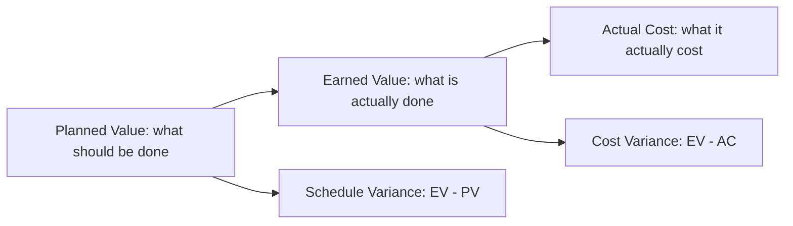

# Schedule and Cost

> **Core capability:** The project manager builds honest forecasts for time and money, communicates variance early, and manages the project's critical path and cost baselines so that schedule slips and cost overruns are decisions, not surprises.

## Why This Matters

Schedule and cost are the two dimensions stakeholders watch most closely — and the two where project managers lose credibility fastest when they hide variance. An honest forecast with a 20% overage is better than a dishonest one that hits the number on paper and overruns in reality.

The project manager does not control how fast engineers work or what vendors charge. They control the forecast: estimating with the team, building contingency against uncertainty, tracking actuals against the baseline, and communicating variance with options before it becomes a crisis. Earned value management, critical path analysis, and cost forecasting are the PM's analytical tools — but the real skill is telling stakeholders what they need to hear, not what they want to hear.

## Topics in This Capability Area

| Topic | Core Skill | When It Matters |
|-------|------------|-----------------|
| [[01_Schedule_Development]] | Building the project schedule with dependencies and critical path | Planning |
| [[02_Critical_Path_Analysis]] | Identifying, monitoring, and protecting the critical path | Schedule management |
| [[03_Cost_Estimation_and_Budgeting]] | Building cost estimates and the project budget | Planning; investment approval |
| [[04_Earned_Value_Management]] | Measuring schedule and cost performance with EVM | Progress tracking |
| [[05_Schedule_and_Cost_Tracking]] | Tracking actuals against baselines and forecasting | Every status cycle |
| [[06_Variance_Analysis_and_Reporting]] | Analyzing and communicating schedule and cost variance | When plans and reality diverge |
| [[07_Schedule_Compression_and_Recovery]] | Crashing, fast-tracking, and re-planning for recovery | When behind schedule |

## Earned Value at a Glance

EVM turns "we're a bit behind" into numbers a steering committee can act on.

## Practical Applications

### Schedule and Cost Checklist

- [ ] Project schedule includes dependencies, critical path, and resource assignments
- [ ] Cost baseline is established and approved
- [ ] Schedule and cost actuals are tracked and reported in every status cycle
- [ ] Variance is analyzed and communicated with corrective action options
- [ ] Critical path is monitored for slippage
- [ ] Schedule compression decisions are made with documented trade-offs

## Common Pitfalls

| Pitfall | Why It Is a Problem | Better Approach |
|---------|---------------------|-----------------|
| **Schedule-by-calendar** | Deadlines set without team input; unrealistic | Collaborative estimation with the people doing the work |
| **Cost-as-afterthought** | Budget tracked only when overspending is obvious | Proactive cost tracking and forecasting |
| **Hidden variance** | Small slips unreported; accumulate into large overruns | Communicate variance at every status cycle |
| **Crash-without-analysis** | Adding people to late projects makes them later | Analyze critical path; crash only where it helps |

## Success Indicators

- Schedule forecasts are within acceptable variance of actuals
- Cost actuals stay within the approved budget
- Variance is communicated early and with corrective options
- Earned value metrics inform stakeholder decisions, not just PM status

## Related Capabilities

- [[02_Scope_and_Planning/00_overview|Scope and Planning]]: scope changes drive schedule and cost changes
- [[04_Risk_and_Issues/00_overview|Risk and Issues]]: contingency is sized from risk analysis
- [[career-path/11_Engineering_Manager/04_Delivery_Leadership_for_Managers/07_Delivery_Metrics_and_Health|Delivery Metrics and Health (EM)]]: team-level delivery measurement

## Summary

Schedule and cost management means building honest forecasts, tracking actuals against baselines, analyzing variance before it compounds, and communicating reality to stakeholders with corrective options. Earned value is the analytical backbone; honesty is the professional backbone. The project manager who hides variance loses the project; the one who communicates it earns the right to fix it.