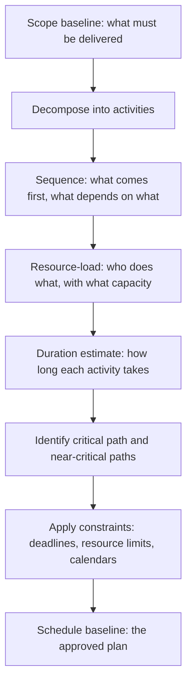

# Schedule Development

> **Core skill:** Building a credible project schedule — activities sequenced with dependencies, resource-loaded, and duration-estimated by the people doing the work — so the schedule is a forecast the team trusts and the business can act on.

## Why This Matters

A schedule that comes from a sponsor's calendar or a Gantt chart drawn alone in a project manager's office is not a schedule — it is a wish with dates on it. Real schedules are built with the team because the team knows the work. The project manager's job is not to estimate durations but to run the process: facilitate decomposition, surface dependencies, identify constraints, and assemble the pieces into a sequence that has a defensible critical path and a chance of surviving contact with reality.

Schedule development is also where the project's assumptions become visible. Every dependency is a bet. Every resource constraint is a trade-off. Every calendar milestone imposed from outside is a risk until the schedule proves it can be met.

## The Schedule Development Process

The baseline is a snapshot, not a straitjacket — it exists so variance can be measured, not to pretend the future is fixed.

## Core Activities

| Step | What It Produces | Common Mistake |
|------|------------------|----------------|
| Decomposition | Activity list from the WBS, at a manageable level of detail | Activities too coarse to track, or too fine to manage |
| Sequencing | Precedence diagram: finish-to-start, start-to-start, finish-to-finish, start-to-finish | Hard-coding dependencies that are actually discretionary |
| Resource estimation | Named or role-level resources per activity, with availability | Assuming full-time availability on multiple activities |
| Duration estimation | Activity durations from the people doing the work, with ranges | Single-point estimates with no range or confidence |
| Critical path identification | The longest path through the network; determines minimum project duration | Ignoring near-critical paths that become critical on small slips |
| Constraint resolution | Calendar constraints, resource leveling, imposed dates | Accepting impossible constraints without escalation |

## Estimation Approaches

| Approach | When to Use | Strength | Weakness |
|----------|-------------|----------|----------|
| **Analogous** | Early stages, limited information | Fast; grounded in real history | Only as good as the analogue; hides differences |
| **Parametric** | Repeatable work with measurable units | Data-driven; scalable | Requires reliable historical data per unit |
| **Bottom-up** | Detailed planning with the team | Most accurate; team ownership | Time-consuming; requires decomposed WBS |
| **Three-point** | Uncertain activities; risk-aware planning | Captures uncertainty; feeds risk analysis | Requires estimation discipline from the team |

Three-point estimation (optimistic, most likely, pessimistic) is the project manager's standard for any activity with real uncertainty — which is most of them in software and technical projects.

## Schedule Documentation

A credible schedule document includes:

- Activity list with durations and responsible resources
- Precedence network or Gantt chart showing dependencies
- Critical path identified and highlighted
- Assumptions log: what the schedule assumes about resource availability, external dependencies, and constraints
- Constraints log: imposed dates, resource limits, calendar restrictions
- Schedule baseline date and version

## Practical Applications

**Schedule development checklist:**

- [ ] Scope is decomposed into activities at a trackable level of granularity
- [ ] Dependencies are explicit: mandatory, discretionary, external
- [ ] Resources are assigned by role or name, with realistic availability
- [ ] Durations are estimated by the people who will do the work
- [ ] Critical path is identified and the team can name it
- [ ] Near-critical paths are flagged for monitoring
- [ ] Assumptions and constraints are documented
- [ ] Schedule baseline is approved and version-controlled

**Schedule review questions:**

- [ ] Can the team explain the logic — "why does this come after that?"
- [ ] Are any dependencies discretionary and could be removed?
- [ ] What is the float on each activity that is not on the critical path?
- [ ] What assumptions would break the schedule if they prove false?
- [ ] Which imposed dates are the schedule fighting?

## Common Pitfalls

| Pitfall | Why It Is a Problem | Better Approach |
|---------|---------------------|-----------------|
| **Schedule by decree** | Sponsor picks a date; PM reverse-engineers the plan to fit | Build the schedule forward from the work; surface gaps to sponsors |
| **Activity overload** | Hundreds of sub-day tasks that create noise, not insight | One or two activities per work package; duration roughly a status cycle |
| **Duration without range** | Single-point estimates collapse on first slip | Three-point estimates for uncertain activities; confidence ranges |
| **Ignoring resource capacity** | Schedule assumes 100% availability; real people have meetings, support, and other projects | Resource-loaded schedule with realistic availability factors |
| **Skipping near-critical paths** | Only the critical path is monitored; a small slip on a near-critical path flips the schedule | Flag and monitor all paths within 10–15% of critical path duration |

## Success Indicators

- The team can describe the schedule logic without referencing the Gantt chart
- Activity durations carry confidence ranges, not single numbers
- Imposed dates are reconciled with the schedule, not pasted on top of it
- Critical and near-critical paths are reviewed at every status cycle
- The schedule baseline is stable enough to measure variance against

## Related Topics

- [[02_Critical_Path_Analysis]]: monitoring and protecting the critical path
- [[03_Cost_Estimation_and_Budgeting]]: cost follows schedule duration
- [[05_Schedule_and_Cost_Tracking]]: tracking actuals against the baseline
- [[02_Scope_and_Planning/00_overview|Scope and Planning]]: the WBS feeds the activity list
- [[06_Governance_and_Change_Control/00_overview|Governance and Change Control]]: baseline changes go through governance

## Summary

Schedule development turns scope into a sequenced, resource-loaded, duration-estimated plan that the team built and the business can measure against. The project manager facilitates decomposition, sequences dependencies, resources activities realistically, and identifies the critical path — but does not estimate the durations alone. A schedule made without the team is a document; a schedule made with the team is a forecast.