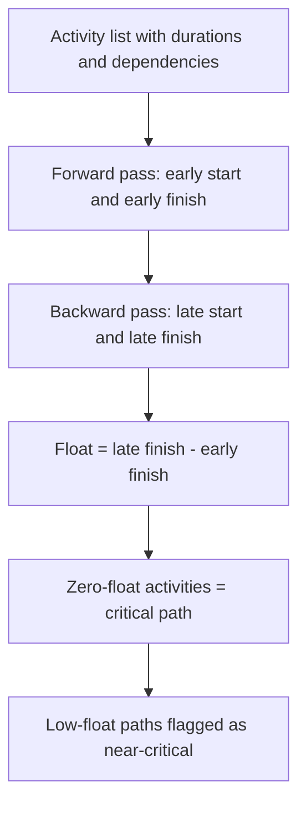

# Critical Path Analysis

> **Core skill:** Identifying the longest path through the project's network of activities — the sequence that determines the minimum project duration — and monitoring, protecting, and acting on it before slips cascade.

## Why This Matters

The critical path is the project's spine. Every day of slip on the critical path is a day of slip on the project. Activities not on the critical path have float — they can slip within a window without affecting the finish date. The project manager who cannot identify, explain, and protect the critical path is managing a Gantt chart, not a project.

Critical path analysis is not a one-time planning exercise. It is a continuous monitoring discipline: what was critical last month may not be critical this month. Near-critical paths — activities with only a few days of float — deserve as much attention as the critical path itself because a small delay turns them critical instantly.

For program managers, the critical path extends across projects: dependencies between projects create a program-level critical path that no individual project manager can see alone.

## Core Concepts

| Concept | Definition | Why It Matters |
|---------|------------|----------------|
| **Critical path** | The longest sequence of dependent activities through the network | Determines the project's minimum duration |
| **Float (slack)** | The time an activity can be delayed without delaying the project | Identifies activities that can absorb delays |
| **Total float** | Delay allowed without delaying the project finish date | The standard measure of schedule flexibility |
| **Free float** | Delay allowed without delaying any successor activity | Identifies activities that can slip without cascading |
| **Near-critical path** | Paths with very low float — typically less than 10% of project duration | These become critical on small delays |
| **Forward pass** | Calculates early start and early finish dates from the start | Establishes the earliest possible completion |
| **Backward pass** | Calculates late start and late finish dates from the finish | Establishes float by comparing early and late dates |

## The Critical Path Method (CPM)

The critical path is the chain of activities with zero total float. Every activity on it has no schedule flexibility — and the project manager must know exactly which activities those are.

## Critical Path Monitoring

| Monitoring Activity | Frequency | What to Watch |
|---------------------|-----------|---------------|
| Critical path review | Every status cycle | Actual vs. planned progress on critical activities |
| Float trending | Every status cycle | Is float on near-critical paths shrinking? |
| Dependency check | Weekly | Are external dependencies on the critical path still on track? |
| Resource check | Weekly | Are critical path resources still available at planned capacity? |
| Re-analysis | Monthly or after any significant change | Has the critical path shifted? |

## Critical Path Shifts

The critical path is not static. Common causes of shifts:

| Trigger | Effect | Response |
|---------|--------|----------|
| A critical path activity finishes early | Float increases; another path may become critical | Re-run forward and backward passes |
| A near-critical activity slips past its float | That path becomes critical; the project finish date shifts | Re-analyze; communicate the shift |
| A resource leaves a critical activity | Activity duration extends; critical path lengthens | Re-estimate; consider resource re-allocation |
| A new dependency is discovered | The network topology changes | Update the network diagram; re-calculate |
| Scope is added | New activities join the network; paths shift | Re-baseline after change control |

## Protecting the Critical Path

| Strategy | How It Works | When to Use |
|----------|-------------|-------------|
| **Resource focus** | Assign your strongest resources to critical path activities | When critical path resources are spread too thin |
| **Float buffer** | Keep a small buffer of uncommitted time on critical resources | When critical resources are heavily loaded |
| **Dependency reduction** | Challenge discretionary dependencies on the critical path | When a dependency can be removed or softened |
| **Risk monitoring** | Watch risks on critical path activities more closely | Always — risks on the critical path have zero float to absorb them |
| **Near-critical flagging** | Treat near-critical paths as critical for monitoring purposes | When project duration is long and small slips accumulate |

## Program-Level Critical Path

For program managers, the critical path crosses project boundaries:

| Program Consideration | What It Means | What to Do |
|-----------------------|---------------|------------|
| Cross-project dependencies | Project B cannot start until Project A delivers | The program critical path includes both projects |
| Shared resources | Critical resources are allocated across projects | Resource-level across projects; identify bottlenecks |
| Milestone integration | Program milestones depend on multiple project deliveries | Map dependencies across project boundaries |
| Benefit realization | The critical path extends to the point where benefits are realized | Track beyond individual project completion |

## Practical Applications

**Critical path checklist:**

- [ ] Critical path is identified and visible in the project schedule
- [ ] Near-critical paths (float < 10% of project duration) are flagged
- [ ] Critical path is reviewed in every status cycle
- [ ] Float trending is tracked for near-critical paths
- [ ] Critical path resources are protected from over-allocation
- [ ] Schedule re-analysis occurs after any significant change
- [ ] Program-level critical path is visible for cross-project dependencies

**Critical path review questions:**

- [ ] What activities are on the critical path this week?
- [ ] Has the critical path shifted since the last review?
- [ ] What near-critical paths are trending toward zero float?
- [ ] Are critical path resources available and unblocked?
- [ ] What external dependencies on the critical path are at risk?

## Common Pitfalls

| Pitfall | Why It Is a Problem | Better Approach |
|---------|---------------------|-----------------|
| **One-time analysis** | Critical path identified at planning, never revisited | Re-analyze after changes; review float trending every cycle |
| **Ignoring near-critical** | Paths with 3 days of float become critical on a 4-day delay | Flag and monitor all paths within 10–15% of critical path duration |
| **Resource-blind path** | Critical path derived from durations only, ignoring resource constraints | Resource-loaded critical path; the resource-critical path may differ |
| **Dependency blindness** | Discretionary dependencies hard-coded as mandatory | Challenge every dependency; remove those that are not required |
| **Program path invisible** | Each project manager sees only their own critical path | Program manager maps and communicates the program-level critical path |

## Success Indicators

- The project manager can name the current critical path activities without looking at the schedule
- Float trending is a standard item in the status report
- Near-critical path slippage is caught before it shifts the finish date
- Critical path resources are not the bottleneck on other activities
- The program manager's critical path view is consistent with individual project schedules

## Related Topics

- [[01_Schedule_Development]]: the critical path emerges from schedule development
- [[07_Schedule_Compression_and_Recovery]]: crashing and fast-tracking act on the critical path
- [[05_Schedule_and_Cost_Tracking]]: tracking actuals against the critical path baseline
- [[02_Scope_and_Planning/00_overview|Scope and Planning]]: scope changes alter the activity network
- [[career-path/12_Technical_Program_Manager/03_Cross_Team_Execution_Coordination/00_overview|Cross-Team Execution (TPM)]]: program-level dependency management

## Summary

Critical path analysis identifies the sequence of activities that determines the project's minimum duration and the float on everything else. It is not a one-time planning exercise — it is a continuous monitoring discipline. The project manager reviews the critical path every status cycle, watches near-critical paths for float erosion, protects critical resources, and re-analyzes after any change. At the program level, the critical path crosses project boundaries and the program manager owns the integrated view.