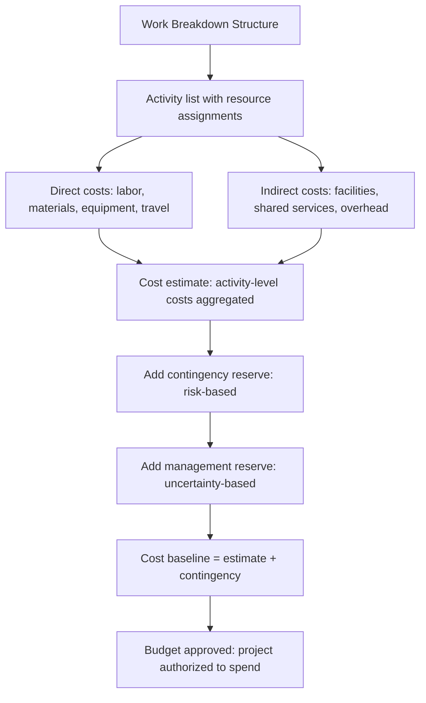

# Cost Estimation and Budgeting

> **Core skill:** Building cost estimates from activity-based resource requirements, establishing the cost baseline, and managing the budget so that spending is forecast, authorized, and tracked — not discovered in arrears.

## Why This Matters

Cost is the dimension that converts a project plan into an organizational commitment. A project without a budget is a project without permission. A project with a budget that is disconnected from the schedule and resource plan is a project that will either overspend in silence or under-deliver to stay within an arbitrary number.

The project manager builds cost estimates from the same activity list that drives the schedule: resources × duration × rate. This creates traceability — every dollar in the budget traces to work in the plan. When scope changes, cost changes visibly. When resources change, the budget updates. The cost baseline is the approved version of this relationship, and every variance from it is either a decision or a problem.

## Cost Estimation Flow

## Cost Categories

| Category | What It Includes | Estimation Approach |
|----------|-----------------|---------------------|
| **Labor** | Staff hours × loaded rates (salary, benefits, overhead) | Bottom-up from resource-loaded schedule |
| **Materials** | Hardware, software licenses, cloud, data | Vendor quotes or historical actuals |
| **Equipment** | Capital purchases, specialized tools, test environments | Lease vs. buy analysis |
| **Travel** | Team travel, stakeholder meetings, site visits | Per-trip estimation or historical rate |
| **Services** | Contractors, consultants, vendors, training | Statements of work, rate cards, quotes |
| **Facilities** | Office space, labs, co-location costs | Per-square-foot or per-seat rates |
| **Contingency** | Risk-based reserve for known unknowns | P × I for quantified risks; percentage for unidentified risks |
| **Management reserve** | Reserve for unknown unknowns | Percentage of total estimate; sponsor-controlled |

Contingency reserve is for identified risks — the risks in the register. Management reserve is for unidentified risks — the ones that have not been named yet. The project manager controls contingency; the sponsor controls management reserve.

## Estimation Approaches

| Approach | Accuracy Range | When to Use | Limitation |
|----------|---------------|-------------|------------|
| **Rough order of magnitude (ROM)** | -25% to +75% | Initiation; feasibility | Too wide to commit against |
| **Budget estimate** | -10% to +25% | Planning; after scope definition | Adequate for authorization |
| **Definitive estimate** | -5% to +10% | Detailed planning; before execution | Requires complete WBS and resource plan |
| **Three-point estimate** | Depends on inputs | High-uncertainty activities | Only as good as the three points |

The estimate accuracy improves as scope definition improves. A definitive estimate on vaguely defined scope is no more accurate than a ROM.

## Building the Cost Baseline

| Step | Action | Output |
|------|--------|--------|
| 1. Activity costing | Assign rates to resource-loaded activities | Activity-level cost estimates |
| 2. Aggregation | Sum activity costs into work packages and control accounts | Work-package budgets |
| 3. Contingency allocation | Add contingency reserves based on risk analysis | Risk-adjusted cost estimates |
| 4. Time-phasing | Spread costs across the project timeline by activity schedule | Time-phased budget (spending plan) |
| 5. Baseline approval | Sponsor approves the time-phased budget | Cost baseline |
| 6. Funding reconciliation | Align funding releases with spending profile | Funding requirements documentation |

The time-phased budget is the spending plan — it tells finance when money will be spent, not just how much. This is the basis for cash-flow forecasting and funding requests.

## Budget Governance

| Governance Element | What It Means | The PM's Role |
|--------------------|---------------|---------------|
| Cost baseline | The approved time-phased budget | Manage to the baseline; escalate when variance exceeds threshold |
| Change control | Any change to the cost baseline requires approval | Document the cost impact of every scope change |
| Funding limits | Periodic or milestone-based funding releases | Align spending with funding availability |
| Variance thresholds | The point at which cost variance requires escalation | Report variance at every status cycle; escalate above threshold |
| Reserve draw | Using contingency or management reserve | Document the risk or issue that triggered the draw |

## Practical Applications

**Cost estimation checklist:**

- [ ] Cost estimates are built from the activity list and resource plan
- [ ] Labor rates include loaded costs (benefits, overhead, indirects)
- [ ] Vendor quotes are current and documented
- [ ] Contingency reserve is sized from the risk register
- [ ] Management reserve is identified and sponsor-controlled
- [ ] Budget is time-phased to match the schedule
- [ ] Funding profile aligns with spending forecast
- [ ] Cost baseline is approved and version-controlled

**Budget review questions:**

- [ ] Are actual costs tracking within variance thresholds?
- [ ] What is the estimate at completion (EAC)?
- [ ] Has any contingency been drawn, and was it risk-justified?
- [ ] Are funding releases sufficient for the next period's spending?
- [ ] What pending change requests have cost implications?

## Common Pitfalls

| Pitfall | Why It Is a Problem | Better Approach |
|---------|---------------------|-----------------|
| **Budget-by-analogy, no bottom-up** | The budget is a round number with no traceability to work | Build the estimate from activities; the total is a result, not an input |
| **Contingency as padding** | Contingency is added arbitrarily, not risk-based | Size contingency from the risk register: probability × impact |
| **Single-point estimates** | A single number hides uncertainty and invites false precision | Three-point estimates with confidence ranges |
| **Ignoring indirect costs** | Only direct costs are budgeted; overhead surprises arrive later | Load labor rates; include facilities, shared services, and overhead |
| **Baseline drift** | Budget changes without governance; no one knows the real baseline | Formal baseline management; every change approved and documented |

## Success Indicators

- Every dollar in the budget traces to an activity in the schedule
- Cost estimates include confidence ranges, not single numbers
- Contingency reserves are drawn for identified risks only
- Variance from baseline is communicated in every status cycle
- The estimate at completion (EAC) is stable or converging

## Related Topics

- [[01_Schedule_Development]]: cost estimation starts from the activity list
- [[04_Earned_Value_Management]]: EVM measures cost performance against the baseline
- [[05_Schedule_and_Cost_Tracking]]: tracking actual costs against the budget
- [[04_Risk_and_Issues/00_overview|Risk and Issues]]: contingency is sized from risk analysis
- [[06_Governance_and_Change_Control/00_overview|Governance and Change Control]]: budget changes go through governance

## Summary

Cost estimation and budgeting convert the project plan into a financial commitment. The project manager builds the estimate from the activity list — resources × duration × rate — adds contingency sized from the risk register, time-phases the budget, and manages to the approved baseline. Cost is not a separate workstream; it is the schedule expressed in currency. When scope changes, cost changes; when the risk profile shifts, contingency shifts. An honest cost estimate beats a round-number budget every time.