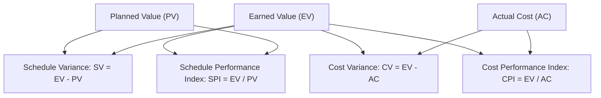

# Earned Value Management

> **Core skill:** Measuring project performance by comparing planned value, earned value, and actual cost — so schedule and cost variance are quantified together and forecasts are based on performance, not optimism.

## Why This Matters

"Are we on track?" is the question every stakeholder asks and the question most status reports answer with a traffic light and a feeling. Earned value management replaces the feeling with numbers: how much work was planned, how much was actually done, and what it actually cost. The result is not just variance — it is a performance index that predicts the project's future.

EVM is the project manager's most powerful analytical tool because it combines schedule and cost into one measurement system. A project that is under budget but behind schedule looks good on a cost report and bad on a schedule report — EVM shows both in the same moment. The steering committee that sees a CPI of 0.85 and an SPI of 1.05 knows exactly what the project needs: cost recovery, not schedule recovery.

## The Three Core Metrics

| Metric | Abbreviation | Definition | What It Answers |
|--------|-------------|------------|-----------------|
| **Planned Value** | PV | The authorized budget assigned to scheduled work | What should have been done by now? |
| **Earned Value** | EV | The budget value of work actually completed | What was actually done? |
| **Actual Cost** | AC | The realized cost of work performed | What did it actually cost? |

All three are cumulative — measured from the project start to the status date — and expressed in the same currency.

## Derived Metrics

| Derived Metric | Formula | Interpretation |
|----------------|---------|----------------|
| Schedule Variance (SV) | EV − PV | Positive = ahead of schedule; negative = behind |
| Cost Variance (CV) | EV − AC | Positive = under budget; negative = over budget |
| Schedule Performance Index (SPI) | EV / PV | > 1.0 = ahead; < 1.0 = behind |
| Cost Performance Index (CPI) | EV / AC | > 1.0 = under budget; < 1.0 = over budget |

Indices are preferred over variances for trending and comparison across projects because they are ratios — they scale.

## Forecasting with EVM

EVM's real power is forecasting: using past performance to predict where the project will land.

| Forecast | Formula | What It Tells You |
|-----------|---------|-------------------|
| Estimate at Completion (EAC) | BAC / CPI | Forecast total cost based on current cost performance |
| Estimate to Complete (ETC) | EAC − AC | Forecast cost to finish remaining work |
| To-Complete Performance Index (TCPI) | (BAC − EV) / (BAC − AC) | The CPI needed on remaining work to hit the budget |
| Variance at Completion (VAC) | BAC − EAC | Forecast overrun or underrun at completion |

Where BAC = Budget at Completion (the total approved budget).

## Reading the EVM Numbers

| Scenario | EVM Signal | What It Means |
|----------|-----------|---------------|
| CPI < 1.0, SPI < 1.0 | Over budget and behind schedule | The project is in trouble on both dimensions |
| CPI < 1.0, SPI > 1.0 | Over budget but ahead of schedule | Spending faster than planned; may be a resource issue |
| CPI > 1.0, SPI < 1.0 | Under budget but behind schedule | Spending slower than planned; check if work is really being done |
| CPI > 1.0, SPI > 1.0 | Under budget and ahead of schedule | The project is outperforming the plan — verify the baseline is honest |

The worst-case scenario is CPI < 1.0 and SPI < 1.0 early in the project: performance indices rarely improve without intervention, and the gap compounds over time.

## EVM Implementation Requirements

| Requirement | Why It Is Needed |
|-------------|-----------------|
| Defined scope (WBS) | EV is earned against scope; undefined scope cannot be measured |
| Time-phased budget | PV requires budget spread across the project timeline |
| Objective progress measurement | EV requires honest, measurable completion — not percent-complete by feel |
| Actual cost tracking | AC requires time-reporting or cost-accounting systems |
| Regular status cycles | EVM data must be collected and analyzed consistently |

EVM is not free — it requires scope definition, time-phased budgeting, and honest progress measurement. For small or short projects, the overhead may not be justified. For projects over a certain size, duration, or risk profile, EVM is the cheapest way to know the truth.

## Practical Applications

**EVM implementation checklist:**

- [ ] Work is decomposed into measurable work packages
- [ ] Budget is time-phased to match the schedule
- [ ] Progress measurement rules are defined: how is percent complete determined?
- [ ] Actual cost data is collected per work package or control account
- [ ] EVM data is collected and analyzed in every status cycle
- [ ] Variance thresholds are defined for escalation
- [ ] EAC is calculated and reported alongside variance

**EVM review questions:**

- [ ] What is the CPI and SPI this period? Trending up or down?
- [ ] What is the estimate at completion (EAC) and is it within tolerance?
- [ ] What is the TCPI — is the remaining performance requirement achievable?
- [ ] Are variances explained by specific work packages or systemic?
- [ ] Has the baseline remained valid, or does it need re-baselining?

## Common Pitfalls

| Pitfall | Why It Is a Problem | Better Approach |
|---------|---------------------|-----------------|
| **Percent complete by feel** | EV is inflated; the SPI shows progress that is not real | Objective completion rules: 0/100, 50/50, or physical percent complete |
| **EVM as a hammer** | Applied to every project regardless of size or duration | EVM for projects above a size/risk threshold; lighter methods for the rest |
| **Baseline neglect** | The baseline is stale; EVM reports variance against a plan nobody follows | Re-baseline when the plan changes materially; document the change |
| **Forecast-by-hope** | EAC is the optimistic number, not the EVM-derived number | Calculate EAC from CPI; explain deviations from the formula |
| **EVM-only reporting** | Numbers without narrative; the steering committee sees indices but no story | Pair EVM data with variance analysis: what caused the variance and what is being done |

## Success Indicators

- EVM data is collected and reported in every status cycle
- Progress measurement is objective, not subjective
- CPI and SPI trends are stable or improving
- EAC forecasts converge as the project progresses
- Stakeholders understand what CV, SV, CPI, SPI, and EAC mean

## Related Topics

- [[03_Cost_Estimation_and_Budgeting]]: the cost baseline is the foundation for EVM
- [[01_Schedule_Development]]: the time-phased plan feeds PV
- [[05_Schedule_and_Cost_Tracking]]: EVM data comes from tracking actuals
- [[06_Variance_Analysis_and_Reporting]]: EVM variances drive analysis
- [[career-path/05_Tech_Lead/04_Team_Delivery_and_Execution_Leadership/07_Delivery_Metrics_and_Health|Delivery Metrics and Health (Tech Lead)]]: team-level delivery measurement

## Summary

Earned value management measures schedule and cost performance together — planned value, earned value, and actual cost — producing variances and indices that quantify performance honestly. The real power is forecasting: the CPI projects the estimate at completion, and the TCPI tells you what performance is needed on remaining work to hit the budget. EVM turns "we're a bit behind" into numbers a steering committee can act on — but only if the baseline is honest, progress is measured objectively, and the numbers are paired with narrative that explains the why.