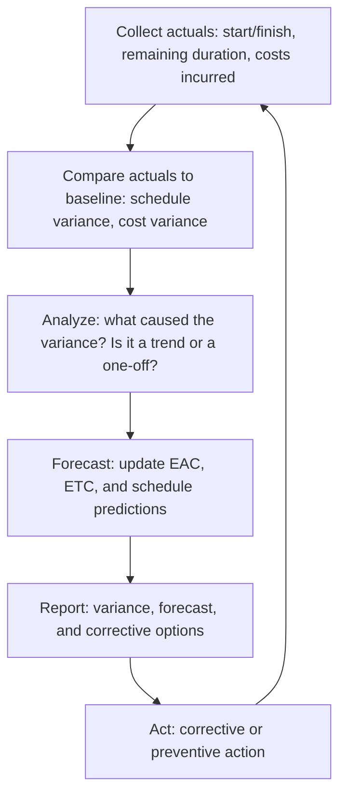

# Schedule and Cost Tracking

> **Core skill:** Collecting actual schedule progress and cost data against the baseline every status cycle — so the project manager knows where the project is, not where the plan says it should be.

## Why This Matters

A baseline without tracking is an aspiration. Tracking without a baseline is a diary. The project manager's core operational discipline is putting actuals against the plan with enough frequency and honesty to see variance while it is still small enough to correct.

Schedule and cost tracking is the heartbeat of project control. Every status cycle — typically weekly or bi-weekly — the project manager collects actual start and finish dates, remaining duration estimates, actual costs incurred, and percent complete on in-progress activities. This data feeds earned value analysis, variance reporting, and forecasting. Without it, the project manager is guessing.

The discipline is not the data collection itself — it is making sure the data is honest. Schedule tracking is routinely gamed: "90% complete" on an activity for three weeks in a row is not tracking; it is hoping. Cost tracking is routinely lagging: invoices arrive late, timesheets are submitted late, and the project manager sees last month's spending when this month's is already overspent.

## The Tracking Cycle

The cycle runs every status period. A tracking cycle that skips the analysis step — collecting data but not understanding it — is reporting without management.

## What to Track

### Schedule Tracking

| Data Point | Source | Frequency | What It Reveals |
|------------|--------|-----------|-----------------|
| Actual start date | Team status update | Per activity | Activities starting late are an early warning |
| Actual finish date | Team status update | Per activity | Accumulated delays on the critical path |
| Remaining duration | Person doing the work | Every status cycle | Honest forecast from ground truth — more valuable than percent complete |
| Percent complete | Objective measurement rule | Every status cycle | EV calculation; must be objective, not subjective |
| Milestone achievement | Milestone list | As reached | Binary: met or missed; trend in misses is a warning |

### Cost Tracking

| Data Point | Source | Frequency | What It Reveals |
|------------|--------|-----------|-----------------|
| Labor cost actuals | Timesheets or allocations | Every status cycle | Are hours matching planned effort? |
| Vendor invoices | Finance system | As received | Accrued vs. invoiced; watch for lag |
| Material and equipment costs | Purchase orders, receipts | Per transaction | Capital vs. expense; lease vs. buy actuals |
| Accruals | Finance system | Every status cycle | Costs incurred but not yet invoiced |
| Commitments | Purchase orders, contracts | As committed | Future obligations not yet spent |

## Progress Measurement Rules

Subjective percent complete is the most common source of dishonest schedule tracking. Use objective rules:

| Rule | How It Works | When to Use |
|------|-------------|-------------|
| **0/100** | Activity is 0% complete until finished, then 100% | Short activities (≤ one status cycle) |
| **50/50** | 50% at start, 50% at finish | Activities spanning 2–3 status cycles |
| **Weighted milestones** | Percent complete based on milestone achievement | Long activities with clear intermediate deliverables |
| **Physical percent complete** | Units complete / total units | Repeatable, countable work |
| **Level of effort** | Time elapsed / total duration | Support or management activities with no measurable output |

The rule must be chosen before the activity starts — changing the measurement rule mid-activity to make variance disappear is the oldest tracking abuse.

## Tracking at the Program Level

For program managers, tracking aggregates across projects and adds integration dimensions:

| Program Tracking | What It Adds | Why It Matters |
|-----------------|--------------|----------------|
| Cross-project milestone integration | Dependencies between project milestones | A slip in one project may cascade across several |
| Resource allocation actuals | Actual resource usage vs. planned across projects | Identifies over-allocated resources and bottlenecks |
| Program-level cost aggregation | Summed cost actuals and forecasts across projects | Provides the program financial picture |
| Benefit tracking | Actual benefit metrics vs. projected | Connects delivery to organizational value |

## Tracking Systems

| System Type | What It Tracks | Limitation |
|-------------|---------------|------------|
| Project management tool (MS Project, Jira, etc.) | Schedule: dates, durations, dependencies, percent complete | Requires discipline to keep current |
| Timesheet system | Labor hours by project and activity | Lag; often disconnected from project tool |
| Finance/ERP system | Costs: invoices, accruals, commitments | Lag; accrual timing can mislead |
| Spreadsheet | Anything the other systems do not cover | Manual; error-prone; version chaos |

The project manager's job is to connect these systems — the finance system's cost data to the project tool's schedule data — so that earned value analysis is possible. When the cost system and the schedule system do not talk, EVM is manual and error-prone.

## Practical Applications

**Tracking checklist:**

- [ ] Actual start and finish dates are collected for every activity each status cycle
- [ ] Remaining duration is updated by the person doing the work
- [ ] Percent complete uses an objective measurement rule
- [ ] Actual costs are collected and compared to the time-phased budget
- [ ] Accruals and commitments are tracked alongside invoiced costs
- [ ] Cross-project dependencies are tracked at the program level
- [ ] Tracking data feeds EVM, variance analysis, and forecasting

**Tracking review questions:**

- [ ] Are any activities stuck at the same percent complete for multiple cycles?
- [ ] Is remaining duration growing on activities that should be closing?
- [ ] Are actual costs diverging from planned costs, and why?
- [ ] What items have started late or finished late this cycle?
- [ ] Is the tracking data honest — would an auditor agree with the percent complete?

## Common Pitfalls

| Pitfall | Why It Is a Problem | Better Approach |
|---------|---------------------|-----------------|
| **Subjective percent complete** | "90% complete" for three weeks — the last 10% is half the work | Objective measurement rules chosen before the activity starts |
| **Tracking lag** | Data arrives too late to act on | Collect in the last two days of the status cycle; report in the first two days of the next |
| **Cost blindness** | Only schedule is tracked; cost is "finance's job" | Track cost alongside schedule; the project manager owns the integrated view |
| **Remaining-duration neglect** | Percent complete is tracked, but not how much work is left | Remaining duration from the person doing the work — it is the most honest number |
| **Tracking-as-compliance** | Data collected to satisfy process, never analyzed | Every tracking cycle produces analysis, not just data |

## Success Indicators

- Actuals are collected and reported within two days of the status cycle close
- Percent complete is objective and auditable
- Remaining duration is updated by the person doing the work, not the PM
- Cost actuals and schedule actuals are integrated in one report
- Tracking data directly feeds variance analysis and corrective action

## Related Topics

- [[01_Schedule_Development]]: the baseline that tracking measures against
- [[03_Cost_Estimation_and_Budgeting]]: the cost baseline
- [[04_Earned_Value_Management]]: tracking data feeds EVM
- [[06_Variance_Analysis_and_Reporting]]: tracking data is the input to variance analysis
- [[02_Scope_and_Planning/00_overview|Scope and Planning]]: scope changes affect what is tracked

## Summary

Schedule and cost tracking is the project manager's operational backbone: collecting actuals against the baseline every status cycle with enough honesty to see variance while it is still correctable. The key discipline is objective progress measurement — not percent complete by feel — combined with remaining duration from the people doing the work. Tracking that collects data without analyzing it is reporting without management; tracking that analyzes and then acts is project control.